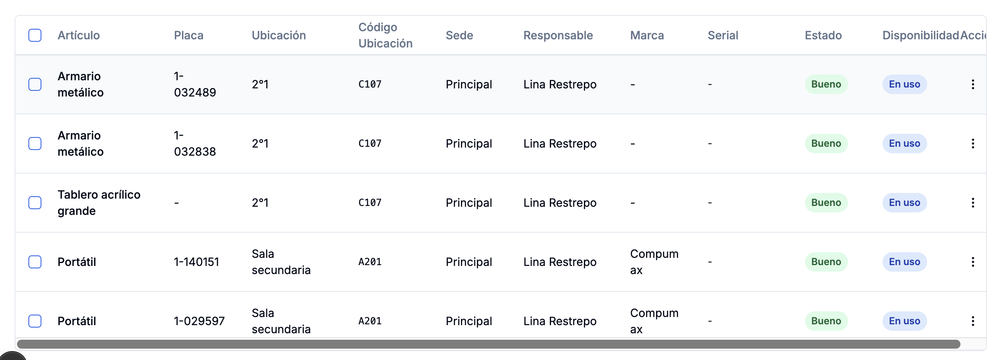
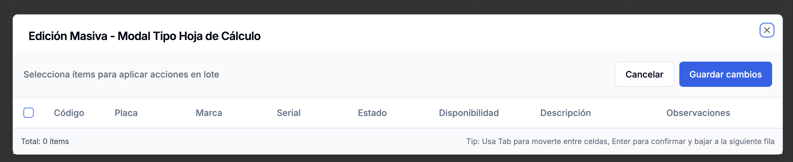
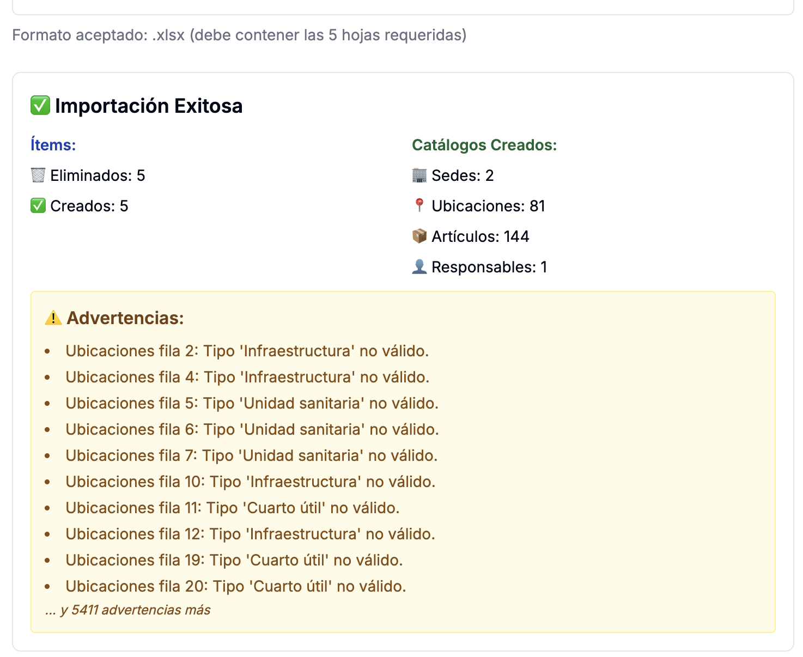
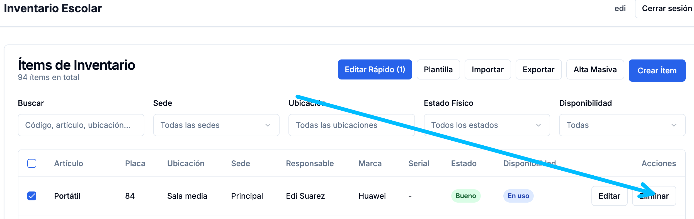
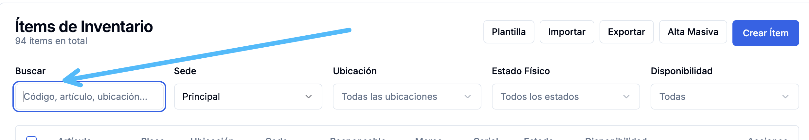
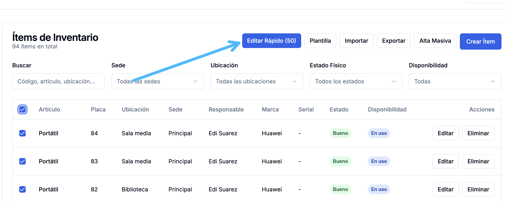
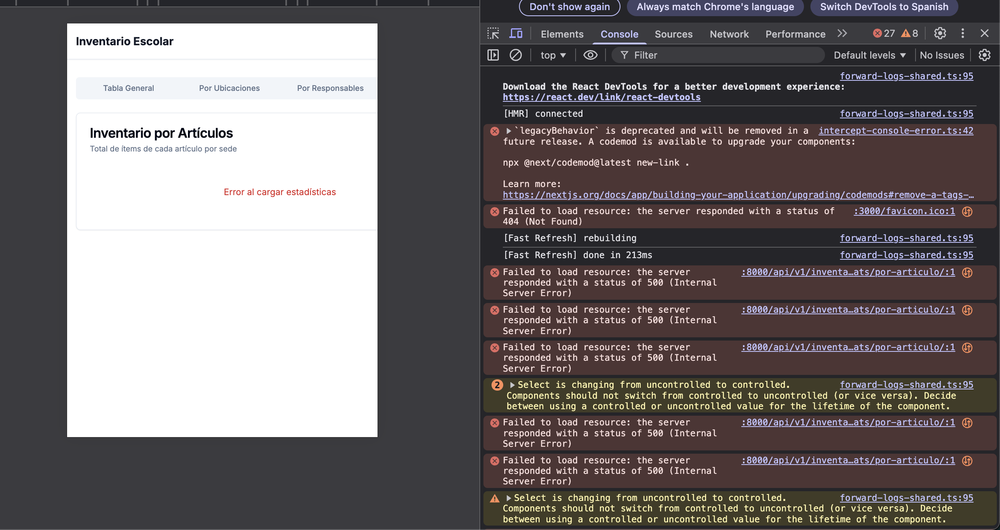

# Informe de desarrollo de IA vs requerimientos orginales

Con ayuda de varias inteligencias artificiales, pude construir un documento de requerimientos para montar de un sistema de inventario. Estos requerimientos inicialmente están plasmados dentro del archivo llamado INICIAL.md, el cual yace en la raíz de este proyecto. Más adelante, este documento, junto a otras indicaciones (que no contradecían lo plasmado en INICIAL.md), fue pulido y mejor detallado, hasta dar lugar al conjunto de archivos contenidos dentro de la carpeta "docs" dentro de este mismo proyecto. El tema aquí es que al darle la carpeta docs a la inteligencia artificial de Claude Code CLI, este ejecutó unas tareas, corrieron aparentemente a la perfección en todas sus fases, pero cuando voy a revisar los requerimientos me encontré con varias inconsistencias, y voy a tratar de especificarte cuáles en este escrito, haciendo la claridad de que hay cosas que quiero que cambien con respecto al documento INICIAL.md. Quiero entonces que, a partir de lo que ya está creado, le demos la dirección al proyecto que yo quiero, con las funcionalidades tal cual como yo las quiero, y entregándoselas a Claude Code CLI de manera efectiva para que se modifique el proyecto tal cual como yo quiero, con iteraciones mínimas.

AJUSTES SOBRE REQUERIMIENTOS:

1. La página principal en next.js es una vista de tabla general con una serie de botones:
    

## "Plantilla"

La plantilla de Excel tiene unos campos, los cuales pueden diligenciarse, y luego importarse al sistema, el cual debería hacer las validaciones correspondientes sobre cada campo, y luego, si pasan dichas validaciones, importar los datos al sistema. Los campos son los siguientes:
"articulo_codigo", "ubicacion_codigo", "responsable_documento", "estado",	"disponibilidad", "placa", "marca", "serial", "descripcion" y "observaciones".

Me gustaría que se agregara el campo "responsable", con el nombre del responsable y se quitara el campo "responsable_documento".

También me gustaría que el campo "articulo_codigo" sea intercambiado por "articulo", el cual tiene el nombre del artículo. Y que por cada artículo se genere un código en la base de datos interna, y se le asocie un "articulo_codigo" pero a nivel interno y despues de las validaciones existentes, que además deben verificar a partir del excel que se genera un código de artículo único según cada nombre único de artículo.

## "Importar"

Dejémoslo ahí por ahora hasta solucionar lo demás.

## "Exportar"

Exportar exactamente la vista de la tabla general en la interfaz como la ve el cleinte.

## "Alta masiva"

Dejarlo así por ahora, ya que funciona correctamente.

## "Crear Ítem"

Dejarlo así por ahora, ya que funciona correctamente.

## "Editar en hoja"

Solo se activa cuando se hace una selección múltiple de varios ítems
 , pero al abrirse el modal donde debería mostrarse los ítems a editar en los campos "Código", "Placa", "Marca", "Serial", "Estado", "Disponibilidad", "Descripción" y "Observaciones", este modal solo muestra los nombres de los campos pero sin los ítems, tal como se muestra en la imagen. Sin embargo, lo he pensando, y realmente ya no quiero que aparezca este botón.

## "Editar rápido"

 
Solo se activa cuando se hace una selección múltiple de varios ítems. Me gustaría solo conservar las funciones "Modo atómico", "Actualizar ubicación", "Actualizar responsable", "Actualizar Estado Físico", "Actualizar Disponibilidad". Ten en cuenta que la función "Actualizar responsable" lanza el error: Cannot read properties of null (reading 'codigo')
components/items/BatchEditDialog.tsx (246:44) @ <unknown>

244 |                     {responsablesData?.results.map((responsable) => {
245 |                       const sedeInfo = typeof responsable.sede === 'object'

> 246 |                         ? responsable.sede.codigo
> |                                            ^
> 247 |                         : '';
> 248 |                       return (
> 249 |                         <SelectItem key={responsable.id} value={responsable.id.toString()}>

## Otras consideraciones

Ten en cuenta también que me gustaría que la aplicación quede hecha enteramente con shadcn, incluida la tabla principal, y que esta no es la única vista, ya que esta tabla es solo una parte de un dashboard, en el cual deben ir por ahora, la tabla general en una sección, y en otras secciones deben ir el inventario por ubicaciones, el inventario por responsables, y el inventario por artículo. Consulta en el documento de fases dentro de la carpeta docs, ahí está eso indicado.

Quiero que empieces la implementación pero primero tomes un criterio y me proponas cuál es la manera más sólida de trabajar para ir teniendo avances progresivos y verificables, así que adelante.

# Respuesta de Claude

Propuesta de Estrategia de Trabajo

Basándome en tu documento [CLAUDE.md](http://CLAUDE.md), te propongo un enfoque incremental y verificable con las siguientes prioridades:

📋 Estrategia Propuesta: 3 Bloques de Trabajo

BLOQUE 1: Ajustes al Modelo de Datos y Plantilla Excel (1-2 días)
Primero ajustaremos la base de datos y la estructura de importación para reflejar tus cambios.

Cambios específicos:

1. Campo articulo → Cambiar de código a nombre, generar código interno automáticamente
2. Campo responsable → Agregar y quitar responsable_documento
3. Validaciones → Asegurar que cada artículo único genera un código único

Verificación: Backend funciona con nuevos campos, se pueden crear artículos manualmente

BLOQUE 2: Ajuste de UI - Botones y Tabla Principal ✅ COMPLETADO
Modificaremos la interfaz para tener solo los botones que necesitas y ajustar funcionalidades.

Cambios específicos:

1. ✅ Quitar botón "Editar en hoja" - Eliminado completamente
2. ✅ Simplificar "Editar rápido" - Solo 5 opciones: Modo atómico, Ubicación, Responsable, Estado, Disponibilidad
3. ✅ Corregir bug del error en BatchEditDialog.tsx (línea 246) - Validación defensiva agregada
4. ✅ Tabla con shadcn → Ya usa componentes shadcn completamente

Verificación: ✅ Interfaz muestra solo botones solicitados, tabla funciona correctamente

Ver documentación completa en: BLOQUE-2-IMPLEMENTACION.md

BLOQUE 3: Dashboard Completo con Vistas (3-4 días)
Implementaremos el dashboard con las 4 vistas que mencionaste.

Cambios específicos:

1. \
   Dashboard layout con 4 secciones:
   ◦  Tabla general (actual)
   ◦  Inventario por ubicaciones
   ◦  Inventario por responsables◦  Inventario por artículo
2. Navegación entre vistas
3. Diseño coherente con shadcn

Verificación: Dashboard completo funcional con las 4 vistas

🎯 Ventajas de este Enfoque:

✅ Progreso visible - Cada bloque entrega valor tangible
✅ Verificable - Puedes probar cada etapa antes de continuar
✅ Reversible - Si algo no funciona, no afecta lo demás
✅ Iteraciones mínimas - Trabajo enfocado reduce idas y vueltas

# Peticiones

## Incidencia - Botón eliminar

 

Al intentar eliminar un ítem, lanza el siguiente mensaje:
Request failed with status code 500
lib/api/items.ts (64:5) @ async Object.delete

62 |    \*/
63 |   delete: async (id: number): Promise<void> => {

> 64 |     await apiClient.delete(`/inventario/items/${id}/`);
> |     ^
> 65 |   },
> 66 |
> 67 |   /\*\*

## Requerimiento - filtros en la tabla general

La tabla general donde se ven los ítems del inventario, me gustaría que refines a tu criterio y de la manera más escalable, legible y mantenible posible con buena experiencia de usuario, cada una de las siguientes opciones:

* Que en la paginación actual, dé el número de ítems, o sea no solo el total de ítems del inventario que ya está, sino que se sepa claramente en la paginación que estamos, en cuántos ítem vamos. ¿Es claro?

* Buscar por el campo placa. Es decir, por ejemplo el ítem con placa única 1-067348.
* Buscar por el campo serial. Es decir, por ejemplo el ítem con serial SN820489403.
* Que se pueda buscar según la lista de responsables, por decir algo, ver solo los ítems de cierto reponsable, y que además muestre cuántas coincidencias se encuentran en total según el texto que se introduzca y los demás filtros que hayan aplicados.
* Que si se va a buscar dentro de la lista de artículos, se pueda ver las diferentes opciones de artículo, y seleccionar el artículo que se quiere filtrar. Por ejemplo, solo quiero ver los portátiles, y que además muestre cuántas coincidencias se encuentran en total según el texto que se introduzca y los demás filtros que hayan aplicados.
* La barra que tiene para búsqueda dinámica por código, artículo, ubicación… pero en realidad, me gustaría que esa barra busque solo por placa, artículo y serial, y que además muestre cuántas coincidencias se encuentran en total según el texto que se introduzca y los demás filtros que hayan aplicados.      
* Me gustaría que añadas otro campo a la tabla general, y para ello, ten en cuenta que lo debes añadir también al archivo de importación, el cual es el código de la ubicación, el cual se ve en el archivo de exportación bajo el nombre de “Ubicación Código”. Unifica estos nombres en toda la base código por si no lo está.
* Para aclarar, la búsqueda de los siguientes campos me gustaría que tuviesen claramente indicados los filtros, es decir, mostrar las diferentes opciones según los registros. los campos son: Artículo, Ubicación, Código de ubicación, Sede, Responsable, Estado (El mismo Estado Físico que está actualmente), Disponibilidad.
* Con base en estos requerimientos, y sin dejar de cumplir con mis solicitudes, puedes tomar una acción que resulte eficiente, cómoda para el usuario y legible, mantenible y escalable para la base de código, y que tal vez no esté teniendo en cuenta. Recuerda usar componentes shadcn.

## Requerimiento - vista de dashboard

Ya está implementada la vista de tabla general, pero además me gustaría que esta vista sea una que haga parte de un dashboard, construido con shadcn, y que este dashboard tengas otras secciones, las cuales contengan el inventario por ubicaciones, el inventario por responsables y e inventario por artículos.

### Inventario de ubicaciones

El inventario por ubicaciones debe tener una tabla totalizada donde haya posibilidad de elegir la sede y el código de ubicación (junto al nombre de la ubicación) para que el cliente sepa qué código de ubicación elegir. Una vez se elija la ubicación, se debe mostrar en forma una tabla del siguiente tipo:

Resumen de inventario - Código de ubicación - Ubicación - Sede - Responsable de ubicación

| Artículo | Total |
|----|----|
| Portátil | 10 |
| Silla amarilla | 40 |

Y luego de este resumen de inventario (que es un totalizado por artículos en dicha ubicación), se muestre el inventario detallado, algo de este estilo:

| Artículo | Placa | Estado | Descripción | Observación | Marca | Serial | Disponibilidad | Responsable |
|----|----|----|----|----|----|----|----|----|
| Portátil | 1-038983 | Bueno | Descripción 1 | Observación 1 | HP | L238U823UM | En uso | Edi Suárez |
| Portátil | 1-083739 | Regular | Descripción 2 | Observación 2 | DELL |    | En uso | Edi Suárez |

Esta tabla debe contar con los mismo elementos de búsqueda y acciones en lote (Botón "Editar Rápido). Lógicamente, como estaríamos parados en una ubicación específica, ya no se mostraría ese filtro por ubicación ni código de ubicación.     

### Inventario por responsable

El inventario por responsable debe tener, así como el de ubicaciones, una tabla resumen que muestre el totalizado por artículos para el responsable que se elija, y luego una tabla detallada.

La tabla resumen o totalizada debe verse así:

Resumen de inventario - Nombre del responsable

| Artículo | Ubicación | Código ubicación | Total |
|----|----|----|----|
| Portátil | Sala media | A302 | 2 |
| Silla amarilla | Sala media | A302 | 1 |
| Portátil | Biblioteca | B402 | 3 |
| Televisor | Biblioteca | B402 | 1 |

De otro lado, la tabla detallada debe verse así:

| Artículo | Placa | Ubicación | Código ubicación | Sede | Estado | Descripción | Observación | Marca | Serial | Disponibilidad | Responsable |
|----|----|----|----|----|----|----|----|----|----|----|----|
| Portátil | 1-038983 |    |    |    | Bueno | Descripción 1 | Observación 1 | HP | L238U823UM | En uso | Edi Suárez |
| Portátil | 1-083739 |    |    |    | Regular | Descripción 2 | Observación 2 | DELL |    | En uso | Edi Suárez |

Esta tabla debe contar con los mismo elementos de búsqueda y acciones en lote (Botón "Editar Rápido). Lógicamente, como estaríamos parados en un responsable específoco, ya no se mostraría ese filtro por responsable.

### Inventario por artículo

El inventario por artículo debe tener solo la tabla resumen que muestre el totalizado. La tabla debe mostrar el total de ítems de cada artículo en cada sede y ubicación, que se debe ver así.

| Artículo | Sede 1 | Sede 2 |
|----|----|----|
| Portátil | 100 | 50 |
| Silla amarilla | 1000 | 400 |

# Incidencias
 
## Vista de artículos en el dashboard

## Tablas detalladas
Las tablas detalladas en el inventario por ubicación y por responsable recuerda que deben ser lo más parecida a la de la vista de tabla general, pero con los detalles de cada una, donde por ejemplo si es para un ubicación, ya se omite la columna de ubicació y código de ubicación, lo mismo que para la tabla detallada de inventario por responsable. lo otro es que esta vista detallada debe dar las mismas posibilidades de edición que las de la tabla general, por ejemplo te cuento que el botón eliminar y el botón editar no los veo en estas vistas, que lo diferente está en el tema de los campos que por lógica no aparecen.

## Error en consola de next js
Console Error

`legacyBehavior` is deprecated and will be removed in a future release. A codemod is available to upgrade your components:

npx @next/codemod@latest new-link .

Learn more: https://nextjs.org/docs/app/building-your-application/upgrading/codemods#remove-a-tags-from-link-components
components/dashboard/DashboardNav.tsx (32:11) @ DashboardNav

  30 |       <Tabs value={getActiveTab()} className="w-full">
  31 |         <TabsList className="grid w-full grid-cols-4">
> 32 |           <Link href="/" passHref legacyBehavior>
     |           ^
  33 |             <TabsTrigger value="general" asChild>
  34 |               <a>Tabla General</a>
  35 |             </TabsTrigger>