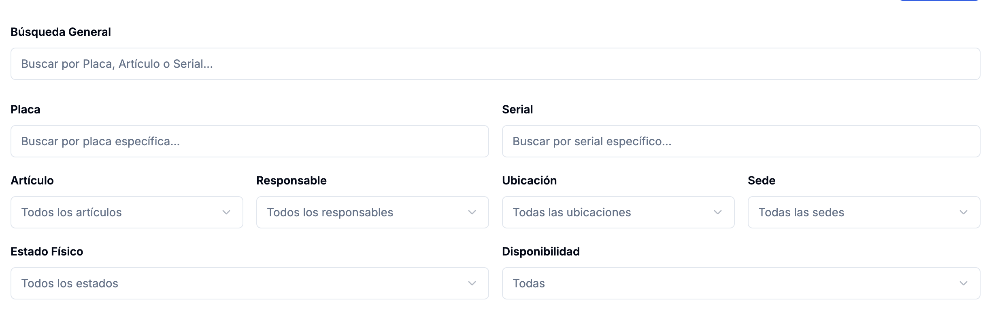

# Peticiones

## Mejor organización de los filtros en ítems detallados y rediseño genreal de la experiencia de usuario

Organizar mejor los filtros al buscar ítems detallados en la pestaña correspondiente donde esté, ya que está mal diseñado, es como difícil encontrar entre tanto filtro, hay campos que ocupan mucho espacio. De otro lado, no hay filtro para buscar por el campo "Descripción" ni por el campo "Observaciones", y que se puedan buscar con un texto libre, ya que no hay valores predecibles una lista para los registros en esos campos. Mira la manera de hacer esta experiencia para el usuario mucho más intuitiva, con buenas prácticas y manteniendo el código legible, pero de verdad, algo muy intuitivo para el usuario.

Dale un cambio de look que haga la interfaz de next js mucho más atractiva en términos generales. Doy cambida suelta a tu creatividad. Recuerda buenas prácticas y mantenibilidad.

## Contexto rápido de documentación
Ten presente que Claude Code CLI ya hizo la implementación inicial del sistema de inventario, con base en la documentación que está en la carpeta docs. Sin embargo, en el camino me di cuenta de requrimientos que no atendió como yo los pedí exactamente, y que, de otro lado, habían formas de hacer diferentes cosas de mejor manera, razón por la cual seguí la tarea con cursor, y ya tomando como archivo de entrada este de acá (CLAUDE.md). A partir de aquí se ha ido puliendo el sistema, y se han generado las respectivas documentaciones en la raíz del proyecto. Ten en cuenta también que el archivo llamado "ESTANDARES.md" dentro de la carpeta docs sigue en vigencia, con el ánimo de mantener el código fácilmente mantenible, legible, modular, escalable y robusta, ofreciendo además, una excelente experiencia al usuario final.

