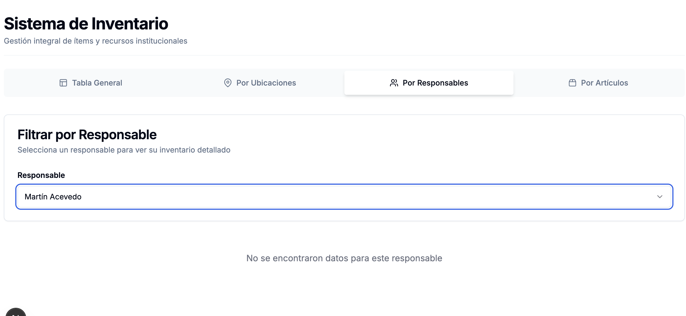

# Peticiones

## Inventario detallado omite elementos
He notado que por ejemplo en la pestaña "Por Ubicaciones", se muestra correctamente la tabla resumen o totalizada, pero la tabla detallada omite elementos, que sí logro encontrar en la pestaña "Tabla General". Verifica esto para todos los inventarios detallados

## Pestaña "Por Responsables no encuentra datos"

Cuando en la tabla general esos datos sí están presentes

## Incluir campo "Observacions" y "Descripción"

Por favor incluir estos campos en todas las pestañas, donde se muestre la tabla detallada.
## Mantén el código legible, mantenible y modular

Implementa las soluciones con buenas prácticas, y ten en cuenta que por ejemplo esa lógica en la tabla de inventario detallado para todas las pestañas no tiene por qué diferir la una de la otra, ya que todas parten de la lógica que se maneja en la pestaña "Tabla General", con ligeras variaciones en los filtros que se deciden mostrar.

## Otros issues no detectados

En cuanto reflexiones y soluciones estos issues, verifica si aplicas esa lógica centralizada, modularizada, haciendo el código legible, mantenible y escalable también para las tablas o vistas resumidas en cada una de las pestañas.

## Contexto rápido de documentación
Ten presente que Claude Code CLI ya hizo la implementación inicial del sistema de inventario, con base en la documentación que está en la carpeta docs. Sin embargo, en el camino me di cuenta de requrimientos que no atendió como yo los pedí exactamente, y que, de otro lado, habían formas de hacer diferentes cosas de mejor manera, razón por la cual seguí la tarea con cursor, y ya tomando como archivo de entrada este de acá (CLAUDE.md). A partir de aquí se ha ido puliendo el sistema, y se han generado las respectivas documentaciones en la raíz del proyecto. Ten en cuenta también que el archivo llamado "ESTANDARES.md" dentro de la carpeta docs sigue en vigencia, con el ánimo de mantener el código fácilmente mantenible, legible, modular, escalable y robusta, ofreciendo además, una excelente experiencia al usuario final.