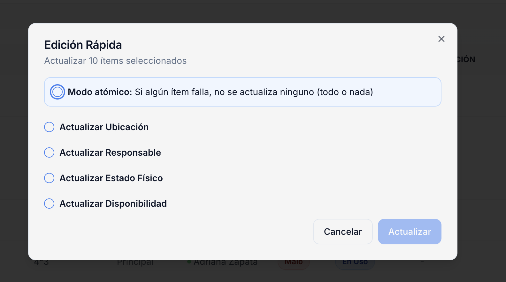
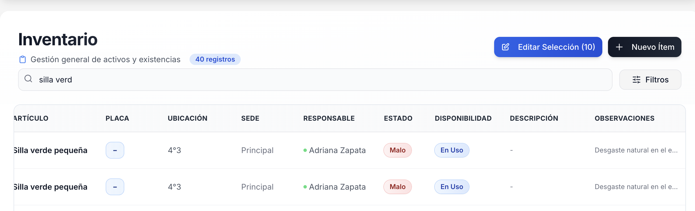
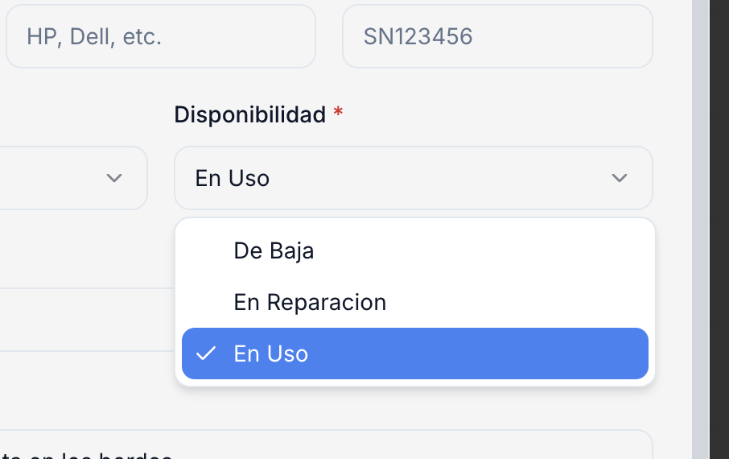
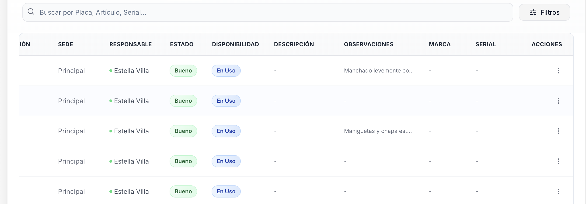
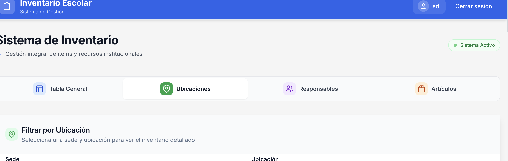
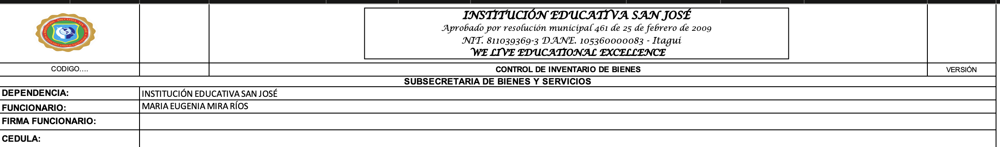
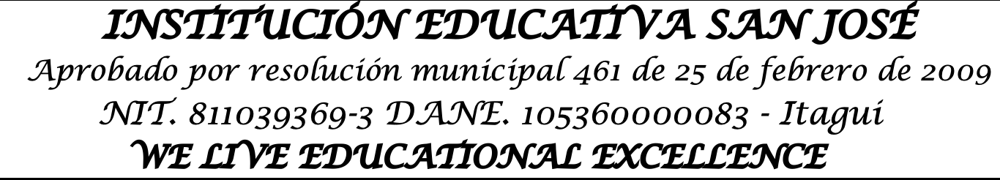

# Peticiones

## Revisión: Operación en lote para cambiar el campo "Observaciones"

El botón "Editar Selección me gustaría que añadiera la operación en lote conjunta de añadir "Observaciones", y se pueda hacer una observación en lote

Esta función la implementó otro agente. Revisa que esté bien implementada, sin duplicaciones o hardcodeos, haciendo el código fácilmente mantenible.

## Agregar una nueva opción al campo "Disponibilidad"

Donde sea que se pueda seleccionar la disponibilidad de parte del cliente, bien sea en la pestaña "Tabla General" o en la pestaña "Ubicaciones" o en la pestaña "Responsables", agrega la opción "Extraviado"

## Mémbrete institucional en hoja llamada "Ítems"

La idea es que la hoja llamada "Ítems" salga un con un encabezado institucional, compuesto por la imagen del escudo (Escudo.png), y un texto, que va centrado, el cual diga lo expuesto la siguiente imagen:

Esa imagen te puedes dar cuenta que está en el encabezado a la derecha del esucudo. De igual manera te voy a recordar el texto de cada línea, junto a su tipo de letra y tamaño de letra.
Línea 1: INSTITUCIÓN EDUCATIVA SAN JOSÉ; fuente: Lucida Calligraphy; tamaño: 12
Linea 2: Aprobado por resolución municipal 461 de 25 de febrero de 2009; fuente: Lucida Calligraphy; tamaño: 9
Línea 3: NIT. 811039369-3 DANE. 105360000083 - Itagui; fuente: Lucida Calligraphy - tamaño: 10
Línea 4: WE LIVE EDUCATIONAL EXCELLENCE; fuente: Lucida Calligraphy; tamaño: 10

## Contexto rápido de documentación
Ten presente que Claude Code CLI ya hizo la implementación inicial del sistema de inventario, con base en la documentación que está en la carpeta docs. Sin embargo, en el camino me di cuenta de requrimientos que no atendió como yo los pedí exactamente, y que, de otro lado, habían formas de hacer diferentes cosas de mejor manera, razón por la cual seguí la tarea con cursor, y ya tomando como archivo de entrada este de acá (CLAUDE.md). A partir de aquí se ha ido puliendo el sistema, y se han generado las respectivas documentaciones en la raíz del proyecto. Ten en cuenta también que el archivo llamado "ESTANDARES.md" dentro de la carpeta docs sigue en vigencia, con el ánimo de mantener el código fácilmente mantenible, legible, modular, escalable y robusta, ofreciendo además, una excelente experiencia al usuario final.

