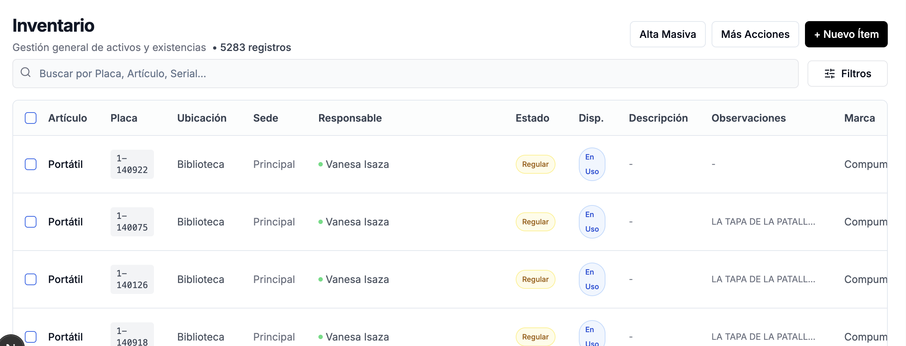

# Peticiones

## Rediseño del estilo global del frontend

Te pido por favor hagas un rediseño total de la web que se vea profesional, que la web por ejemplo en la tabla de ítems tambien haga una mejor distribición de los espacios en los campos, esto para todas las pestañas, donde por ejemplo el campo placa se ve en dos renglones. Quisiera que se vea en uno solo. 

También te pido que tengas mucho cuidado con el hacer este diseño y que luego hayan problemas de rendimiento con componentes react, ya que ya un agente me hizo una implementación anterior y eso casusó que cuando iba a cambiar de repsonsable o de ubicación en la respectiva pestaña, el sistema ya no dejaba seleccionar más opciones, nisiquiera moverme a otras pestañas. La única forma de salir de ese congelamiento fue hacer un refresh de la web. El agente intentó resolver y no se pudo, por lo que me tocó devolverme al commit anterior. 

El rediseño debe tener un efecto wow en todas las páginas, pero a la vez un efecto elegante, con un estilo claro, por ejemplo en las cabeceras, en las diferentes secciones, en el issue que te mandé de la tabla con los ítems en las diferentes pestañas, un pulido general para todos los campos incluido el manejo del espacio, no importa sí se va con un scroll hacia la derecha, que se vea armónico, sin espacios excesivos entre campos. Todo ello con buenas prácticas, y con código mantenible, que no sea código inmantenible, pero con efeco wow para los directivos. Ten en cuenta que esto para todas las páginas del forntend con next js, incluyendo la página de login.

## Contexto rápido de documentación
Ten presente que Claude Code CLI ya hizo la implementación inicial del sistema de inventario, con base en la documentación que está en la carpeta docs. Sin embargo, en el camino me di cuenta de requrimientos que no atendió como yo los pedí exactamente, y que, de otro lado, habían formas de hacer diferentes cosas de mejor manera, razón por la cual seguí la tarea con cursor, y ya tomando como archivo de entrada este de acá (CLAUDE.md). A partir de aquí se ha ido puliendo el sistema, y se han generado las respectivas documentaciones en la raíz del proyecto. Ten en cuenta también que el archivo llamado "ESTANDARES.md" dentro de la carpeta docs sigue en vigencia, con el ánimo de mantener el código fácilmente mantenible, legible, modular, escalable y robusta, ofreciendo además, una excelente experiencia al usuario final.

