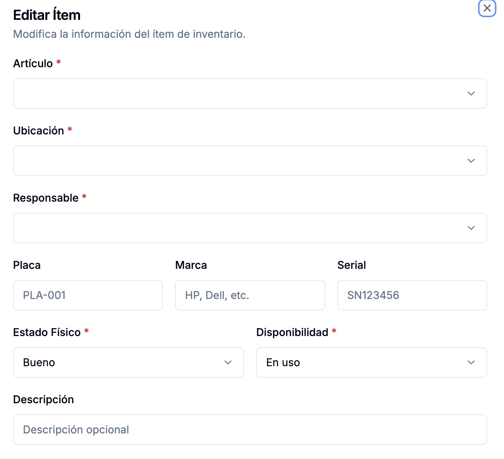

# Peticiones

## No se rellenan los campos al dar acción "Editar"
Al darle en la acción "Editar" del campo acciones, en cualquiera de las pestañas donde aparece la tabla de ítems detallados, no aparecen previamente rellenos los campos "Artículo", "Ubicación" y "Responsable" con los valores que tiene actualmente. Este problema ya lo han intentado varios agente spero creo que es un tema de prácticas recomendadas en react.js. Puedes por favor analizarlo a profundidad, encontrar las causas y resolverlo

## Next.js debe ser fiel a Django Rest Framework
Por favor cambia el orden en que se presentan los campos en la tabla de ítems detallada, que aparece en las pestañas "Tabla General", "Por Ubicación" y "Por Responsable", con buenas prácticas y bajo una sola lógica, para que el orden en que se presenten los campos sea, de izquierda a derecha: Artículo, Placa, Ubicación, Sede, Responsable, Estado, Disponibilidad, Descripción, Observaciones, Marca, Serial y Acciones.

## Contexto rápido de documentación
Ten presente que Claude Code CLI ya hizo la implementación inicial del sistema de inventario, con base en la documentación que está en la carpeta docs. Sin embargo, en el camino me di cuenta de requrimientos que no atendió como yo los pedí exactamente, y que, de otro lado, habían formas de hacer diferentes cosas de mejor manera, razón por la cual seguí la tarea con cursor, y ya tomando como archivo de entrada este de acá (CLAUDE.md). A partir de aquí se ha ido puliendo el sistema, y se han generado las respectivas documentaciones en la raíz del proyecto. Ten en cuenta también que el archivo llamado "ESTANDARES.md" dentro de la carpeta docs sigue en vigencia, con el ánimo de mantener el código fácilmente mantenible, legible, modular, escalable y robusta, ofreciendo además, una excelente experiencia al usuario final.

