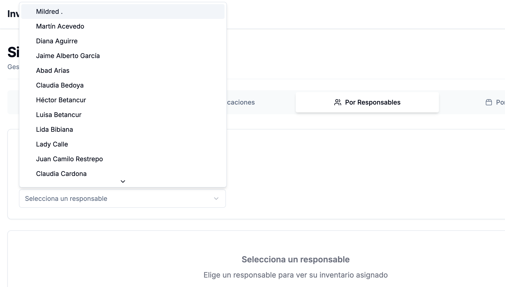
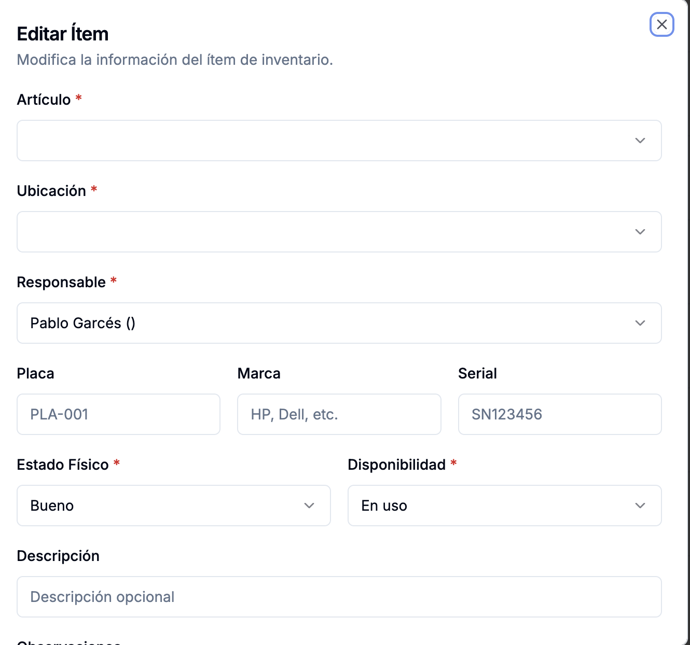
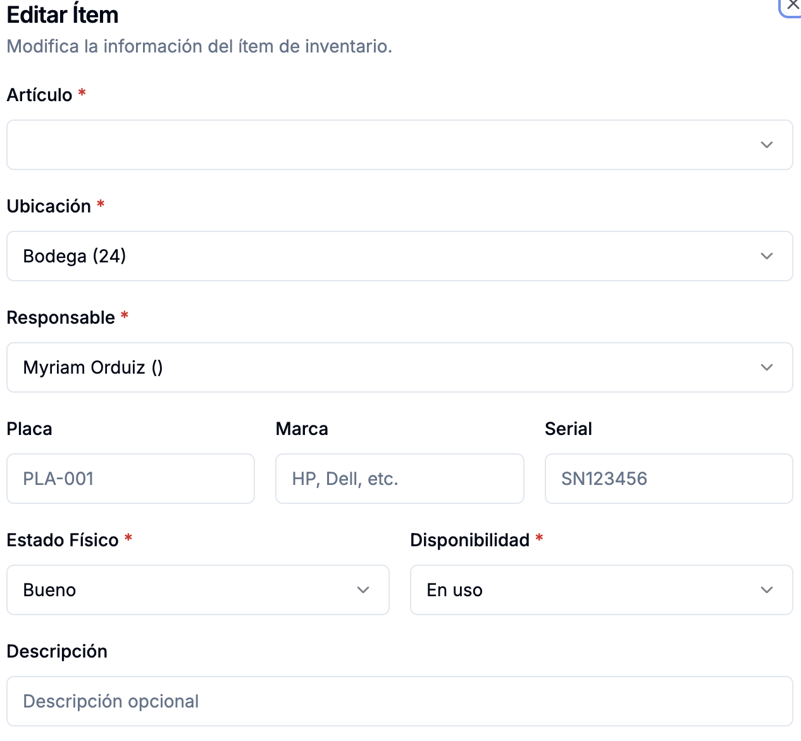
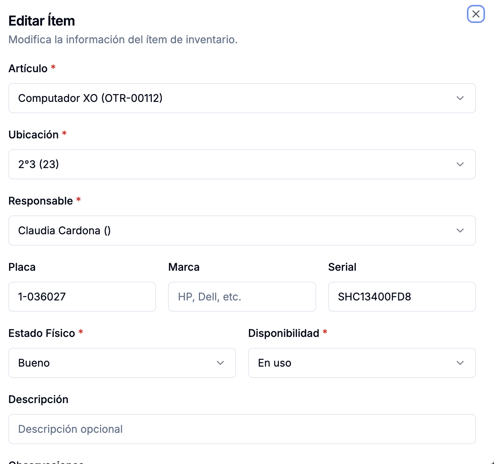
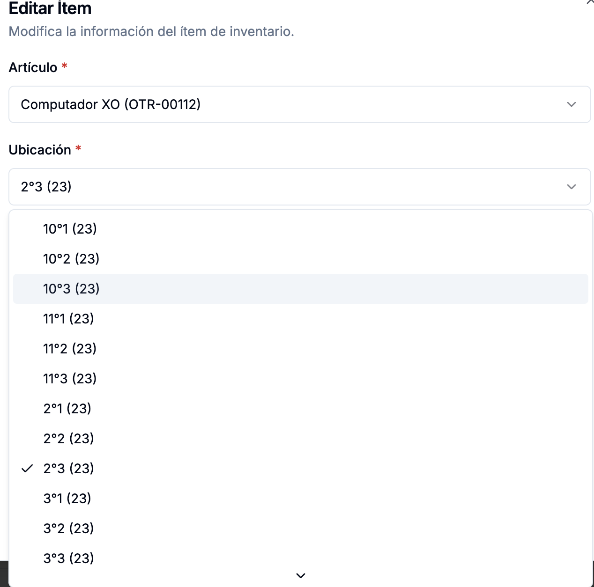

# Peticiones

## Filtros funcionando mal

Por ejemplo el filtro que es por responsables no me muestra la lista de los responsables que tiene el backend en django admin. Me muestra una lista limitada, con solo nombres y en un orden todo extraño. Ya verifiqué y el backend sí está importando correctamente los datos y los ubico en el django admin. Pero este tema de los filtros por favor mejóralo en todas las pestañas y en todos los filtros, diseñando una estrategia efectiva y fácilmente mantenible.

El filtro de la pestaña "Por Responsables" no muestra todos los responsables que muestra el django admin.

En general te pido que analices cómo está esta lógica para mostrar con los filtros y la mejores por favor, sobre todos los filtros.

## No se rellenan los campos al dar acción "Editar"

Al darle en la acción "Editar" del campo acciones de la tabla que se muestra en la pestaña "Tabla General", no muestra los rellenados previamente los campos "Artículo" y "Ubicación"

Cuando intento esa misma acción pero desde la pestaña "Por Ubicaciones", el único campo que no se llena es el campo "Artículo"

En cambio cuando intento esa misma acción de "Editar" desde la pestaña "Por Responsable", ahí sí se llenan todos los campos

Esto lo que me dice a mí es otro indicio de que no estás aplicando buenas prácticas, ya que parece que estás duplicando funciones y de maneras diferentes. Consulta bien lo que funciona, por ejemplo desde esta pestaña de "Por Responsables", y replicalo en las demás, sin duplicar código.

Otra cosa que observo es que cuando intento darle a la acción "Editar" en la pestaña "Por Responsables", y le doy a ver si cambio la ubicación, aparecen una serie de paréntesis raros en la lista de ubicaciones, cosa que no tiene nada que ver. Esto sucede al intentar esta acción de "Editar", sin importar la pestaña donde se esté

## Next.js debe ser fiel a Django Rest Framework
Lo que tenga en el frontend veo que me está mostrando cosas incosistentes con lo que tengo en el backend, o mejor dicho incompleto. Creo que lo que trae la tabla general en la pestaña "Tabla General" está completo, pero el problema es que por ejemplo en el filtro de responsables me pone una lista desplegabl en la cual no figuran todos los responsables que están en el backend. Quiero que por favor analices cómo está montada esa lógica de los filtros en todos los campos y en todas las vistas y lo hagas de una manera más efectiva, que pueda filtrar fácilmente por todos los campos, y siempre fiel a los datos del backend, sin suponer valores predeterminados, sino simplemente basándose en lo que tiene en su propia tabla.

## Reflexión

Pienso que todos estos issues merecen una revisión y análisis del código a fondo, teniendo presente que el backend tiene un comportamiento esperado, más allá de lo que se pueda pensar mejor en términos de arquitectura o buenas prácticas (lo cual también puedes revisar a fondo). El tema lo veo en el frontend y su diseño, no sé como que hay algo mal de fondo. Por favor analiza exhaustivamente y soluciona con buenas prácticas.

## Contexto rápido de documentación
Ten presente que Claude Code CLI ya hizo la implementación inicial del sistema de inventario, con base en la documentación que está en la carpeta docs. Sin embargo, en el camino me di cuenta de requrimientos que no atendió como yo los pedí exactamente, y que, de otro lado, habían formas de hacer diferentes cosas de mejor manera, razón por la cual seguí la tarea con cursor, y ya tomando como archivo de entrada este de acá (CLAUDE.md). A partir de aquí se ha ido puliendo el sistema, y se han generado las respectivas documentaciones en la raíz del proyecto. Ten en cuenta también que el archivo llamado "ESTANDARES.md" dentro de la carpeta docs sigue en vigencia, con el ánimo de mantener el código fácilmente mantenible, legible, modular, escalable y robusta, ofreciendo además, una excelente experiencia al usuario final.

