# Peticiones

## No se muestran los estados físicos disponibles al abrir la acción "Editar"
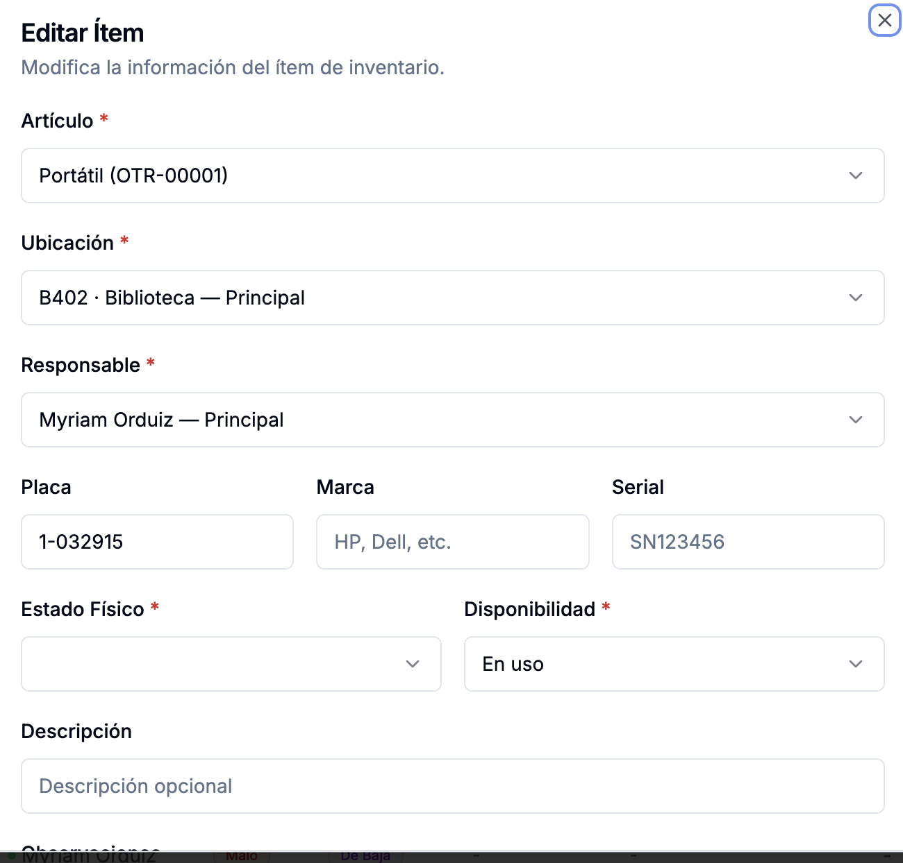

Al abril el modal de la acción "Editar", este elemento tiene el estado físico "Sin estado", el cual creo que no se espera desde el backend o no lo tiene predeterminado el modelo de Django...consulta bien y resuelve para que todos esos filtros en todos los campos de la tabla se muestren con base en los datos reales, y no en datos harcodeados o datos que se esperen a partir de un enum. Por favor mira cómo se trabaja el filtro de ese mismo campo pero desde la cabecera de la tabla, para que se aplique ese mismo comportamiento en el modal que se abre cuando se le da a la acción "Editar"
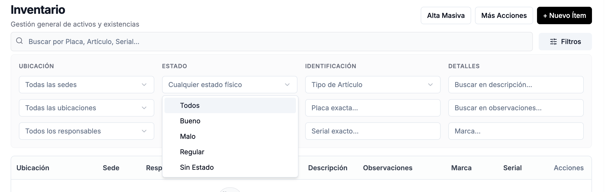

## Incluir el campo responsable por defecto de la ubicación del backend en el excel que se importa y exporta
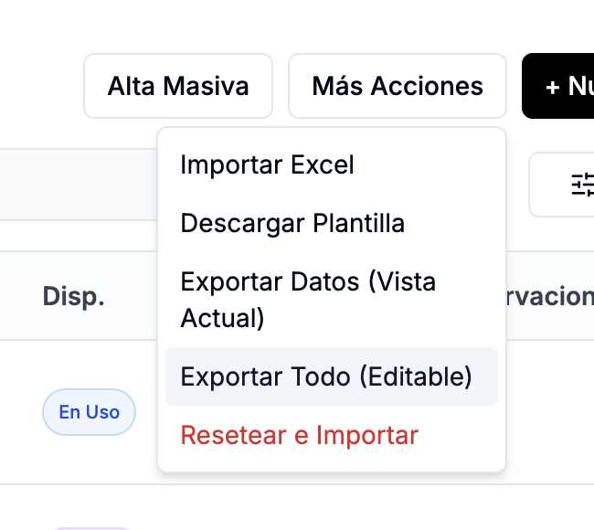
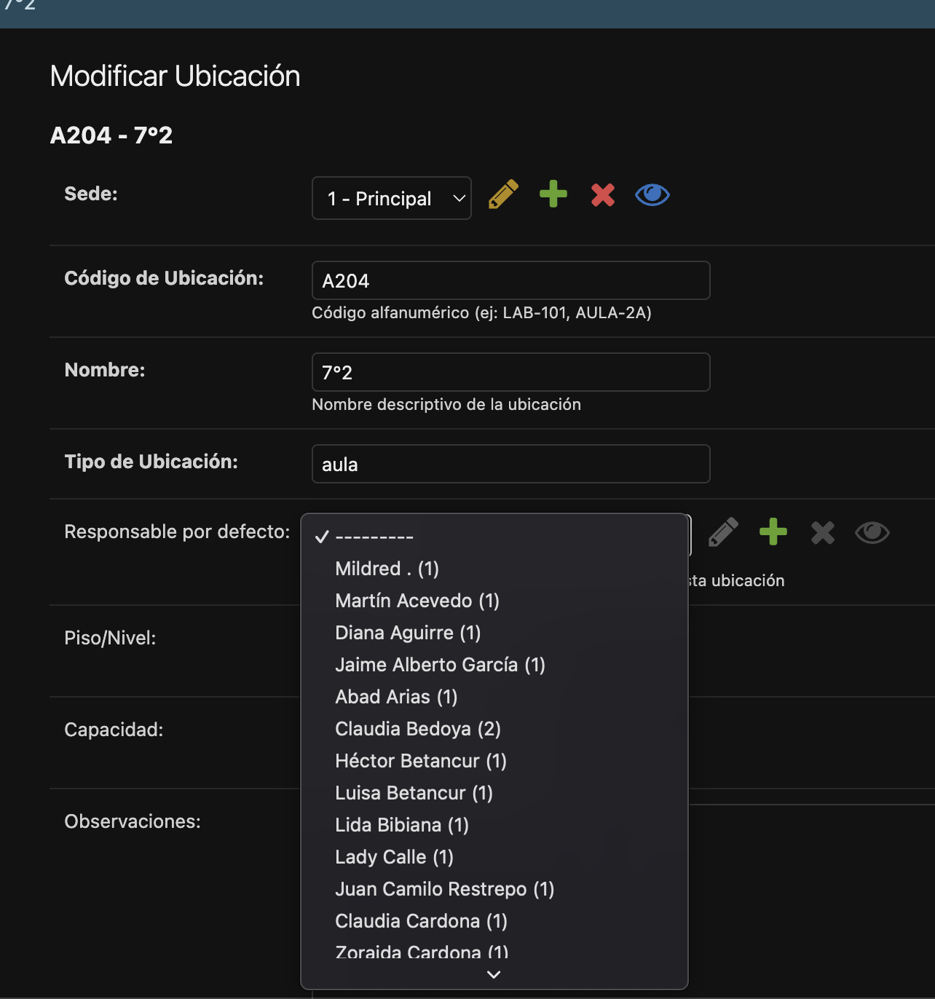

## Tabla con ítems detallados debe mostrar número de registros
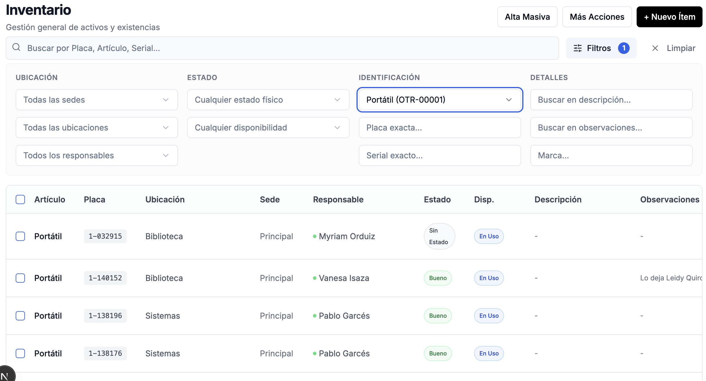

## Crear un campo "Coordinador de sede" en el modelo sede
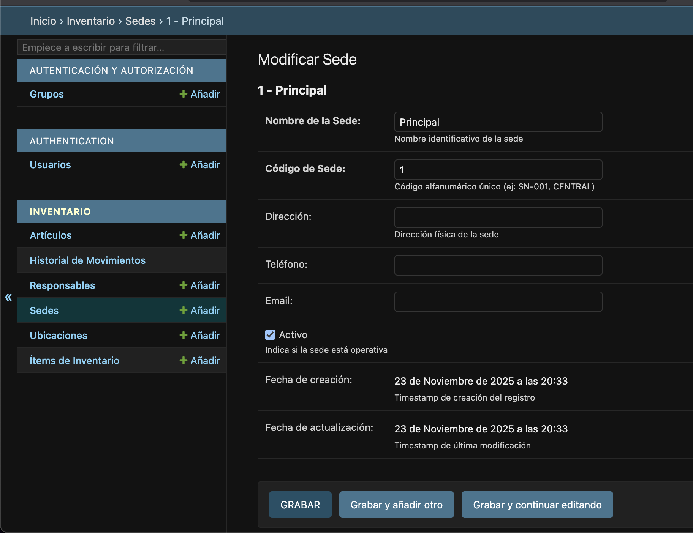
Esta persona debe elegirse de la lista de Responsables, y debe figurar cómo el responsable de sede.

## Responsable por defecto cuando se agreguen ítems
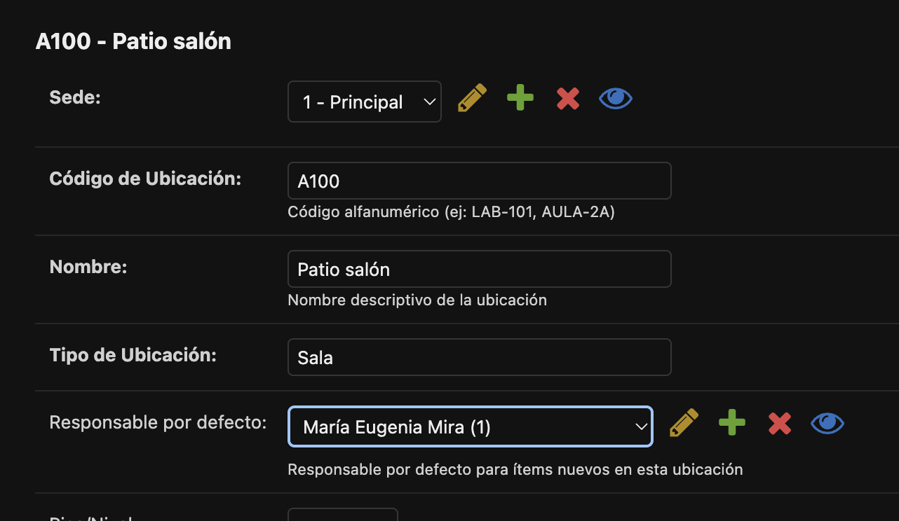
Cuando se agreguen ítem a cierta ubicación, debe asignarse por defectoc como responsable el responsable por defecto que se asigna a esa ubicación al momento de crearse. Este responsable también debe figurar en la pestaña "Por ubicación", cuando se va a presentar la información asociada a dicha ubicación. De igual manera, cuando se vaya al botón "Exportar todo", debe poder agregarse el responsable de ubicación en la hoja de resposables.
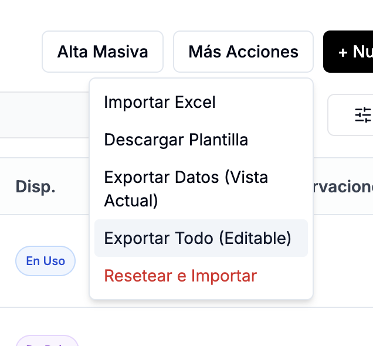
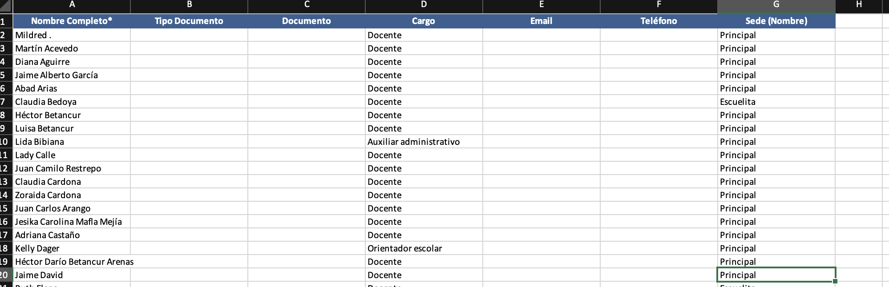

## Uniformidad entre el excel y la interfaz en el frontend
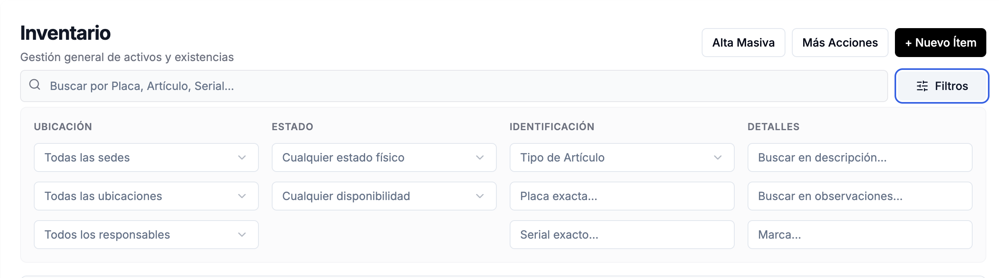
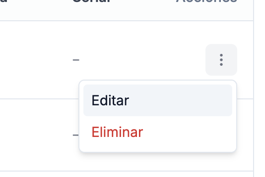
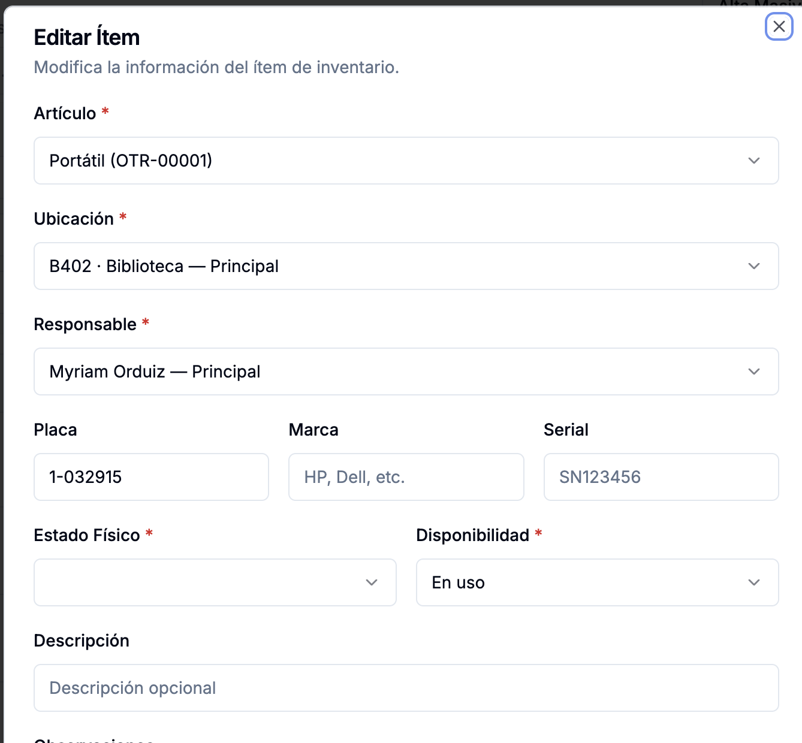
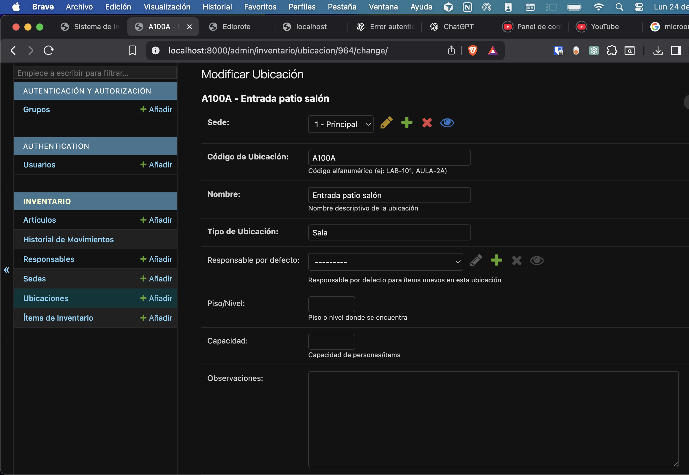

Te pido una uniformidad total, y, con lo que ya sabes, las mejores prácticas para hacer de este sistema algo potente, es decir, que se puedan importar el inventario y cuando se haga esto, entre en sincrónia total con los modelos de django reflejados en el django admin, de igual manera que esto se vea aboslutamente reflejado en los diferentes filtros de la interfaz, así como en la acción "Editar".

## Contexto rápido de documentación
Ten presente que Claude Code CLI ya hizo la implementación inicial del sistema de inventario, con base en la documentación que está en la carpeta docs. Sin embargo, en el camino me di cuenta de requrimientos que no atendió como yo los pedí exactamente, y que, de otro lado, habían formas de hacer diferentes cosas de mejor manera, razón por la cual seguí la tarea con cursor, y ya tomando como archivo de entrada este de acá (CLAUDE.md). A partir de aquí se ha ido puliendo el sistema, y se han generado las respectivas documentaciones en la raíz del proyecto. Ten en cuenta también que el archivo llamado "ESTANDARES.md" dentro de la carpeta docs sigue en vigencia, con el ánimo de mantener el código fácilmente mantenible, legible, modular, escalable y robusta, ofreciendo además, una excelente experiencia al usuario final.

