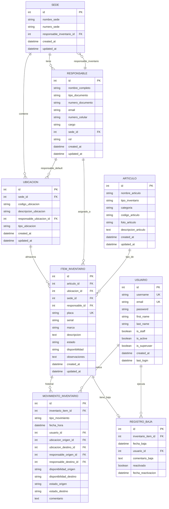

# Análisis Profundo y Mejora del Sistema de Inventario Escolar

## 📋 TABLA DE CONTENIDOS

1. [Resumen Ejecutivo](#resumen-ejecutivo)
2. [Stack Tecnológico Definitivo](#stack-tecnológico-definitivo)
3. [Arquitectura y Estructura del Proyecto](#arquitectura-y-estructura-del-proyecto)
4. [Modelo de Datos Completo](#modelo-de-datos-completo)
5. [Requerimientos Funcionales Detallados](#requerimientos-funcionales-detallados)
6. [Convenciones y Estándares de Código](#convenciones-y-estándares-de-código)
7. [Plan de Implementación Por Fases](#plan-de-implementación-por-fases)
8. [Guías de Validación y Testing](#guías-de-validación-y-testing)
9. [Apéndices y Referencias](#apéndices-y-referencias)

---

## 1. RESUMEN EJECUTIVO

### 1.1 Visión del Proyecto

Sistema web integral para gestión de inventario físico escolar, implementado con enfoque **progresivo, local-first** que evoluciona a producción dockerizada. Prioriza **código limpio, mantenible y verificable en cada incremento**.

### 1.2 Características Distintivas

- ✅ **Despliegue Progresivo:** Local → Docker → Producción
- ✅ **Validaciones Robustas:** Doble capa (aplicación + BD)
- ✅ **Edición Masiva Temprana:** Modal tipo Excel desde MVP+
- ✅ **Trazabilidad Completa:** Historial automático de movimientos
- ✅ **Import/Export Excel:** Con validación exhaustiva pre-inserción
- ✅ **Auto-creación de Catálogos:** Artículos se crean dinámicamente en importación

### 1.3 Alcance del MVP y Más Allá

**MVP (Semana 1-2):**
- ✅ CRUD completo de ítems con validaciones
- ✅ Importación/Exportación Excel
- ✅ Autenticación JWT
- ✅ Filtrado avanzado en tabla principal
- ✅ Gestión básica de catálogos

**MVP+ (Semana 3):**
- ✅ Modal de edición masiva (prioridad alta)
- ✅ Operaciones batch en ubicación/responsable
- ✅ Edición inline en tabla

**Post-MVP:**
- Vistas especializadas (por ubicación, responsable, artículo)
- Historial de movimientos UI
- Sistema de permisos granular
- Reportes avanzados
- Integración QR codes

---

## 2. STACK TECNOLÓGICO DEFINITIVO

### 2.1 Versiones Confirmadas (Noviembre 2025)

```yaml
Backend:
  - Python: 3.13.8 (última estable, con JIT experimental y mejor REPL)
  - Django: 5.2 LTS (soporte hasta 2027)
  - Django REST Framework: 3.16.1 (compatible Django 5.2)
  - PostgreSQL: 16.6 (última estable)
  - Simple JWT: 5.4.0

Frontend:
  - Node.js: 22 LTS (mejor rendimiento V8)
  - Next.js: 16.0.3 (Turbopack estable, React 19.2)
  - React: 19.2
  - TypeScript: 5.7
  - Zustand: 5.0.3 (manejo de estado global)
  - TanStack Query: 5.61
  - Tailwind CSS: 3.4.17
  - shadcn/ui: (última versión compatible)

Infraestructura:
  - Docker: 27.x
  - Docker Compose: 2.31.x

Librerías Auxiliares Backend:
  - pandas: 2.2.3 (procesamiento Excel)
  - openpyxl: 3.1.5 (generación Excel)
  - django-filter: 24.3 (filtros avanzados)
  - django-cors-headers: 4.6.0
  - psycopg: 3.2.3 (driver PostgreSQL)
  - python-decouple: 3.8 (variables de entorno)
  - Pillow: 11.0.0 (procesamiento imágenes)

Librerías Frontend:
  - lucide-react: 0.469.0 (iconos)
  - react-hook-form: 7.54.0 (formularios)
  - zod: 3.24.1 (validación esquemas)
  - date-fns: 4.1.0 (manipulación fechas)
  - react-hot-toast: 2.4.1 (notificaciones)
```

### 2.2 Justificación de Elecciones Clave

#### ¿Por qué Zustand sobre Context API?
- ✅ **Rendimiento:** No causa re-renders innecesarios
- ✅ **DevTools:** Mejor debugging
- ✅ **Boilerplate mínimo:** Código más limpio
- ✅ **TypeScript:** Tipado superior
- ✅ **Middleware integrado:** Persist, devtools, immer

#### ¿Por qué Tailwind + shadcn/ui desde el inicio?
- ✅ **Consistencia:** Un solo sistema de diseño
- ✅ **Componentes listos:** Acelera desarrollo sin sacrificar personalización
- ✅ **Mantenibilidad:** Mejor que CSS Modules para este proyecto
- ✅ **No hay migración futura:** Evita reescritura de estilos
- ✅ **Responsive por defecto:** Mobile-first incorporado
- ✅ **Accesibilidad:** shadcn/ui sigue ARIA guidelines

**Decisión Final:** Tailwind + shadcn/ui es **definitivo**. No se cambiará en fases posteriores.

#### ¿Por qué Python 3.13?
- ✅ Mejor rendimiento (JIT experimental)
- ✅ REPL mejorado para debugging
- ✅ Free-threading experimental (futuro)
- ✅ Mejor manejo de errores
- ✅ Totalmente compatible con Django 5.2

#### ¿Por qué Next.js 16?
- ✅ Turbopack estable (builds mucho más rápidos)
- ✅ App Router maduro
- ✅ React Server Components estables
- ✅ Mejor caching y performance
- ✅ TypeScript mejorado

---

## 3. ARQUITECTURA Y ESTRUCTURA DEL PROYECTO

### 3.1 Enfoque de Despliegue

```
FASE 1 (Desarrollo Inicial): localhost sin Docker
├── Backend: manage.py runserver
├── Frontend: npm run dev
└── PostgreSQL: Instalación local o Docker solo para BD

FASE 2 (Estabilización): Docker Compose completo
├── Servicio: db (PostgreSQL)
├── Servicio: backend (Django)
└── Servicio: frontend (Next.js)

FASE 3 (Producción): Docker optimizado + nginx
├── Servicio: db (PostgreSQL con volumen persistente)
├── Servicio: backend (Gunicorn + Django)
├── Servicio: frontend (Next.js build estático)
└── Servicio: nginx (Proxy reverso)
```

**Nota Crítica:** Durante Fase 1, el desarrollador tendrá máxima agilidad para iterar. Docker se introduce en Fase 2 cuando las funcionalidades base estén estables.

### 3.2 Estructura de Directorios Definitiva

```
inventario-escolar/
│
├── backend/                          # Django Project
│   ├── config/                       # Configuración Django
│   │   ├── __init__.py
│   │   ├── settings/
│   │   │   ├── __init__.py
│   │   │   ├── base.py              # Settings comunes
│   │   │   ├── development.py       # Local
│   │   │   ├── production.py        # Producción
│   │   │   └── testing.py           # Tests
│   │   ├── urls.py
│   │   ├── asgi.py
│   │   └── wsgi.py
│   │
│   ├── apps/                         # Aplicaciones Django
│   │   │
│   │   ├── core/                     # App: Funcionalidad común
│   │   │   ├── __init__.py
│   │   │   ├── apps.py
│   │   │   ├── management/          # Comandos personalizados
│   │   │   ├── middleware.py        # Middleware custom
│   │   │   ├── mixins.py            # Mixins reutilizables
│   │   │   └── utils.py             # Utilidades generales
│   │   │
│   │   ├── authentication/           # App: Autenticación y Usuarios
│   │   │   ├── __init__.py
│   │   │   ├── apps.py
│   │   │   ├── models/
│   │   │   │   ├── __init__.py
│   │   │   │   └── user.py          # CustomUser model
│   │   │   ├── serializers/
│   │   │   │   ├── __init__.py
│   │   │   │   ├── user.py
│   │   │   │   └── auth.py
│   │   │   ├── views/
│   │   │   │   ├── __init__.py
│   │   │   │   ├── auth.py          # Login, refresh, logout
│   │   │   │   └── user.py          # CRUD usuarios
│   │   │   ├── permissions.py       # Permisos custom
│   │   │   ├── urls.py
│   │   │   ├── admin.py
│   │   │   └── tests/
│   │   │
│   │   └── inventario/               # App: Core del inventario
│   │       ├── __init__.py
│   │       ├── apps.py
│   │       ├── models/
│   │       │   ├── __init__.py
│   │       │   ├── choices.py       # Enums y constantes
│   │       │   ├── sede.py          # Modelo Sede
│   │       │   ├── responsable.py   # Modelo Responsable
│   │       │   ├── ubicacion.py     # Modelo Ubicacion
│   │       │   ├── articulo.py      # Modelo Articulo (catálogo)
│   │       │   ├── item.py          # Modelo ItemInventario
│   │       │   ├── movimiento.py    # Modelo MovimientoInventario
│   │       │   └── baja.py          # Modelo RegistroBaja
│   │       ├── serializers/
│   │       │   ├── __init__.py
│   │       │   ├── catalogos.py     # Sede, Ubicacion, Responsable, Articulo
│   │       │   ├── item.py          # ItemInventario (read/write separados)
│   │       │   ├── movimiento.py
│   │       │   └── import_export.py # Serializers para import/export
│   │       ├── views/
│   │       │   ├── __init__.py
│   │       │   ├── catalogos.py     # ViewSets de catálogos
│   │       │   ├── item.py          # ViewSet ItemInventario
│   │       │   ├── batch_operations.py  # Operaciones en lote
│   │       │   ├── import_view.py   # Importación Excel
│   │       │   ├── export_view.py   # Exportación Excel
│   │       │   └── vistas_especializadas.py  # Agregados por ubicación/responsable
│   │       ├── services/
│   │       │   ├── __init__.py
│   │       │   ├── import_service.py    # Lógica importación Excel
│   │       │   ├── export_service.py    # Lógica exportación Excel
│   │       │   ├── batch_service.py     # Lógica operaciones batch
│   │       │   └── movement_service.py  # Registro automático movimientos
│   │       ├── filters.py           # Filtros django-filter
│   │       ├── pagination.py        # Paginación custom
│   │       ├── permissions.py       # Permisos específicos inventario
│   │       ├── validators.py        # Validadores custom
│   │       ├── signals.py           # Signals (auto-registro movimientos)
│   │       ├── urls.py
│   │       ├── admin.py
│   │       └── tests/
│   │           ├── __init__.py
│   │           ├── test_models.py
│   │           ├── test_serializers.py
│   │           ├── test_views.py
│   │           ├── test_services.py
│   │           └── fixtures/        # Datos de prueba
│   │
│   ├── media/                        # Archivos subidos
│   ├── static/                       # Archivos estáticos Django
│   ├── requirements/
│   │   ├── base.txt                 # Dependencias base
│   │   ├── development.txt          # + Dev tools
│   │   ├── production.txt           # + Production only
│   │   └── testing.txt              # + Testing tools
│   ├── manage.py
│   ├── pytest.ini
│   └── .env.example
│
├── frontend/                         # Next.js Project
│   ├── app/                          # App Router (Next.js 16)
│   │   ├── (auth)/                  # Grupo de rutas autenticadas
│   │   │   ├── login/
│   │   │   │   └── page.tsx
│   │   │   └── layout.tsx           # Layout común para auth
│   │   │
│   │   ├── (dashboard)/             # Grupo de rutas protegidas
│   │   │   ├── layout.tsx           # Layout principal con sidebar
│   │   │   ├── page.tsx             # Dashboard home
│   │   │   │
│   │   │   ├── inventario/
│   │   │   │   ├── page.tsx         # Tabla principal inventario
│   │   │   │   ├── [id]/
│   │   │   │   │   └── page.tsx     # Detalle ítem individual
│   │   │   │   ├── nuevo/
│   │   │   │   │   └── page.tsx     # Formulario crear ítem
│   │   │   │   └── components/
│   │   │   │       ├── tabla-inventario.tsx
│   │   │   │       ├── filtros-inventario.tsx
│   │   │   │       ├── modal-edicion-batch.tsx
│   │   │   │       └── formulario-item.tsx
│   │   │   │
│   │   │   ├── catalogos/
│   │   │   │   ├── sedes/
│   │   │   │   │   └── page.tsx
│   │   │   │   ├── ubicaciones/
│   │   │   │   │   └── page.tsx
│   │   │   │   ├── responsables/
│   │   │   │   │   └── page.tsx
│   │   │   │   └── articulos/
│   │   │   │       └── page.tsx
│   │   │   │
│   │   │   ├── vistas/              # Vistas especializadas (Post-MVP)
│   │   │   │   ├── por-ubicacion/
│   │   │   │   │   └── page.tsx
│   │   │   │   ├── por-responsable/
│   │   │   │   │   └── page.tsx
│   │   │   │   └── por-articulo/
│   │   │   │       └── page.tsx
│   │   │   │
│   │   │   └── administracion/      # Panel admin
│   │   │       ├── usuarios/
│   │   │       │   └── page.tsx
│   │   │       └── configuracion/
│   │   │           └── page.tsx
│   │   │
│   │   ├── api/                     # API Routes (si necesario)
│   │   ├── layout.tsx               # Root layout
│   │   ├── page.tsx                 # Landing/redirect
│   │   ├── loading.tsx              # Loading UI global
│   │   ├── error.tsx                # Error boundary global
│   │   └── not-found.tsx
│   │
│   ├── components/                   # Componentes reutilizables
│   │   ├── ui/                      # shadcn/ui components
│   │   │   ├── button.tsx
│   │   │   ├── input.tsx
│   │   │   ├── select.tsx
│   │   │   ├── table.tsx
│   │   │   ├── dialog.tsx
│   │   │   ├── dropdown-menu.tsx
│   │   │   ├── card.tsx
│   │   │   ├── badge.tsx
│   │   │   ├── alert.tsx
│   │   │   └── ...                  # Más componentes shadcn
│   │   │
│   │   ├── layout/
│   │   │   ├── header.tsx
│   │   │   ├── sidebar.tsx
│   │   │   ├── footer.tsx
│   │   │   └── auth-guard.tsx       # HOC protección rutas
│   │   │
│   │   ├── forms/
│   │   │   ├── form-field.tsx       # Wrapper con validación
│   │   │   ├── autocomplete.tsx     # Autocomplete reutilizable
│   │   │   └── file-upload.tsx      # Upload Excel
│   │   │
│   │   └── shared/
│   │       ├── loading-spinner.tsx
│   │       ├── error-message.tsx
│   │       ├── confirmation-dialog.tsx
│   │       └── data-table.tsx       # Tabla genérica reutilizable
│   │
│   ├── lib/                          # Utilidades y configuraciones
│   │   ├── api/
│   │   │   ├── client.ts            # Axios configurado
│   │   │   ├── endpoints.ts         # URLs centralizadas
│   │   │   └── interceptors.ts      # Request/Response interceptors
│   │   ├── stores/                  # Zustand stores
│   │   │   ├── auth-store.ts
│   │   │   ├── inventario-store.ts
│   │   │   └── catalogos-store.ts
│   │   ├── hooks/                   # Custom React hooks
│   │   │   ├── use-auth.ts
│   │   │   ├── use-inventario.ts
│   │   │   ├── use-filtros.ts
│   │   │   └── use-debounce.ts
│   │   ├── validations/             # Esquemas Zod
│   │   │   ├── item-schema.ts
│   │   │   ├── catalogos-schemas.ts
│   │   │   └── auth-schemas.ts
│   │   ├── utils/
│   │   │   ├── format.ts            # Formateo de datos
│   │   │   ├── date.ts              # Manejo fechas
│   │   │   └── excel.ts             # Utils Excel import/export
│   │   └── constants.ts             # Constantes globales
│   │
│   ├── types/                        # TypeScript types
│   │   ├── models.ts                # Tipos de modelos backend
│   │   ├── api.ts                   # Tipos respuestas API
│   │   └── enums.ts                 # Enums frontend
│   │
│   ├── styles/
│   │   └── globals.css              # Estilos globales + Tailwind
│   │
│   ├── public/
│   │   ├── images/
│   │   └── icons/
│   │
│   ├── .env.local.example
│   ├── next.config.ts
│   ├── tailwind.config.ts
│   ├── tsconfig.json
│   ├── components.json              # Config shadcn/ui
│   └── package.json
│
├── docker/                           # Configuración Docker (Fase 2)
│   ├── backend/
│   │   ├── Dockerfile
│   │   └── entrypoint.sh
│   ├── frontend/
│   │   ├── Dockerfile
│   │   └── entrypoint.sh
│   └── nginx/
│       ├── Dockerfile
│       └── nginx.conf
│
├── docs/                             # Documentación del proyecto
│   ├── API.md                       # Documentación API
│   ├── DEPLOYMENT.md                # Guía despliegue
│   ├── CONTRIBUTING.md              # Guía contribución
│   └── PHASES.md                    # Detalle de cada fase
│
├── scripts/                          # Scripts de utilidad
│   ├── setup.sh                     # Setup inicial local
│   ├── generate-test-data.py        # Generar datos de prueba
│   └── backup-db.sh                 # Backup BD
│
├── .gitignore
├── .env.example                     # Variables de entorno template
├── docker-compose.yml               # Compose development
├── docker-compose.prod.yml          # Compose production
├── Makefile                         # Comandos útiles
└── README.md                        # Documentación principal
```

### 3.3 Naming Conventions

```python
# BACKEND (Python/Django)
# Archivos: snake_case
# Clases: PascalCase
# Funciones/métodos: snake_case
# Constantes: UPPER_SNAKE_CASE
# Variables: snake_case

# Ejemplos:
class ItemInventario(models.Model):  # Clase
    MAX_PLACA_LENGTH = 50            # Constante
    
    def validate_unique_placa(self):  # Método
        pass

# FRONTEND (TypeScript/React)
# Archivos: kebab-case.tsx
# Componentes: PascalCase
# Funciones: camelCase
# Tipos/Interfaces: PascalCase
# Constantes: UPPER_SNAKE_CASE
# Variables: camelCase

// Ejemplos:
interface ItemInventario {}        // Tipo
const MAX_ITEMS_PER_PAGE = 50;     // Constante

function TablaInventario() {}      // Componente
function handleSubmit() {}         // Función

# API ENDPOINTS
# Patrón: /api/v1/resource-name/
# Siempre plural para colecciones
# Ejemplos:
GET    /api/v1/items/
POST   /api/v1/items/
GET    /api/v1/items/{id}/
PUT    /api/v1/items/{id}/
DELETE /api/v1/items/{id}/
POST   /api/v1/items/batch-update/
GET    /api/v1/items/export/
POST   /api/v1/items/import/
```

---

## 4. MODELO DE DATOS COMPLETO

### 4.1 Diagrama Entidad-Relación



### 4.2 Especificación Detallada por Modelo

#### 4.2.1 Modelo: Sede

```python
# apps/inventario/models/sede.py

from django.db import models
from django.core.validators import RegexValidator
from apps.core.models import TimeStampedModel

class Sede(TimeStampedModel):
    """
    Representa un campus o sede física de la institución educativa.
    
    Reglas de negocio:
    - nombre_sede debe ser único
    - numero_sede debe ser único y seguir formato alfanumérico
    - Puede tener un responsable de inventario asignado (opcional)
    - Al eliminar, verificar que no tenga ubicaciones asociadas
    """
    
    nombre_sede = models.CharField(
        max_length=200,
        unique=True,
        verbose_name="Nombre de la Sede",
        help_text="Nombre identificativo de la sede (ej: Sede Norte, Campus Central)"
    )
    
    numero_sede = models.CharField(
        max_length=20,
        unique=True,
        validators=[
            RegexValidator(
                regex=r'^[A-Z0-9\-]+$',
                message='Número de sede debe contener solo letras mayúsculas, números y guiones'
            )
        ],
        verbose_name="Número de Sede",
        help_text="Código alfanumérico único (ej: SN-001, C2)"
    )
    
    responsable_inventario = models.ForeignKey(
        'inventario.Responsable',
        on_delete=models.SET_NULL,
        null=True,
        blank=True,
        related_name='sedes_a_cargo',
        verbose_name="Responsable de Inventario",
        help_text="Responsable principal del inventario de esta sede"
    )
    
    class Meta:
        db_table = 'inventario_sede'
        verbose_name = 'Sede'
        verbose_name_plural = 'Sedes'
        ordering = ['numero_sede']
        indexes = [
            models.Index(fields=['nombre_sede']),
            models.Index(fields=['numero_sede']),
        ]
    
    def __str__(self):
        return f"{self.numero_sede} - {self.nombre_sede}"
    
    def clean(self):
        """Validaciones adicionales a nivel de modelo"""
        from django.core.exceptions import ValidationError
        
        # Validar que responsable pertenezca a esta sede (si está asignado)
        if self.responsable_inventario and self.pk:
            if self.responsable_inventario.sede_id and self.responsable_inventario.sede_id != self.pk:
                raise ValidationError({
                    'responsable_inventario': 'El responsable debe pertenecer a esta sede'
                })
    
    def save(self, *args, **kwargs):
        self.full_clean()
        super().save(*args, **kwargs)
    
    @property
    def total_ubicaciones(self):
        """Cantidad de ubicaciones en esta sede"""
        return self.ubicaciones.count()
    
    @property
    def total_items(self):
        """Cantidad de ítems de inventario en esta sede"""
        return self.items_inventario.filter(disponibilidad__ne='DE_BAJA').count()
```

#### 4.2.2 Modelo: Responsable

```python
# apps/inventario/models/responsable.py

from django.db import models
from django.core.validators import EmailValidator, RegexValidator
from apps.core.models import TimeStampedModel
from .choices import RolChoices, TipoDocumentoChoices

class Responsable(TimeStampedModel):
    """
    Persona responsable de ítems o ubicaciones del inventario.
    
    Reglas de negocio:
    - nombre_completo es obligatorio
    - Si tiene sede, debe ser consistente con ubicaciones asignadas
    - email único si se proporciona
    - numero_documento único por tipo_documento
    """
    
    nombre_completo = models.CharField(
        max_length=200,
        verbose_name="Nombre Completo",
        help_text="Nombre completo de la persona responsable"
    )
    
    tipo_documento = models.CharField(
        max_length=20,
        choices=TipoDocumentoChoices.choices,
        blank=True,
        null=True,
        verbose_name="Tipo de Documento",
        help_text="Tipo de identificación (CC, CE, TI, etc.)"
    )
    
    numero_documento = models.CharField(
        max_length=50,
        blank=True,
        null=True,
        verbose_name="Número de Documento",
        help_text="Número de identificación"
    )
    
    email = models.EmailField(
        unique=True,
        blank=True,
        null=True,
        validators=[EmailValidator()],
        verbose_name="Correo Electrónico"
    )
    
    numero_celular = models.CharField(
        max_length=20,
        blank=True,
        null=True,
        validators=[
            RegexValidator(
                regex=r'^\+?1?\d{9,15}$',
                message='Número de celular debe contener entre 9 y 15 dígitos'
            )
        ],
        verbose_name="Número de Celular"
    )
    
    cargo = models.CharField(
        max_length=100,
        blank=True,
        null=True,
        verbose_name="Cargo",
        help_text="Cargo o posición en la institución"
    )
    
    sede = models.ForeignKey(
        'inventario.Sede',
        on_delete=models.SET_NULL,
        null=True,
        blank=True,
        related_name='responsables',
        verbose_name="Sede",
        help_text="Sede a la que pertenece este responsable"
    )
    
    rol = models.CharField(
        max_length=20,
        choices=RolChoices.choices,
        default=RolChoices.USUARIO,
        verbose_name="Rol de Sistema",
        help_text="Rol para permisos en el sistema (no confundir con cargo)"
    )
    
    class Meta:
        db_table = 'inventario_responsable'
        verbose_name = 'Responsable'
        verbose_name_plural = 'Responsables'
        ordering = ['nombre_completo']
        indexes = [
            models.Index(fields=['nombre_completo']),
            models.Index(fields=['email']),
            models.Index(fields=['sede']),
        ]
        constraints = [
            # Unicidad de documento solo si ambos campos están presentes
            models.UniqueConstraint(
                fields=['tipo_documento', 'numero_documento'],
                name='unique_documento',
                condition=models.Q(tipo_documento__isnull=False, numero_documento__isnull=False)
            )
        ]
    
    def __str__(self):
        sede_str = f" ({self.sede.numero_sede})" if self.sede else ""
        return f"{self.nombre_completo}{sede_str}"
    
    def clean(self):
        from django.core.exceptions import ValidationError
        
        # Si tiene tipo_documento, debe tener numero_documento
        if self.tipo_documento and not self.numero_documento:
            raise ValidationError({
                'numero_documento': 'Debe proporcionar el número de documento si indica el tipo'
            })
        
        if self.numero_documento and not self.tipo_documento:
            raise ValidationError({
                'tipo_documento': 'Debe indicar el tipo de documento'
            })
    
    def save(self, *args, **kwargs):
        self.full_clean()
        super().save(*args, **kwargs)
    
    @property
    def items_a_cargo(self):
        """Cantidad de ítems asignados a este responsable"""
        return self.items_asignados.filter(disponibilidad__ne='DE_BAJA').count()
```

#### 4.2.3 Modelo: Ubicacion

```python
# apps/inventario/models/ubicacion.py

from django.db import models
from django.core.validators import RegexValidator
from apps.core.models import TimeStampedModel
from .choices import TipoUbicacionChoices

class Ubicacion(TimeStampedModel):
    """
    Lugar físico dentro de una sede donde se almacena inventario.
    
    Reglas de negocio:
    - sede es obligatoria
    - codigo_ubicacion único por sede
    - responsable_ubicacion debe pertenecer a la misma sede
    - tipo_ubicacion es configurable
    """
    
    sede = models.ForeignKey(
        'inventario.Sede',
        on_delete=models.CASCADE,
        related_name='ubicaciones',
        verbose_name="Sede",
        help_text="Sede a la que pertenece esta ubicación"
    )
    
    codigo_ubicacion = models.CharField(
        max_length=50,
        validators=[
            RegexValidator(
                regex=r'^[A-Z0-9\-]+$',
                message='Código debe contener solo letras mayúsculas, números y guiones'
            )
        ],
        verbose_name="Código de Ubicación",
        help_text="Código alfanumérico corto (ej: E204, LAB-FIS-01)"
    )
    
    descripcion_ubicacion = models.CharField(
        max_length=300,
        verbose_name="Descripción de Ubicación",
        help_text="Descripción detallada (ej: Laboratorio de Física - Edificio 2)"
    )
    
    responsable_ubicacion = models.ForeignKey(
        'inventario.Responsable',
        on_delete=models.SET_NULL,
        null=True,
        blank=True,
        related_name='ubicaciones_responsables',
        verbose_name="Responsable de Ubicación",
        help_text="Responsable por defecto de esta ubicación"
    )
    
    tipo_ubicacion = models.CharField(
        max_length=50,
        choices=TipoUbicacionChoices.choices,
        verbose_name="Tipo de Ubicación",
        help_text="Categoría de la ubicación (Aula, Oficina, Laboratorio, etc.)"
    )
    
    class Meta:
        db_table = 'inventario_ubicacion'
        verbose_name = 'Ubicación'
        verbose_name_plural = 'Ubicaciones'
        ordering = ['sede', 'codigo_ubicacion']
        indexes = [
            models.Index(fields=['sede', 'codigo_ubicacion']),
            models.Index(fields=['tipo_ubicacion']),
        ]
        constraints = [
            models.UniqueConstraint(
                fields=['sede', 'codigo_ubicacion'],
                name='unique_codigo_por_sede'
            )
        ]
    
    def __str__(self):
        return f"{self.codigo_ubicacion} - {self.descripcion_ubicacion}"
    
    def clean(self):
        from django.core.exceptions import ValidationError
        
        # Validar que responsable pertenezca a la misma sede
        if self.responsable_ubicacion:
            if self.responsable_ubicacion.sede and self.responsable_ubicacion.sede != self.sede:
                raise ValidationError({
                    'responsable_ubicacion': f'El responsable debe pertenecer a la sede {self.sede.numero_sede}'
                })
    
    def save(self, *args, **kwargs):
        self.full_clean()
        super().save(*args, **kwargs)
    
    @property
    def total_items(self):
        """Cantidad de ítems en esta ubicación"""
        return self.items.filter(disponibilidad__ne='DE_BAJA').count()
```

#### 4.2.4 Modelo: Articulo

```python
# apps/inventario/models/articulo.py

from django.db import models
from apps.core.models import TimeStampedModel
from .choices import TipoInventarioChoices

class Articulo(TimeStampedModel):
    """
    Catálogo maestro de tipos de artículos (no ítems físicos individuales).
    
    Reglas de negocio:
    - nombre_articulo único
    - codigo_articulo generado automáticamente si no se proporciona
    - tipo_inventario y categoria configurables
    - Se crea automáticamente en importación si no existe
    """
    
    nombre_articulo = models.CharField(
        max_length=300,
        unique=True,
        verbose_name="Nombre del Artículo",
        help_text="Nombre común del artículo (ej: Computador Portátil Dell Latitude 5420)"
    )
    
    tipo_inventario = models.CharField(
        max_length=50,
        choices=TipoInventarioChoices.choices,
        verbose_name="Tipo de Inventario",
        help_text="Categoría general del artículo"
    )
    
    categoria = models.CharField(
        max_length=100,
        verbose_name="Categoría",
        help_text="Subcategoría dentro del tipo (ej: Cómputo, Mobiliario Escolar)"
    )
    
    codigo_articulo = models.CharField(
        max_length=50,
        unique=True,
        blank=True,
        verbose_name="Código de Artículo",
        help_text="SKU o código interno (se genera automáticamente si no se proporciona)"
    )
    
    foto_articulo = models.ImageField(
        upload_to='articulos/fotos/',
        blank=True,
        null=True,
        verbose_name="Foto del Artículo",
        help_text="Imagen referencial del artículo"
    )
    
    descripcion_articulo = models.TextField(
        blank=True,
        null=True,
        verbose_name="Descripción",
        help_text="Descripción detallada del artículo"
    )
    
    class Meta:
        db_table = 'inventario_articulo'
        verbose_name = 'Artículo'
        verbose_name_plural = 'Artículos'
        ordering = ['tipo_inventario', 'categoria', 'nombre_articulo']
        indexes = [
            models.Index(fields=['nombre_articulo']),
            models.Index(fields=['codigo_articulo']),
            models.Index(fields=['tipo_inventario', 'categoria']),
        ]
    
    def __str__(self):
        return f"[{self.codigo_articulo}] {self.nombre_articulo}"
    
    def save(self, *args, **kwargs):
        # Generar código automáticamente si no existe
        if not self.codigo_articulo:
            self.codigo_articulo = self._generate_codigo()
        
        self.full_clean()
        super().save(*args, **kwargs)
    
    def _generate_codigo(self):
        """Genera código automático basado en tipo + secuencia"""
        from django.utils.text import slugify
        
        # Prefijo basado en tipo
        prefijo_map = {
            'TECNOLOGIA': 'TEC',
            'MUEBLES': 'MUE',
            'INFRAESTRUCTURA': 'INF',
            'INSUMOS': 'INS',
        }
        prefijo = prefijo_map.get(self.tipo_inventario, 'ART')
        
        # Obtener último número
        ultimo = Articulo.objects.filter(
            codigo_articulo__startswith=prefijo
        ).order_by('-codigo_articulo').first()
        
        if ultimo:
            try:
                ultimo_num = int(ultimo.codigo_articulo.split('-')[-1])
                nuevo_num = ultimo_num + 1
            except:
                nuevo_num = 1
        else:
            nuevo_num = 1
        
        return f"{prefijo}-{nuevo_num:05d}"
    
    @property
    def total_items(self):
        """Cantidad total de ítems físicos de este artículo"""
        return self.items_inventario.filter(disponibilidad__ne='DE_BAJA').count()
```

#### 4.2.5 Modelo: ItemInventario (CRÍTICO)

```python
# apps/inventario/models/item.py

from django.db import models
from django.core.validators import RegexValidator
from django.core.exceptions import ValidationError
from apps.core.models import TimeStampedModel
from .choices import EstadoFisicoChoices, DisponibilidadChoices

class ItemInventario(TimeStampedModel):
    """
    Ítem físico individual del inventario.
    
    REGLAS DE NEGOCIO CRÍTICAS:
    1. Cada registro = 1 unidad física (no hay campo cantidad)
    2. placa: única globalmente (constraint + validación)
    3. serial: único por artículo (constraint + validación)
    4. sede debe coincidir con sede de ubicación
    5. responsable debe pertenecer a la misma sede
    6. Movimientos registrados automáticamente vía signals
    """
    
    # RELACIONES OBLIGATORIAS
    articulo = models.ForeignKey(
        'inventario.Articulo',
        on_delete=models.PROTECT,  # No permitir eliminar artículos con ítems
        related_name='items_inventario',
        verbose_name="Artículo",
        help_text="Tipo de artículo del catálogo"
    )
    
    ubicacion = models.ForeignKey(
        'inventario.Ubicacion',
        on_delete=models.PROTECT,
        related_name='items',
        verbose_name="Ubicación",
        help_text="Ubicación física actual del ítem"
    )
    
    sede = models.ForeignKey(
        'inventario.Sede',
        on_delete=models.PROTECT,
        related_name='items_inventario',
        verbose_name="Sede",
        help_text="Sede (derivada de ubicación, redundante por rendimiento)"
    )
    
    responsable = models.ForeignKey(
        'inventario.Responsable',
        on_delete=models.SET_NULL,
        null=True,
        blank=True,
        related_name='items_asignados',
        verbose_name="Responsable Asignado",
        help_text="Persona responsable de este ítem"
    )
    
    # IDENTIFICADORES
    placa = models.CharField(
        max_length=50,
        unique=True,
        blank=True,
        null=True,
        validators=[
            RegexValidator(
                regex=r'^[A-Z0-9\-]+$',
                message='Placa debe contener solo letras mayúsculas, números y guiones'
            )
        ],
        verbose_name="Placa Institucional",
        help_text="Código patrimonial único de la institución"
    )
    
    serial = models.CharField(
        max_length=100,
        blank=True,
        null=True,
        verbose_name="Serial del Fabricante",
        help_text="Número de serie del fabricante"
    )
    
    marca = models.CharField(
        max_length=100,
        blank=True,
        null=True,
        verbose_name="Marca",
        help_text="Marca o fabricante del ítem"
    )
    
    # DESCRIPCIÓN Y ESTADO
    descripcion = models.TextField(
        blank=True,
        null=True,
        verbose_name="Descripción Específica",
        help_text="Descripción particular de este ítem (ej: 'Con cargador y estuche')"
    )
    
    estado = models.CharField(
        max_length=20,
        choices=EstadoFisicoChoices.choices,
        default=EstadoFisicoChoices.BUENO,
        verbose_name="Estado Físico",
        help_text="Condición física actual del ítem"
    )
    
    disponibilidad = models.CharField(
        max_length=20,
        choices=DisponibilidadChoices.choices,
        default=DisponibilidadChoices.EN_USO,
        verbose_name="Disponibilidad",
        help_text="Situación operacional actual"
    )
    
    observaciones = models.TextField(
        blank=True,
        null=True,
        verbose_name="Observaciones",
        help_text="Comentarios adicionales sobre el ítem"
    )
    
    class Meta:
        db_table = 'inventario_item'
        verbose_name = 'Ítem de Inventario'
        verbose_name_plural = 'Ítems de Inventario'
        ordering = ['-created_at']
        indexes = [
            models.Index(fields=['articulo', 'ubicacion']),
            models.Index(fields=['sede', 'disponibilidad']),
            models.Index(fields=['responsable']),
            models.Index(fields=['estado']),
            models.Index(fields=['marca']),
            models.Index(fields=['created_at']),
        ]
        constraints = [
            # Placa única globalmente (ignorando nulls)
            models.UniqueConstraint(
                fields=['placa'],
                name='unique_placa_global',
                condition=models.Q(placa__isnull=False)
            ),
            # Serial único por artículo (ignorando nulls)
            models.UniqueConstraint(
                fields=['articulo', 'serial'],
                name='unique_serial_por_articulo',
                condition=models.Q(serial__isnull=False)
            ),
        ]
    
    def __str__(self):
        placa_str = f"[{self.placa}]" if self.placa else "[SIN PLACA]"
        return f"{placa_str} {self.articulo.nombre_articulo} - {self.ubicacion.codigo_ubicacion}"
    
    def clean(self):
        """Validaciones complejas de reglas de negocio"""
        errors = {}
        
        # VALIDACIÓN 1: Sede debe coincidir con ubicación
        if self.ubicacion and self.sede:
            if self.ubicacion.sede_id != self.sede_id:
                errors['sede'] = 'La sede debe coincidir con la sede de la ubicación seleccionada'
        
        # VALIDACIÓN 2: Derivar sede de ubicación si no está establecida
        if self.ubicacion and not self.sede_id:
            self.sede = self.ubicacion.sede
        
        # VALIDACIÓN 3: Responsable debe pertenecer a la misma sede
        if self.responsable and self.sede:
            if self.responsable.sede and self.responsable.sede != self.sede:
                errors['responsable'] = f'El responsable debe pertenecer a la sede {self.sede.numero_sede}'
        
        # VALIDACIÓN 4: Placa única (adicional a constraint DB)
        if self.placa:
            placa_existente = ItemInventario.objects.filter(placa=self.placa).exclude(pk=self.pk)
            if placa_existente.exists():
                errors['placa'] = f'Ya existe un ítem con la placa {self.placa}'
        
        # VALIDACIÓN 5: Serial único por artículo (adicional a constraint DB)
        if self.serial and self.articulo:
            serial_existente = ItemInventario.objects.filter(
                articulo=self.articulo,
                serial=self.serial
            ).exclude(pk=self.pk)
            if serial_existente.exists():
                errors['serial'] = f'Ya existe otro {self.articulo.nombre_articulo} con el serial {self.serial}'
        
        if errors:
            raise ValidationError(errors)
    
    def save(self, *args, **kwargs):
        # Validar antes de guardar
        self.full_clean()
        
        # Guardar valor anterior para detectar cambios (signals)
        if self.pk:
            self._previous_values = ItemInventario.objects.get(pk=self.pk)
        
        super().save(*args, **kwargs)
    
    @property
    def esta_activo(self):
        """Ítem está activo (no dado de baja)"""
        return self.disponibilidad != DisponibilidadChoices.DE_BAJA
    
    @property
    def requiere_atencion(self):
        """Ítem requiere atención (extraviado o en reparación)"""
        return self.disponibilidad in [
            DisponibilidadChoices.EXTRAVIADO,
            DisponibilidadChoices.EN_REPARACION
        ]
```

#### 4.2.6 Modelo: MovimientoInventario

```python
# apps/inventario/models/movimiento.py

from django.db import models
from django.conf import settings
from apps.core.models import TimeStampedModel
from .choices import TipoMovimientoChoices

class MovimientoInventario(TimeStampedModel):
    """
    Registro histórico de operaciones sobre ítems de inventario.
    
    Tipos de movimientos:
    - ALTA: Creación del ítem
    - CAMBIO_UBICACION: Traslado físico
    - CAMBIO_RESPONSABLE: Reasignación
    - CAMBIO_DISPONIBILIDAD: Cambio de estado operacional
    - CAMBIO_ESTADO: Cambio de condición física
    - BAJA: Marcar como dado de baja
    - REACTIVACION: Retorno al inventario activo
    """
    
    inventario_item = models.ForeignKey(
        'inventario.ItemInventario',
        on_delete=models.CASCADE,
        related_name='movimientos',
        verbose_name="Ítem de Inventario"
    )
    
    tipo_movimiento = models.CharField(
        max_length=30,
        choices=TipoMovimientoChoices.choices,
        verbose_name="Tipo de Movimiento"
    )
    
    fecha_hora = models.DateTimeField(
        auto_now_add=True,
        verbose_name="Fecha y Hora",
        help_text="Timestamp del movimiento"
    )
    
    usuario = models.ForeignKey(
        settings.AUTH_USER_MODEL,
        on_delete=models.SET_NULL,
        null=True,
        related_name='movimientos_realizados',
        verbose_name="Usuario que realizó la acción"
    )
    
    # CAMPOS PARA CAMBIO DE UBICACIÓN
    ubicacion_origen = models.ForeignKey(
        'inventario.Ubicacion',
        on_delete=models.SET_NULL,
        null=True,
        blank=True,
        related_name='movimientos_origen',
        verbose_name="Ubicación Origen"
    )
    
    ubicacion_destino = models.ForeignKey(
        'inventario.Ubicacion',
        on_delete=models.SET_NULL,
        null=True,
        blank=True,
        related_name='movimientos_destino',
        verbose_name="Ubicación Destino"
    )
    
    # CAMPOS PARA CAMBIO DE RESPONSABLE
    responsable_origen = models.ForeignKey(
        'inventario.Responsable',
        on_delete=models.SET_NULL,
        null=True,
        blank=True,
        related_name='movimientos_responsable_origen',
        verbose_name="Responsable Origen"
    )
    
    responsable_destino = models.ForeignKey(
        'inventario.Responsable',
        on_delete=models.SET_NULL,
        null=True,
        blank=True,
        related_name='movimientos_responsable_destino',
        verbose_name="Responsable Destino"
    )
    
    # CAMPOS PARA CAMBIOS DE ESTADO/DISPONIBILIDAD
    disponibilidad_origen = models.CharField(
        max_length=20,
        blank=True,
        null=True,
        verbose_name="Disponibilidad Anterior"
    )
    
    disponibilidad_destino = models.CharField(
        max_length=20,
        blank=True,
        null=True,
        verbose_name="Disponibilidad Nueva"
    )
    
    estado_origen = models.CharField(
        max_length=20,
        blank=True,
        null=True,
        verbose_name="Estado Físico Anterior"
    )
    
    estado_destino = models.CharField(
        max_length=20,
        blank=True,
        null=True,
        verbose_name="Estado Físico Nuevo"
    )
    
    comentario = models.TextField(
        blank=True,
        null=True,
        verbose_name="Comentario",
        help_text="Descripción adicional del movimiento"
    )
    
    class Meta:
        db_table = 'inventario_movimiento'
        verbose_name = 'Movimiento de Inventario'
        verbose_name_plural = 'Movimientos de Inventario'
        ordering = ['-fecha_hora']
        indexes = [
            models.Index(fields=['inventario_item', '-fecha_hora']),
            models.Index(fields=['tipo_movimiento']),
            models.Index(fields=['usuario']),
            models.Index(fields=['-fecha_hora']),
        ]
    
    def __str__(self):
        return f"{self.get_tipo_movimiento_display()} - {self.inventario_item.placa or 'SIN PLACA'} - {self.fecha_hora.strftime('%Y-%m-%d %H:%M')}"
    
    def get_descripcion_detallada(self):
        """Genera descripción legible del movimiento"""
        descripciones = {
            TipoMovimientoChoices.ALTA: f"Creación del ítem en {self.ubicacion_destino}",
            TipoMovimientoChoices.CAMBIO_UBICACION: f"Traslado de {self.ubicacion_origen} a {self.ubicacion_destino}",
            TipoMovimientoChoices.CAMBIO_RESPONSABLE: f"Reasignación de {self.responsable_origen} a {self.responsable_destino}",
            TipoMovimientoChoices.CAMBIO_DISPONIBILIDAD: f"Cambio de disponibilidad: {self.disponibilidad_origen} → {self.disponibilidad_destino}",
            TipoMovimientoChoices.CAMBIO_ESTADO: f"Cambio de estado físico: {self.estado_origen} → {self.estado_destino}",
            TipoMovimientoChoices.BAJA: "Ítem dado de baja",
            TipoMovimientoChoices.REACTIVACION: "Ítem reactivado",
        }
        
        desc = descripciones.get(self.tipo_movimiento, self.get_tipo_movimiento_display())
        if self.comentario:
            desc += f" - {self.comentario}"
        
        return desc
```

#### 4.2.7 Modelo: RegistroBaja

```python
# apps/inventario/models/baja.py

from django.db import models
from django.conf import settings
from apps.core.models import TimeStampedModel

class RegistroBaja(TimeStampedModel):
    """
    Registro detallado cuando un ítem se da de baja.
    
    Reglas de negocio:
    - Se crea automáticamente cuando disponibilidad cambia a DE_BAJA
    - Puede reactivarse (campo reactivado=True)
    - Mantiene histórico incluso después de reactivación
    """
    
    inventario_item = models.OneToOneField(
        'inventario.ItemInventario',
        on_delete=models.CASCADE,
        related_name='registro_baja',
        verbose_name="Ítem de Inventario"
    )
    
    fecha_baja = models.DateTimeField(
        auto_now_add=True,
        verbose_name="Fecha de Baja"
    )
    
    usuario = models.ForeignKey(
        settings.AUTH_USER_MODEL,
        on_delete=models.SET_NULL,
        null=True,
        related_name='bajas_realizadas',
        verbose_name="Usuario que ejecutó la baja"
    )
    
    comentario_baja = models.TextField(
        verbose_name="Motivo/Comentario de Baja",
        help_text="Razón por la cual se da de baja (ej: Donado, Desechado, Obsoleto)"
    )
    
    reactivado = models.BooleanField(
        default=False,
        verbose_name="Reactivado",
        help_text="Indica si el ítem fue reactivado posteriormente"
    )
    
    fecha_reactivacion = models.DateTimeField(
        blank=True,
        null=True,
        verbose_name="Fecha de Reactivación"
    )
    
    class Meta:
        db_table = 'inventario_registro_baja'
        verbose_name = 'Registro de Baja'
        verbose_name_plural = 'Registros de Bajas'
        ordering = ['-fecha_baja']
        indexes = [
            models.Index(fields=['-fecha_baja']),
            models.Index(fields=['reactivado']),
        ]
    
    def __str__(self):
        estado = "REACTIVADO" if self.reactivado else "ACTIVO"
        return f"Baja [{estado}] - {self.inventario_item.placa or 'SIN PLACA'} - {self.fecha_baja.strftime('%Y-%m-%d')}"
    
    def reactivar(self, usuario):
        """Marca el registro como reactivado"""
        from django.utils import timezone
        self.reactivado = True
        self.fecha_reactivacion = timezone.now()
        self.save()
```

### 4.3 Modelo: Choices (Enums)

```python
# apps/inventario/models/choices.py

from django.db import models

class TipoDocumentoChoices(models.TextChoices):
    """Tipos de documento de identificación"""
    CC = 'CC', 'Cédula de Ciudadanía'
    CE = 'CE', 'Cédula de Extranjería'
    TI = 'TI', 'Tarjeta de Identidad'
    PASAPORTE = 'PASAPORTE', 'Pasaporte'
    NIT = 'NIT', 'NIT'

class RolChoices(models.TextChoices):
    """Roles de sistema para responsables"""
    ADMIN = 'ADMIN', 'Administrador'
    USUARIO = 'USUARIO', 'Usuario Estándar'
    RESPONSABLE_SEDE = 'RESPONSABLE_SEDE', 'Responsable de Sede'

class TipoUbicacionChoices(models.TextChoices):
    """Tipos de ubicaciones físicas"""
    AULA = 'AULA', 'Aula'
    OFICINA = 'OFICINA', 'Oficina'
    LABORATORIO = 'LABORATORIO', 'Laboratorio'
    BIBLIOTECA = 'BIBLIOTECA', 'Biblioteca'
    DEPOSITO = 'DEPOSITO', 'Depósito/Almacén'
    AUDITORIO = 'AUDITORIO', 'Auditorio'
    CAFETERIA = 'CAFETERIA', 'Cafetería'
    ZONA_COMUN = 'ZONA_COMUN', 'Zona Común'
    OTRO = 'OTRO', 'Otro'

class TipoInventarioChoices(models.TextChoices):
    """Categorías generales de inventario"""
    TECNOLOGIA = 'TECNOLOGIA', 'Tecnología'
    MUEBLES = 'MUEBLES', 'Muebles'
    INFRAESTRUCTURA = 'INFRAESTRUCTURA', 'Infraestructura'
    INSUMOS = 'INSUMOS', 'Insumos'

# Categorías por tipo de inventario (se manejarán dinámicamente)
CATEGORIAS_POR_TIPO = {
    'TECNOLOGIA': [
        'Cómputo',
        'Redes',
        'Impresión',
        'Audiovisual',
        'Telefonía',
        'Otros'
    ],
    'MUEBLES': [
        'Sillas',
        'Mesas',
        'Escritorios',
        'Estantes',
        'Archivadores',
        'Otros'
    ],
    'INFRAESTRUCTURA': [
        'Eléctrico',
        'Hidráulico',
        'Estructural',
        'Climatización',
        'Otros'
    ],
    'INSUMOS': [
        'Papelería',
        'Limpieza',
        'Herramientas',
        'Otros'
    ]
}

class EstadoFisicoChoices(models.TextChoices):
    """Estado físico del ítem"""
    BUENO = 'BUENO', 'Bueno'
    REGULAR = 'REGULAR', 'Regular'
    MALO = 'MALO', 'Malo'

class DisponibilidadChoices(models.TextChoices):
    """Disponibilidad operacional del ítem"""
    EN_USO = 'EN_USO', 'En Uso'
    EN_REPARACION = 'EN_REPARACION', 'En Reparación'
    EXTRAVIADO = 'EXTRAVIADO', 'Extraviado'
    DE_BAJA = 'DE_BAJA', 'De Baja'

class TipoMovimientoChoices(models.TextChoices):
    """Tipos de movimientos de inventario"""
    ALTA = 'ALTA', 'Alta'
    CAMBIO_UBICACION = 'CAMBIO_UBICACION', 'Cambio de Ubicación'
    CAMBIO_RESPONSABLE = 'CAMBIO_RESPONSABLE', 'Cambio de Responsable'
    CAMBIO_DISPONIBILIDAD = 'CAMBIO_DISPONIBILIDAD', 'Cambio de Disponibilidad'
    CAMBIO_ESTADO = 'CAMBIO_ESTADO', 'Cambio de Estado Físico'
    BAJA = 'BAJA', 'Baja'
    REACTIVACION = 'REACTIVACION', 'Reactivación'
```

---

# SISTEMA DE INVENTARIO ESCOLAR
## Documentación Técnica Exhaustiva - PARTE 2

---

## 5. REQUERIMIENTOS FUNCIONALES DETALLADOS

### 5.1 RF-001: Gestión de Catálogos Base

#### 5.1.1 Gestión de Sedes

**Descripción:** CRUD completo de sedes con validaciones.

**Criterios de Aceptación:**
- ✅ Crear sede con nombre y número únicos
- ✅ Validar formato alfanumérico de numero_sede
- ✅ Asignar responsable de inventario (opcional)
- ✅ Listar sedes con totales de ubicaciones e ítems
- ✅ No permitir eliminar sede con ubicaciones/ítems asociados
- ✅ Editar información básica de sede

**Validaciones:**
```python
# Backend
- nombre_sede: obligatorio, único, max 200 caracteres
- numero_sede: obligatorio, único, formato [A-Z0-9\-]+, max 20 caracteres
- responsable_inventario: opcional, debe existir en tabla Responsable

# Frontend
- Mensajes claros de error en duplicados
- Autocompletar responsables de la misma sede
- Confirmación antes de intentar eliminar
```

**Endpoints API:**
```
GET    /api/v1/sedes/                    # Listar todas
POST   /api/v1/sedes/                    # Crear nueva
GET    /api/v1/sedes/{id}/               # Detalle
PUT    /api/v1/sedes/{id}/               # Actualizar
DELETE /api/v1/sedes/{id}/               # Eliminar (con validación)
GET    /api/v1/sedes/{id}/estadisticas/  # Total ubicaciones/ítems
```

#### 5.1.2 Gestión de Responsables

**Descripción:** CRUD de personas responsables del inventario.

**Criterios de Aceptación:**
- ✅ Crear responsable con nombre completo (obligatorio)
- ✅ Documento opcional pero si se ingresa tipo, obligar número
- ✅ Email único si se proporciona
- ✅ Asignar a una sede (opcional pero recomendado)
- ✅ Listar responsables filtrables por sede
- ✅ Ver ítems asignados a cada responsable

**Validaciones:**
```python
# Backend
- nombre_completo: obligatorio, max 200 caracteres
- tipo_documento + numero_documento: ambos o ninguno
- email: único, formato válido
- numero_celular: formato internacional (9-15 dígitos)
- sede: debe existir

# Frontend
- Campo nombre siempre visible y obligatorio
- Tipo documento y número documento se habilitan juntos
- Email con validación formato en tiempo real
- Filtro por sede en listado
```

**Endpoints API:**
```
GET    /api/v1/responsables/
POST   /api/v1/responsables/
GET    /api/v1/responsables/{id}/
PUT    /api/v1/responsables/{id}/
DELETE /api/v1/responsables/{id}/
GET    /api/v1/responsables/?sede={sede_id}  # Filtrar por sede
```

#### 5.1.3 Gestión de Ubicaciones

**Descripción:** CRUD de ubicaciones físicas dentro de sedes.

**Criterios de Aceptación:**
- ✅ Crear ubicación asociada a una sede
- ✅ Código único por sede
- ✅ Asignar responsable por defecto de ubicación
- ✅ Categorizar por tipo de ubicación
- ✅ Listar ubicaciones filtrables por sede y tipo
- ✅ Ver total de ítems por ubicación

**Validaciones:**
```python
# Backend
- sede: obligatoria, debe existir
- codigo_ubicacion: obligatorio, único por sede, formato [A-Z0-9\-]+
- descripcion_ubicacion: obligatoria, max 300 caracteres
- responsable_ubicacion: opcional, debe ser de la misma sede
- tipo_ubicacion: obligatorio, valores predefinidos

# Frontend
- Seleccionar sede primero (deshabilita otros campos hasta seleccionar)
- Código en mayúsculas automático
- Responsable filtrado por sede seleccionada
- Dropdown tipos de ubicación
```

**Endpoints API:**
```
GET    /api/v1/ubicaciones/
POST   /api/v1/ubicaciones/
GET    /api/v1/ubicaciones/{id}/
PUT    /api/v1/ubicaciones/{id}/
DELETE /api/v1/ubicaciones/{id}/
GET    /api/v1/ubicaciones/?sede={sede_id}
GET    /api/v1/ubicaciones/?tipo={tipo}
```

#### 5.1.4 Gestión de Artículos (Catálogo)

**Descripción:** CRUD del catálogo maestro de tipos de artículos.

**Criterios de Aceptación:**
- ✅ Crear artículo con nombre único
- ✅ Código se genera automáticamente si no se proporciona
- ✅ Asignar tipo de inventario y categoría
- ✅ Foto opcional
- ✅ Listar artículos filtrables por tipo y categoría
- ✅ Ver total de ítems físicos por artículo
- ✅ **CRÍTICO:** Crear artículos automáticamente en importación Excel

**Validaciones:**
```python
# Backend
- nombre_articulo: obligatorio, único, max 300 caracteres
- tipo_inventario: obligatorio, valores predefinidos
- categoria: obligatorio, depende del tipo
- codigo_articulo: único, generado automático con patrón TIPO-NNNNN
- foto_articulo: opcional, formatos imagen válidos
- descripcion_articulo: opcional, texto libre

# Frontend
- Nombre en título case automático
- Tipo seleccionado primero, luego categorías filtradas
- Código read-only (generado automático)
- Upload foto con preview
```

**Lógica Especial: Auto-creación en Importación**

```python
# En ImportService
def get_or_create_articulo(nombre_articulo, tipo_inventario=None, categoria=None):
    """
    Busca artículo por nombre exacto.
    Si no existe, lo crea con tipo/categoría predeterminados o proporcionados.
    Después el admin puede editar tipo/categoría manualmente.
    """
    articulo, created = Articulo.objects.get_or_create(
        nombre_articulo=nombre_articulo,
        defaults={
            'tipo_inventario': tipo_inventario or 'INSUMOS',  # Default
            'categoria': categoria or 'Otros',  # Default
        }
    )
    
    if created:
        logger.info(f"Artículo creado automáticamente: {nombre_articulo}")
    
    return articulo
```

**Endpoints API:**
```
GET    /api/v1/articulos/
POST   /api/v1/articulos/
GET    /api/v1/articulos/{id}/
PUT    /api/v1/articulos/{id}/
DELETE /api/v1/articulos/{id}/
GET    /api/v1/articulos/?tipo={tipo}
GET    /api/v1/articulos/?categoria={categoria}
GET    /api/v1/articulos/?search={query}  # Buscar por nombre
```

---

### 5.2 RF-002: Gestión de Ítems de Inventario

#### 5.2.1 Crear Ítem Individual

**Descripción:** Formulario para dar de alta un nuevo ítem físico.

**Criterios de Aceptación:**
- ✅ Seleccionar sede → filtra ubicaciones y responsables
- ✅ Seleccionar ubicación → deriva sede automáticamente
- ✅ Seleccionar artículo del catálogo
- ✅ Responsable asignado (por defecto: responsable de ubicación)
- ✅ Placa opcional pero única globalmente
- ✅ Serial opcional pero único por artículo
- ✅ Marca opcional (texto libre o selección de existentes)
- ✅ Estado físico predeterminado: Bueno
- ✅ Disponibilidad predeterminada: En Uso
- ✅ Descripción y observaciones opcionales
- ✅ Registrar movimiento de ALTA automáticamente

**Flujo UX:**
```
1. Usuario hace clic en "Nuevo Ítem"
2. Modal/Página formulario se abre
3. Selecciona Sede (obligatorio primero)
4. Selecciona Ubicación (filtradas por sede)
5. Selecciona Artículo (autocomplete por nombre)
6. Sistema pre-llena:
   - Sede (derivada de ubicación)
   - Responsable (de la ubicación por defecto)
7. Usuario completa campos opcionales:
   - Placa (validación duplicado en tiempo real)
   - Serial (validación duplicado por artículo)
   - Marca (autocomplete de marcas existentes + opción nueva)
   - Descripción
   - Estado físico (dropdown)
   - Disponibilidad (dropdown)
   - Observaciones
8. Usuario hace clic en "Guardar"
9. Sistema valida:
   - Sede coincide con ubicación ✓
   - Responsable pertenece a sede ✓
   - Placa no duplicada ✓
   - Serial no duplicado para ese artículo ✓
10. Si todo OK:
    - Crea ItemInventario
    - Registra MovimientoInventario tipo ALTA
    - Muestra notificación éxito
    - Redirige a tabla principal (ítem visible)
11. Si error:
    - Muestra mensajes específicos por campo
    - Mantiene datos ingresados
    - Usuario corrige y reintenta
```

**Validaciones Frontend (Tiempo Real):**
```typescript
// Validación placa única
const validatePlaca = async (placa: string) => {
  if (!placa) return true;
  
  const response = await api.get(`/api/v1/items/validate-placa/`, {
    params: { placa }
  });
  
  return response.data.available;
};

// Validación serial único por artículo
const validateSerial = async (serial: string, articuloId: number) => {
  if (!serial || !articuloId) return true;
  
  const response = await api.get(`/api/v1/items/validate-serial/`, {
    params: { serial, articulo_id: articuloId }
  });
  
  return response.data.available;
};
```

**Endpoints API:**
```
POST   /api/v1/items/                         # Crear ítem
GET    /api/v1/items/validate-placa/          # Validar placa única
GET    /api/v1/items/validate-serial/         # Validar serial único
GET    /api/v1/ubicaciones/{id}/responsable/  # Obtener responsable default
GET    /api/v1/marcas/                        # Listar marcas existentes (autocomplete)
```

#### 5.2.2 Editar Ítem Individual

**Descripción:** Modificar datos de un ítem existente.

**Criterios de Aceptación:**
- ✅ Editar todos los campos excepto ID y timestamps
- ✅ Cambiar ubicación → registrar movimiento CAMBIO_UBICACION
- ✅ Cambiar responsable → registrar movimiento CAMBIO_RESPONSABLE
- ✅ Cambiar disponibilidad → registrar movimiento CAMBIO_DISPONIBILIDAD
- ✅ Cambiar estado físico → registrar movimiento CAMBIO_ESTADO (opcional)
- ✅ Validaciones mismas que creación
- ✅ No permitir cambiar sede directamente (solo vía ubicación)

**Flujo UX:**
```
1. Usuario hace clic en ícono editar en fila de tabla
2. Modal/Página formulario pre-llenado
3. Usuario modifica campos
4. Sistema detecta cambios en campos críticos:
   - ubicacion_id ≠ anterior → generar movimiento
   - responsable_id ≠ anterior → generar movimiento
   - disponibilidad ≠ anterior → generar movimiento
5. Usuario guarda
6. Sistema:
   - Valida reglas de negocio
   - Actualiza ItemInventario
   - Crea MovimientoInventario correspondiente(s)
   - Muestra notificación éxito
7. Tabla se actualiza con nuevos valores
```

**Endpoints API:**
```
GET    /api/v1/items/{id}/          # Obtener datos actuales
PUT    /api/v1/items/{id}/          # Actualizar completo
PATCH  /api/v1/items/{id}/          # Actualizar parcial
```

#### 5.2.3 Eliminar Ítem (Baja Lógica)

**Descripción:** No se eliminan ítems físicamente, se marcan como "De Baja".

**Criterios de Aceptación:**
- ✅ Cambiar disponibilidad a DE_BAJA
- ✅ Solicitar comentario obligatorio de motivo
- ✅ Crear registro en RegistroBaja
- ✅ Crear movimiento BAJA
- ✅ Ítem no aparece en listados normales
- ✅ Ítem visible en vista "Ítems dados de baja"

**Flujo UX:**
```
1. Usuario selecciona ítem y clic en "Dar de Baja"
2. Modal confirmación con campo comentario obligatorio
3. Usuario ingresa motivo (ej: "Donado a escuela rural")
4. Usuario confirma
5. Sistema:
   - Cambia item.disponibilidad = DE_BAJA
   - Crea RegistroBaja con comentario
   - Crea MovimientoInventario tipo BAJA
   - Muestra notificación éxito
6. Ítem desaparece de tabla principal
```

**Endpoints API:**
```
POST   /api/v1/items/{id}/dar-baja/
  Body: { "comentario_baja": "Motivo..." }
  
GET    /api/v1/items/dados-baja/    # Listar ítems de baja
```

#### 5.2.4 Reactivar Ítem

**Descripción:** Devolver al inventario activo un ítem dado de baja.

**Criterios de Aceptación:**
- ✅ Cambiar disponibilidad de DE_BAJA a EN_USO
- ✅ Marcar RegistroBaja como reactivado
- ✅ Crear movimiento REACTIVACION
- ✅ Ítem vuelve a aparecer en listados normales

**Flujo UX:**
```
1. Usuario ve lista de "Ítems dados de baja"
2. Selecciona ítem y clic en "Reactivar"
3. Modal confirmación (opcional: comentario)
4. Usuario confirma
5. Sistema:
   - Cambia item.disponibilidad = EN_USO
   - Marca registro_baja.reactivado = True
   - Crea MovimientoInventario tipo REACTIVACION
   - Muestra notificación éxito
6. Ítem aparece nuevamente en tabla principal
```

**Endpoints API:**
```
POST   /api/v1/items/{id}/reactivar/
  Body: { "comentario": "Recuperado de..." }  # Opcional
```

---

### 5.3 RF-003: Vista Principal de Inventario (Tabla)

#### 5.3.1 Tabla con Todas las Columnas

**Descripción:** Vista principal que lista todos los ítems activos con filtros avanzados.

**Columnas Visibles:**
```typescript
interface ColumnaTabla {
  key: string;
  label: string;
  sortable: boolean;
  filterable: boolean;
  width?: string;
}

const columnas: ColumnaTabla[] = [
  { key: 'placa', label: 'Placa', sortable: true, filterable: true, width: '120px' },
  { key: 'articulo__nombre_articulo', label: 'Artículo', sortable: true, filterable: true },
  { key: 'ubicacion__codigo_ubicacion', label: 'Ubicación', sortable: true, filterable: true, width: '100px' },
  { key: 'ubicacion__descripcion_ubicacion', label: 'Desc. Ubicación', sortable: false, filterable: false },
  { key: 'sede__numero_sede', label: 'Sede', sortable: true, filterable: true, width: '80px' },
  { key: 'responsable__nombre_completo', label: 'Responsable', sortable: true, filterable: true },
  { key: 'marca', label: 'Marca', sortable: true, filterable: true, width: '100px' },
  { key: 'serial', label: 'Serial', sortable: false, filterable: true, width: '120px' },
  { key: 'estado', label: 'Estado', sortable: true, filterable: true, width: '100px' },
  { key: 'disponibilidad', label: 'Disponibilidad', sortable: true, filterable: true, width: '120px' },
  { key: 'descripcion', label: 'Descripción', sortable: false, filterable: false },
  { key: 'observaciones', label: 'Observaciones', sortable: false, filterable: false },
  { key: 'acciones', label: 'Acciones', sortable: false, filterable: false, width: '100px' },
];
```

#### 5.3.2 Sistema de Filtros Avanzado

**Criterios de Aceptación:**
- ✅ Filtros múltiples simultáneos
- ✅ Filtrado en tiempo real (debounced 300ms)
- ✅ Persistencia de filtros en URL (query params)
- ✅ Botón "Limpiar filtros"
- ✅ Indicador visual de filtros activos

**Tipos de Filtros:**

```typescript
interface FiltrosInventario {
  // Búsqueda global (texto libre)
  search?: string;  // Busca en: placa, serial, articulo, responsable, observaciones
  
  // Filtros específicos (multi-selección)
  sedes?: number[];
  ubicaciones?: number[];
  responsables?: number[];
  articulos?: number[];
  marcas?: string[];
  estados?: EstadoFisico[];
  disponibilidades?: Disponibilidad[];
  tipos_inventario?: TipoInventario[];
  
  // Ordenamiento
  ordering?: string;  // Ej: "placa", "-created_at"
  
  // Paginación
  page?: number;
  page_size?: number;
}
```

**Implementación Backend (django-filter):**

```python
# apps/inventario/filters.py

import django_filters
from .models import ItemInventario

class ItemInventarioFilter(django_filters.FilterSet):
    """
    Filtros avanzados para ItemInventario.
    Soporta múltiples valores, búsqueda de texto, y rangos.
    """
    
    # Búsqueda de texto global
    search = django_filters.CharFilter(method='filter_search')
    
    # Filtros multi-select
    sedes = django_filters.ModelMultipleChoiceFilter(
        field_name='sede',
        queryset=Sede.objects.all()
    )
    
    ubicaciones = django_filters.ModelMultipleChoiceFilter(
        field_name='ubicacion',
        queryset=Ubicacion.objects.all()
    )
    
    responsables = django_filters.ModelMultipleChoiceFilter(
        field_name='responsable',
        queryset=Responsable.objects.all()
    )
    
    articulos = django_filters.ModelMultipleChoiceFilter(
        field_name='articulo',
        queryset=Articulo.objects.all()
    )
    
    marcas = django_filters.MultipleChoiceFilter(
        field_name='marca',
        choices=[]  # Se populan dinámicamente
    )
    
    estados = django_filters.MultipleChoiceFilter(
        field_name='estado',
        choices=EstadoFisicoChoices.choices
    )
    
    disponibilidades = django_filters.MultipleChoiceFilter(
        field_name='disponibilidad',
        choices=DisponibilidadChoices.choices
    )
    
    tipos_inventario = django_filters.MultipleChoiceFilter(
        field_name='articulo__tipo_inventario',
        choices=TipoInventarioChoices.choices
    )
    
    # Filtros de fecha (opcional, para búsquedas avanzadas)
    created_after = django_filters.DateFilter(
        field_name='created_at',
        lookup_expr='gte'
    )
    
    created_before = django_filters.DateFilter(
        field_name='created_at',
        lookup_expr='lte'
    )
    
    class Meta:
        model = ItemInventario
        fields = []
    
    def filter_search(self, queryset, name, value):
        """
        Búsqueda de texto en múltiples campos.
        """
        from django.db.models import Q
        
        if not value:
            return queryset
        
        return queryset.filter(
            Q(placa__icontains=value) |
            Q(serial__icontains=value) |
            Q(articulo__nombre_articulo__icontains=value) |
            Q(responsable__nombre_completo__icontains=value) |
            Q(marca__icontains=value) |
            Q(descripcion__icontains=value) |
            Q(observaciones__icontains=value)
        )
```

**Implementación Frontend:**

```typescript
// lib/hooks/use-filtros-inventario.ts

import { useState, useEffect } from 'react';
import { useRouter, useSearchParams } from 'next/navigation';
import { useDebounce } from './use-debounce';

export function useFiltrosInventario() {
  const router = useRouter();
  const searchParams = useSearchParams();
  
  // Estado de filtros desde URL
  const [filtros, setFiltros] = useState<FiltrosInventario>(() => ({
    search: searchParams.get('search') || '',
    sedes: searchParams.getAll('sedes').map(Number),
    ubicaciones: searchParams.getAll('ubicaciones').map(Number),
    // ... más filtros
  }));
  
  // Debounce de búsqueda de texto
  const debouncedSearch = useDebounce(filtros.search, 300);
  
  // Sincronizar filtros con URL
  useEffect(() => {
    const params = new URLSearchParams();
    
    if (debouncedSearch) params.set('search', debouncedSearch);
    if (filtros.sedes.length) {
      filtros.sedes.forEach(s => params.append('sedes', s.toString()));
    }
    // ... más parámetros
    
    router.push(`/inventario?${params.toString()}`);
  }, [debouncedSearch, filtros]);
  
  const actualizarFiltro = (key: string, value: any) => {
    setFiltros(prev => ({ ...prev, [key]: value }));
  };
  
  const limpiarFiltros = () => {
    setFiltros({
      search: '',
      sedes: [],
      ubicaciones: [],
      // ... resetear todo
    });
    router.push('/inventario');
  };
  
  return {
    filtros,
    actualizarFiltro,
    limpiarFiltros,
    hayFiltrosActivos: Object.values(filtros).some(v => 
      Array.isArray(v) ? v.length > 0 : !!v
    ),
  };
}
```

#### 5.3.3 Paginación

**Criterios de Aceptación:**
- ✅ Paginación server-side
- ✅ Tamaño página configurable (25, 50, 100)
- ✅ Navegación: Primera, Anterior, Siguiente, Última
- ✅ Indicador "Mostrando X-Y de Z ítems"
- ✅ Persistencia de página en URL

**Implementación Backend:**

```python
# apps/inventario/pagination.py

from rest_framework.pagination import PageNumberPagination
from rest_framework.response import Response

class ItemInventarioPagination(PageNumberPagination):
    """
    Paginación personalizada con metadata adicional.
    """
    page_size = 50
    page_size_query_param = 'page_size'
    max_page_size = 100
    
    def get_paginated_response(self, data):
        return Response({
            'count': self.page.paginator.count,
            'next': self.get_next_link(),
            'previous': self.get_previous_link(),
            'page_size': self.page.paginator.per_page,
            'current_page': self.page.number,
            'total_pages': self.page.paginator.num_pages,
            'results': data
        })
```

#### 5.3.4 Ordenamiento

**Criterios de Aceptación:**
- ✅ Click en header de columna para ordenar
- ✅ Indicador visual de orden (flecha ↑/↓)
- ✅ Alternar ASC/DESC/Sin orden
- ✅ Persistencia en URL

**Implementación:**

```typescript
// Componente tabla
const [ordering, setOrdering] = useState<string>('-created_at');

const handleSort = (field: string) => {
  if (ordering === field) {
    setOrdering(`-${field}`);  // Cambiar a descendente
  } else if (ordering === `-${field}`) {
    setOrdering('');  // Quitar orden
  } else {
    setOrdering(field);  // Ascendente
  }
};
```

#### 5.3.5 Acciones por Fila

**Criterios de Aceptación:**
- ✅ Ver detalle (ícono ojo)
- ✅ Editar (ícono lápiz)
- ✅ Dar de baja (ícono papelera)
- ✅ Ver historial (ícono reloj) [Post-MVP]

**Implementación:**

```tsx
// components/inventario/acciones-item.tsx

interface AccionesItemProps {
  item: ItemInventario;
  onEdit: (item: ItemInventario) => void;
  onDelete: (item: ItemInventario) => void;
  onViewHistory: (item: ItemInventario) => void;
}

export function AccionesItem({ item, onEdit, onDelete, onViewHistory }: AccionesItemProps) {
  return (
    <div className="flex gap-2">
      <Button variant="ghost" size="sm" onClick={() => onEdit(item)}>
        <Edit className="h-4 w-4" />
      </Button>
      
      <Button variant="ghost" size="sm" onClick={() => onViewHistory(item)}>
        <Clock className="h-4 w-4" />
      </Button>
      
      <Button 
        variant="ghost" 
        size="sm" 
        onClick={() => onDelete(item)}
        className="text-destructive"
      >
        <Trash className="h-4 w-4" />
      </Button>
    </div>
  );
}
```

#### 5.3.6 Exportación desde Vista Principal

**Criterios de Aceptación:**
- ✅ Botón "Exportar a Excel"
- ✅ Exporta SOLO lo visible (respeta filtros activos)
- ✅ Incluye todas las columnas visibles
- ✅ Nombre archivo: `inventario_YYYYMMDD_HHMMSS.xlsx`
- ✅ Feedback visual durante generación

**Flujo:**

```
1. Usuario aplica filtros (ej: Sede=Norte, Estado=Bueno)
2. Tabla muestra 150 ítems filtrados
3. Usuario clic en "Exportar a Excel"
4. Sistema:
   - Muestra spinner "Generando archivo..."
   - Llama API con mismos parámetros de filtro
   - Backend genera Excel con esos 150 ítems
   - Devuelve archivo
5. Navegador descarga archivo automáticamente
6. Usuario abre Excel y ve exactamente los 150 ítems filtrados
```

**Endpoints API:**

```
GET /api/v1/items/export/
  Query params: mismos que listado (search, sedes, etc.)
  Response: application/vnd.openxmlformats-officedocument.spreadsheetml.sheet
  Headers: Content-Disposition: attachment; filename="inventario_20251115_143022.xlsx"
```

---

### 5.4 RF-004: Importación de Inventario desde Excel

#### 5.4.1 Plantilla Excel

**Descripción:** Proporcionar plantilla descargable para facilitar importación.

**Criterios de Aceptación:**
- ✅ Botón "Descargar Plantilla Excel"
- ✅ Archivo con headers predefinidos
- ✅ Hoja con instrucciones
- ✅ Hoja con valores válidos (catálogos)
- ✅ Hoja con ejemplos

**Estructura de Plantilla:**

```
HOJA 1: INSTRUCCIONES
- Explicación de cada columna
- Formatos esperados
- Reglas de validación
- Ejemplos

HOJA 2: DATOS_INVENTARIO (para llenar)
Columnas:
| Sede | Ubicacion | Articulo | Estado | Disponibilidad | Responsable | Placa | Serial | Marca | Descripcion | Observaciones |

HOJA 3: CATALOGOS (referencia)
Sedes existentes: [lista]
Ubicaciones existentes: [lista por sede]
Responsables existentes: [lista por sede]
Artículos existentes: [lista]
Estados válidos: Bueno, Regular, Malo
Disponibilidades válidas: En Uso, En Reparación, Extraviado
```

**Endpoint API:**

```
GET /api/v1/items/download-template/
  Response: Excel file with structure above
```

#### 5.4.2 Proceso de Importación

**Descripción:** Carga masiva de ítems validando en dos fases (dry-run + commit).

**Criterios de Aceptación:**
- ✅ Upload archivo .xlsx o .xls
- ✅ Validación exhaustiva ANTES de insertar
- ✅ Reporte detallado de errores por fila
- ✅ Transaccionalidad: todo o nada
- ✅ Auto-creación de artículos si no existen
- ✅ Feedback de progreso
- ✅ Resumen final: X creados, Y errores

**Flujo Completo:**

```
FASE 1: CARGA Y PARSEO
1. Usuario selecciona archivo Excel
2. Frontend valida:
   - Extensión (.xlsx, .xls)
   - Tamaño máximo (10MB)
3. Muestra preview primeras 5 filas
4. Usuario confirma "Importar"

FASE 2: VALIDACIÓN (DRY-RUN)
5. Frontend envía archivo a API
6. Backend:
   - Lee Excel con pandas
   - Valida estructura (columnas requeridas presentes)
   - Para cada fila:
     a. Validar Sede existe (o crear?) - NO, debe existir
     b. Validar Ubicación existe en esa Sede
     c. Validar Responsable existe (opcional, debe ser de la Sede)
     d. Artículo:
        - Si existe por nombre → usar ese
        - Si NO existe → CREAR con tipo/categoría default
     e. Validar Estado es valor válido
     f. Validar Disponibilidad es valor válido
     g. Validar Placa no duplicada (ni en archivo ni en BD)
     h. Validar Serial no duplicado para ese Artículo
   - Acumular errores por fila
7. Si HAY ERRORES:
   - Retornar JSON con:
     * total_filas
     * filas_validas
     * filas_con_errores
     * detalle_errores: [{fila, columna, error}]
   - Frontend muestra tabla de errores
   - Usuario debe corregir Excel y reintentar
   - **NO SE INSERTA NADA**

FASE 3: INSERCIÓN (COMMIT)
8. Si NO HAY ERRORES:
   - Backend en transaction.atomic():
     * Para cada fila válida:
       - get_or_create Articulo (si no existe)
       - Crear ItemInventario
       - Crear MovimientoInventario tipo ALTA
     * Si algún insert falla → ROLLBACK todo
   - Retornar JSON con:
     * items_creados
     * articulos_creados (auto-generados)
     * tiempo_ejecución
9. Frontend muestra notificación éxito con resumen
10. Redirige a tabla principal (ítems visibles)
```

**Implementación Backend:**

```python
# apps/inventario/services/import_service.py

import pandas as pd
from django.db import transaction
from django.core.exceptions import ValidationError
from typing import Dict, List, Tuple
from ..models import ItemInventario, Articulo, Sede, Ubicacion, Responsable

class ImportService:
    """
    Servicio para importación masiva de ítems desde Excel.
    """
    
    COLUMNAS_REQUERIDAS = [
        'Sede', 'Ubicacion', 'Articulo', 'Estado', 'Disponibilidad'
    ]
    
    COLUMNAS_OPCIONALES = [
        'Responsable', 'Placa', 'Serial', 'Marca', 'Descripcion', 'Observaciones'
    ]
    
    def __init__(self, archivo):
        self.archivo = archivo
        self.df = None
        self.errores = []
        self.articulos_creados = []
    
    def validar_estructura(self) -> Tuple[bool, str]:
        """Validar que el archivo tenga las columnas requeridas."""
        try:
            self.df = pd.read_excel(self.archivo, sheet_name=0)
        except Exception as e:
            return False, f"Error al leer el archivo: {str(e)}"
        
        columnas_faltantes = set(self.COLUMNAS_REQUERIDAS) - set(self.df.columns)
        if columnas_faltantes:
            return False, f"Columnas faltantes: {', '.join(columnas_faltantes)}"
        
        return True, ""
    
    def validar_datos(self) -> Dict:
        """
        Validar todas las filas sin insertar nada.
        Retorna diccionario con errores por fila.
        """
        self.errores = []
        
        # Cachear catálogos para eficiencia
        sedes_cache = {s.numero_sede: s for s in Sede.objects.all()}
        ubicaciones_cache = {}
        for u in Ubicacion.objects.select_related('sede').all():
            key = f"{u.sede.numero_sede}|{u.codigo_ubicacion}"
            ubicaciones_cache[key] = u
        
        responsables_cache = {}
        for r in Responsable.objects.select_related('sede').all():
            key = f"{r.nombre_completo}|{r.sede.numero_sede if r.sede else ''}"
            responsables_cache[key] = r
        
        # Validar placas duplicadas dentro del archivo
        placas_en_archivo = self.df[self.df['Placa'].notna()]['Placa'].tolist()
        placas_duplicadas_archivo = set([
            p for p in placas_en_archivo if placas_en_archivo.count(p) > 1
        ])
        
        # Validar seriales duplicados por artículo dentro del archivo
        seriales_por_articulo = {}
        for idx, row in self.df.iterrows():
            if pd.notna(row.get('Serial')) and pd.notna(row.get('Articulo')):
                articulo = row['Articulo']
                serial = row['Serial']
                if articulo not in seriales_por_articulo:
                    seriales_por_articulo[articulo] = []
                seriales_por_articulo[articulo].append(serial)
        
        seriales_duplicados_archivo = {}
        for articulo, seriales in seriales_por_articulo.items():
            duplicados = set([s for s in seriales if seriales.count(s) > 1])
            if duplicados:
                seriales_duplicados_archivo[articulo] = duplicados
        
        # Validar cada fila
        for idx, row in self.df.iterrows():
            fila_num = idx + 2  # +2 porque Excel empieza en 1 y hay header
            errores_fila = []
            
            # Validar Sede
            numero_sede = row.get('Sede')
            if pd.isna(numero_sede):
                errores_fila.append({
                    'columna': 'Sede',
                    'error': 'Sede es obligatoria'
                })
            elif numero_sede not in sedes_cache:
                errores_fila.append({
                    'columna': 'Sede',
                    'error': f'Sede "{numero_sede}" no existe'
                })
            
            # Validar Ubicación
            codigo_ubicacion = row.get('Ubicacion')
            if pd.isna(codigo_ubicacion):
                errores_fila.append({
                    'columna': 'Ubicacion',
                    'error': 'Ubicación es obligatoria'
                })
            elif numero_sede in sedes_cache:
                key = f"{numero_sede}|{codigo_ubicacion}"
                if key not in ubicaciones_cache:
                    errores_fila.append({
                        'columna': 'Ubicacion',
                        'error': f'Ubicación "{codigo_ubicacion}" no existe en sede "{numero_sede}"'
                    })
            
            # Validar Artículo (se creará si no existe, solo advertir)
            nombre_articulo = row.get('Articulo')
            if pd.isna(nombre_articulo):
                errores_fila.append({
                    'columna': 'Articulo',
                    'error': 'Artículo es obligatorio'
                })
            
            # Validar Estado
            estado = row.get('Estado')
            if pd.isna(estado):
                errores_fila.append({
                    'columna': 'Estado',
                    'error': 'Estado es obligatorio'
                })
            elif estado not in ['Bueno', 'Regular', 'Malo']:
                errores_fila.append({
                    'columna': 'Estado',
                    'error': f'Estado "{estado}" no es válido. Opciones: Bueno, Regular, Malo'
                })
            
            # Validar Disponibilidad
            disponibilidad = row.get('Disponibilidad')
            if pd.isna(disponibilidad):
                errores_fila.append({
                    'columna': 'Disponibilidad',
                    'error': 'Disponibilidad es obligatoria'
                })
            elif disponibilidad not in ['En Uso', 'En Reparación', 'Extraviado']:
                errores_fila.append({
                    'columna': 'Disponibilidad',
                    'error': f'Disponibilidad "{disponibilidad}" no es válida'
                })
            
            # Validar Responsable (opcional)
            nombre_responsable = row.get('Responsable')
            if pd.notna(nombre_responsable) and numero_sede in sedes_cache:
                key = f"{nombre_responsable}|{numero_sede}"
                if key not in responsables_cache:
                    errores_fila.append({
                        'columna': 'Responsable',
                        'error': f'Responsable "{nombre_responsable}" no existe en sede "{numero_sede}"'
                    })
            
            # Validar Placa (opcional pero única)
            placa = row.get('Placa')
            if pd.notna(placa):
                # Duplicado dentro del archivo
                if placa in placas_duplicadas_archivo:
                    errores_fila.append({
                        'columna': 'Placa',
                        'error': f'Placa "{placa}" está duplicada en el archivo'
                    })
                # Duplicado en BD
                elif ItemInventario.objects.filter(placa=placa).exists():
                    errores_fila.append({
                        'columna': 'Placa',
                        'error': f'Placa "{placa}" ya existe en la base de datos'
                    })
            
            # Validar Serial (opcional pero único por artículo)
            serial = row.get('Serial')
            if pd.notna(serial) and pd.notna(nombre_articulo):
                # Duplicado dentro del archivo para este artículo
                if nombre_articulo in seriales_duplicados_archivo:
                    if serial in seriales_duplicados_archivo[nombre_articulo]:
                        errores_fila.append({
                            'columna': 'Serial',
                            'error': f'Serial "{serial}" duplicado para artículo "{nombre_articulo}" en el archivo'
                        })
                
                # Duplicado en BD para este artículo
                articulo_obj = Articulo.objects.filter(nombre_articulo=nombre_articulo).first()
                if articulo_obj:
                    if ItemInventario.objects.filter(articulo=articulo_obj, serial=serial).exists():
                        errores_fila.append({
                            'columna': 'Serial',
                            'error': f'Serial "{serial}" ya existe para artículo "{nombre_articulo}" en BD'
                        })
            
            # Acumular errores
            if errores_fila:
                self.errores.append({
                    'fila': fila_num,
                    'errores': errores_fila
                })
        
        return {
            'total_filas': len(self.df),
            'filas_validas': len(self.df) - len(self.errores),
            'filas_con_errores': len(self.errores),
            'errores': self.errores
        }
    
    @transaction.atomic
    def ejecutar_importacion(self, usuario) -> Dict:
        """
        Insertar todos los ítems validados.
        Se ejecuta en transacción: o se insertan todos o ninguno.
        """
        items_creados = 0
        self.articulos_creados = []
        
        # Cachear catálogos
        sedes_cache = {s.numero_sede: s for s in Sede.objects.all()}
        ubicaciones_cache = {}
        for u in Ubicacion.objects.select_related('sede').all():
            key = f"{u.sede.numero_sede}|{u.codigo_ubicacion}"
            ubicaciones_cache[key] = u
        
        responsables_cache = {}
        for r in Responsable.objects.select_related('sede').all():
            key = f"{r.nombre_completo}|{r.sede.numero_sede if r.sede else ''}"
            responsables_cache[key] = r
        
        # Procesar cada fila
        for idx, row in self.df.iterrows():
            # Obtener o crear Artículo
            nombre_articulo = row['Articulo']
            articulo, created = Articulo.objects.get_or_create(
                nombre_articulo=nombre_articulo,
                defaults={
                    'tipo_inventario': 'INSUMOS',  # Default
                    'categoria': 'Otros',  # Default
                }
            )
            
            if created:
                self.articulos_creados.append(nombre_articulo)
            
            # Obtener objetos relacionados
            numero_sede = row['Sede']
            sede = sedes_cache[numero_sede]
            
            codigo_ubicacion = row['Ubicacion']
            ubicacion = ubicaciones_cache[f"{numero_sede}|{codigo_ubicacion}"]
            
            responsable = None
            nombre_responsable = row.get('Responsable')
            if pd.notna(nombre_responsable):
                key = f"{nombre_responsable}|{numero_sede}"
                responsable = responsables_cache.get(key)
            
            # Mapear estado y disponibilidad
            estado_map = {
                'Bueno': 'BUENO',
                'Regular': 'REGULAR',
                'Malo': 'MALO'
            }
            
            disponibilidad_map = {
                'En Uso': 'EN_USO',
                'En Reparación': 'EN_REPARACION',
                'Extraviado': 'EXTRAVIADO'
            }
            
            # Crear ItemInventario
            item = ItemInventario.objects.create(
                articulo=articulo,
                ubicacion=ubicacion,
                sede=sede,
                responsable=responsable,
                placa=row.get('Placa') if pd.notna(row.get('Placa')) else None,
                serial=row.get('Serial') if pd.notna(row.get('Serial')) else None,
                marca=row.get('Marca') if pd.notna(row.get('Marca')) else None,
                descripcion=row.get('Descripcion') if pd.notna(row.get('Descripcion')) else None,
                estado=estado_map[row['Estado']],
                disponibilidad=disponibilidad_map[row['Disponibilidad']],
                observaciones=row.get('Observaciones') if pd.notna(row.get('Observaciones')) else None,
            )
            
            # Crear movimiento de ALTA
            from ..models import MovimientoInventario, TipoMovimientoChoices
            MovimientoInventario.objects.create(
                inventario_item=item,
                tipo_movimiento=TipoMovimientoChoices.ALTA,
                usuario=usuario,
                ubicacion_destino=ubicacion,
                responsable_destino=responsable,
                comentario='Importación desde Excel'
            )
            
            items_creados += 1
        
        return {
            'items_creados': items_creados,
            'articulos_creados': len(self.articulos_creados),
            'articulos_creados_lista': self.articulos_creados
        }
```

**Endpoints API:**

```
POST /api/v1/items/import/
  Content-Type: multipart/form-data
  Body: { file: <Excel file> }
  
  Response (si errores):
  {
    "success": false,
    "total_filas": 1000,
    "filas_validas": 950,
    "filas_con_errores": 50,
    "errores": [
      {
        "fila": 10,
        "errores": [
          {"columna": "Placa", "error": "Placa ya existe"},
          {"columna": "Sede", "error": "Sede no existe"}
        ]
      },
      ...
    ]
  }
  
  Response (si éxito):
  {
    "success": true,
    "items_creados": 1000,
    "articulos_creados": 15,
    "articulos_creados_lista": ["Mouse óptico", "Teclado USB", ...]
  }
```

---

### 5.5 RF-005: Edición Masiva (Modal Tipo Excel) - PRIORIDAD ALTA

#### 5.5.1 Descripción General

**Objetivo:** Permitir edición eficiente de múltiples ítems simultáneamente en una interfaz tipo hoja de cálculo.

**Triggers (cuándo se abre el modal):**
1. Selección múltiple en tabla principal → "Editar selección"
2. Desde vista por ubicación → Clic en total de artículo
3. Desde vista por responsable → Clic en grupo de ítems
4. Alta masiva rápida (Post-MVP) → Crear N ítems vacíos

**Prioridad:** Implementar en **MVP+** (Semana 3), después de MVP básico estable.

#### 5.5.2 Criterios de Aceptación

- ✅ Tabla editable con navegación por teclado (Tab, Enter, flechas)
- ✅ Todas las celdas editables excepto ID y campos calculados
- ✅ Dropdowns en celdas para campos con valores fijos
- ✅ Autocomplete para relaciones (Ubicación, Responsable, Artículo)
- ✅ Validación en tiempo real (placas, seriales)
- ✅ Operaciones batch sobre filas seleccionadas ("Aplicar a X filas")
- ✅ Copiar/pegar desde Excel
- ✅ Indicadores visuales de cambios (celda modificada)
- ✅ Botón "Guardar todo" → transaccional
- ✅ Feedback de errores por celda
- ✅ Deshacer cambios antes de guardar

#### 5.5.3 Componente React

```tsx
// components/inventario/modal-edicion-batch.tsx

import { useState, useEffect, useRef } from 'react';
import { 
  Dialog, 
  DialogContent, 
  DialogHeader, 
  DialogTitle, 
  DialogFooter 
} from '@/components/ui/dialog';
import { Button } from '@/components/ui/button';
import { useToast } from '@/components/ui/use-toast';

interface ItemEditable extends ItemInventario {
  _modified: boolean;
  _errors: Record<string, string>;
}

interface Props {
  items: ItemInventario[];
  isOpen: boolean;
  onClose: () => void;
  onSave: (items: ItemInventario[]) => Promise<void>;
}

export function ModalEdicionBatch({ items, isOpen, onClose, onSave }: Props) {
  const [editableItems, setEditableItems] = useState<ItemEditable[]>([]);
  const [selectedRows, setSelectedRows] = useState<Set<number>>(new Set());
  const [loading, setLoading] = useState(false);
  const { toast } = useToast();
  
  // Inicializar items editables
  useEffect(() => {
    if (items.length > 0) {
      setEditableItems(items.map(item => ({
        ...item,
        _modified: false,
        _errors: {}
      })));
    }
  }, [items]);
  
  // Actualizar celda individual
  const updateCell = async (rowIndex: number, field: string, value: any) => {
    const newItems = [...editableItems];
    newItems[rowIndex] = {
      ...newItems[rowIndex],
      [field]: value,
      _modified: true
    };
    
    // Validación en tiempo real
    if (field === 'placa' && value) {
      const isDuplicate = await validatePlaca(value, newItems[rowIndex].id);
      if (isDuplicate) {
        newItems[rowIndex]._errors.placa = 'Placa duplicada';
      } else {
        delete newItems[rowIndex]._errors.placa;
      }
    }
    
    if (field === 'serial' && value) {
      const isDuplicate = await validateSerial(
        value, 
        newItems[rowIndex].articulo.id,
        newItems[rowIndex].id
      );
      if (isDuplicate) {
        newItems[rowIndex]._errors.serial = 'Serial duplicado para este artículo';
      } else {
        delete newItems[rowIndex]._errors.serial;
      }
    }
    
    setEditableItems(newItems);
  };
  
  // Aplicar valor a filas seleccionadas
  const applyToSelected = (field: string, value: any) => {
    const newItems = [...editableItems];
    
    selectedRows.forEach(rowIndex => {
      newItems[rowIndex] = {
        ...newItems[rowIndex],
        [field]: value,
        _modified: true
      };
    });
    
    setEditableItems(newItems);
    toast({
      title: 'Aplicado',
      description: `Campo "${field}" actualizado en ${selectedRows.size} filas`,
    });
  };
  
  // Guardar todos los cambios
  const handleSave = async () => {
    // Validar que no haya errores
    const hasErrors = editableItems.some(item => 
      Object.keys(item._errors).length > 0
    );
    
    if (hasErrors) {
      toast({
        variant: 'destructive',
        title: 'Errores de validación',
        description: 'Corrija los errores antes de guardar',
      });
      return;
    }
    
    // Filtrar solo items modificados
    const modifiedItems = editableItems.filter(item => item._modified);
    
    if (modifiedItems.length === 0) {
      toast({
        title: 'Sin cambios',
        description: 'No hay modificaciones para guardar',
      });
      return;
    }
    
    setLoading(true);
    
    try {
      await onSave(modifiedItems);
      toast({
        title: 'Guardado exitoso',
        description: `${modifiedItems.length} ítems actualizados`,
      });
      onClose();
    } catch (error) {
      toast({
        variant: 'destructive',
        title: 'Error al guardar',
        description: error.message,
      });
    } finally {
      setLoading(false);
    }
  };
  
  // Manejo de copiar/pegar desde Excel
  const handlePaste = (e: ClipboardEvent, rowIndex: number, field: string) => {
    e.preventDefault();
    const pastedData = e.clipboardData.getData('text');
    const rows = pastedData.split('\n');
    const newItems = [...editableItems];
    
    rows.forEach((row, i) => {
      const targetIndex = rowIndex + i;
      if (targetIndex < newItems.length) {
        const values = row.split('\t');
        // Asignar valor pegado
        if (values[0]) {
          newItems[targetIndex] = {
            ...newItems[targetIndex],
            [field]: values[0].trim(),
            _modified: true
          };
        }
      }
    });
    
    setEditableItems(newItems);
  };
  
  return (
    <Dialog open={isOpen} onOpenChange={onClose}>
      <DialogContent className="max-w-7xl max-h-[90vh] overflow-auto">
        <DialogHeader>
          <DialogTitle>
            Edición Masiva - {editableItems.length} ítems
          </DialogTitle>
        </DialogHeader>
        
        {/* Toolbar acciones batch */}
        {selectedRows.size > 0 && (
          <div className="flex gap-2 p-2 bg-muted rounded">
            <span>{selectedRows.size} filas seleccionadas</span>
            <Button 
              size="sm" 
              variant="outline"
              onClick={() => {
                // Mostrar modal para cambiar campo masivamente
              }}
            >
              Aplicar cambio a selección
            </Button>
          </div>
        )}
        
        {/* Tabla editable */}
        <div className="overflow-auto">
          <table className="w-full border-collapse">
            <thead>
              <tr className="bg-muted">
                <th className="p-2 border">
                  <input 
                    type="checkbox"
                    onChange={(e) => {
                      if (e.target.checked) {
                        setSelectedRows(new Set(editableItems.map((_, i) => i)));
                      } else {
                        setSelectedRows(new Set());
                      }
                    }}
                  />
                </th>
                <th className="p-2 border">Placa</th>
                <th className="p-2 border">Artículo</th>
                <th className="p-2 border">Ubicación</th>
                <th className="p-2 border">Responsable</th>
                <th className="p-2 border">Estado</th>
                <th className="p-2 border">Disponibilidad</th>
                <th className="p-2 border">Marca</th>
                <th className="p-2 border">Serial</th>
                <th className="p-2 border">Descripción</th>
              </tr>
            </thead>
            <tbody>
              {editableItems.map((item, rowIndex) => (
                <tr 
                  key={item.id}
                  className={item._modified ? 'bg-yellow-50' : ''}
                >
                  <td className="p-1 border">
                    <input 
                      type="checkbox"
                      checked={selectedRows.has(rowIndex)}
                      onChange={(e) => {
                        const newSelected = new Set(selectedRows);
                        if (e.target.checked) {
                          newSelected.add(rowIndex);
                        } else {
                          newSelected.delete(rowIndex);
                        }
                        setSelectedRows(newSelected);
                      }}
                    />
                  </td>
                  
                  {/* Celda Placa */}
                  <td className="p-1 border">
                    <input
                      type="text"
                      value={item.placa || ''}
                      onChange={(e) => updateCell(rowIndex, 'placa', e.target.value)}
                      onPaste={(e) => handlePaste(e, rowIndex, 'placa')}
                      className={`w-full p-1 ${item._errors.placa ? 'border-red-500' : ''}`}
                    />
                    {item._errors.placa && (
                      <span className="text-xs text-red-500">{item._errors.placa}</span>
                    )}
                  </td>
                  
                  {/* Celda Artículo (autocomplete) */}
                  <td className="p-1 border">
                    <AutocompleteArticulo
                      value={item.articulo}
                      onChange={(articulo) => updateCell(rowIndex, 'articulo', articulo)}
                    />
                  </td>
                  
                  {/* Celda Ubicación (autocomplete) */}
                  <td className="p-1 border">
                    <AutocompleteUbicacion
                      sedeId={item.sede.id}
                      value={item.ubicacion}
                      onChange={(ubicacion) => updateCell(rowIndex, 'ubicacion', ubicacion)}
                    />
                  </td>
                  
                  {/* Celda Responsable (autocomplete) */}
                  <td className="p-1 border">
                    <AutocompleteResponsable
                      sedeId={item.sede.id}
                      value={item.responsable}
                      onChange={(responsable) => updateCell(rowIndex, 'responsable', responsable)}
                    />
                  </td>
                  
                  {/* Celda Estado (dropdown) */}
                  <td className="p-1 border">
                    <select
                      value={item.estado}
                      onChange={(e) => updateCell(rowIndex, 'estado', e.target.value)}
                      className="w-full p-1"
                    >
                      <option value="BUENO">Bueno</option>
                      <option value="REGULAR">Regular</option>
                      <option value="MALO">Malo</option>
                    </select>
                  </td>
                  
                  {/* Celda Disponibilidad (dropdown) */}
                  <td className="p-1 border">
                    <select
                      value={item.disponibilidad}
                      onChange={(e) => updateCell(rowIndex, 'disponibilidad', e.target.value)}
                      className="w-full p-1"
                    >
                      <option value="EN_USO">En Uso</option>
                      <option value="EN_REPARACION">En Reparación</option>
                      <option value="EXTRAVIADO">Extraviado</option>
                      <option value="DE_BAJA">De Baja</option>
                    </select>
                  </td>
                  
                  {/* Más celdas... */}
                </tr>
              ))}
            </tbody>
          </table>
        </div>
        
        <DialogFooter>
          <Button variant="outline" onClick={onClose}>
            Cancelar
          </Button>
          <Button onClick={handleSave} disabled={loading}>
            {loading ? 'Guardando...' : 'Guardar Todo'}
          </Button>
        </DialogFooter>
      </DialogContent>
    </Dialog>
  );
}
```

#### 5.5.4 Backend: Endpoint Batch Update

```python
# apps/inventario/views/batch_operations.py

from rest_framework.decorators import action
from rest_framework.response import Response
from rest_framework import status
from django.db import transaction
from ..services.batch_service import BatchService

class ItemInventarioViewSet(viewsets.ModelViewSet):
    # ... código existente ...
    
    @action(detail=False, methods=['post'])
    def batch_update(self, request):
        """
        Actualizar múltiples ítems en una sola transacción.
        
        Body:
        {
          "items": [
            { "id": 1, "placa": "ABC123", "estado": "REGULAR", ... },
            { "id": 2, "responsable_id": 5, "disponibilidad": "EN_REPARACION", ... },
            ...
          ]
        }
        """
        items_data = request.data.get('items', [])
        
        if not items_data:
            return Response(
                {'error': 'Debe proporcionar al menos un ítem'},
                status=status.HTTP_400_BAD_REQUEST
            )
        
        # Usar servicio para aplicar cambios
        batch_service = BatchService(user=request.user)
        
        try:
            result = batch_service.actualizar_items(items_data)
            
            return Response({
                'success': True,
                'items_actualizados': result['items_actualizados'],
                'movimientos_creados': result['movimientos_creados'],
                'errores': result['errores']
            })
            
        except Exception as e:
            return Response(
                {'error': str(e)},
                status=status.HTTP_500_INTERNAL_SERVER_ERROR
            )
```

```python
# apps/inventario/services/batch_service.py

from django.db import transaction
from ..models import ItemInventario, MovimientoInventario, TipoMovimientoChoices
from typing import List, Dict

class BatchService:
    """
    Servicio para operaciones batch sobre ítems.
    """
    
    def __init__(self, user):
        self.user = user
        self.movimientos_creados = []
    
    @transaction.atomic
    def actualizar_items(self, items_data: List[Dict]) -> Dict:
        """
        Actualizar múltiples ítems en una transacción.
        Detecta cambios y registra movimientos automáticamente.
        """
        items_actualizados = 0
        errores = []
        
        for item_data in items_data:
            item_id = item_data.get('id')
            
            if not item_id:
                errores.append({'item': item_data, 'error': 'ID faltante'})
                continue
            
            try:
                item = ItemInventario.objects.get(pk=item_id)
                
                # Guardar valores anteriores para detectar cambios
                valores_anteriores = {
                    'ubicacion_id': item.ubicacion_id,
                    'responsable_id': item.responsable_id,
                    'disponibilidad': item.disponibilidad,
                    'estado': item.estado,
                }
                
                # Actualizar campos
                for field, value in item_data.items():
                    if field != 'id' and hasattr(item, field):
                        setattr(item, field, value)
                
                # Validar y guardar
                item.full_clean()
                item.save()
                
                # Registrar movimientos según cambios
                self._registrar_movimientos(item, valores_anteriores)
                
                items_actualizados += 1
                
            except ItemInventario.DoesNotExist:
                errores.append({'id': item_id, 'error': 'Ítem no encontrado'})
            except Exception as e:
                errores.append({'id': item_id, 'error': str(e)})
        
        return {
            'items_actualizados': items_actualizados,
            'movimientos_creados': len(self.movimientos_creados),
            'errores': errores
        }
    
    def _registrar_movimientos(self, item, valores_anteriores):
        """Crear movimientos según los cambios detectados."""
        
        # Cambio de ubicación
        if item.ubicacion_id != valores_anteriores['ubicacion_id']:
            movimiento = MovimientoInventario.objects.create(
                inventario_item=item,
                tipo_movimiento=TipoMovimientoChoices.CAMBIO_UBICACION,
                usuario=self.user,
                ubicacion_origen_id=valores_anteriores['ubicacion_id'],
                ubicacion_destino=item.ubicacion,
                comentario='Actualización batch'
            )
            self.movimientos_creados.append(movimiento)
        
        # Cambio de responsable
        if item.responsable_id != valores_anteriores['responsable_id']:
            movimiento = MovimientoInventario.objects.create(
                inventario_item=item,
                tipo_movimiento=TipoMovimientoChoices.CAMBIO_RESPONSABLE,
                usuario=self.user,
                responsable_origen_id=valores_anteriores['responsable_id'],
                responsable_destino=item.responsable,
                comentario='Actualización batch'
            )
            self.movimientos_creados.append(movimiento)
        
        # Cambio de disponibilidad
        if item.disponibilidad != valores_anteriores['disponibilidad']:
            movimiento = MovimientoInventario.objects.create(
                inventario_item=item,
                tipo_movimiento=TipoMovimientoChoices.CAMBIO_DISPONIBILIDAD,
                usuario=self.user,
                disponibilidad_origen=valores_anteriores['disponibilidad'],
                disponibilidad_destino=item.disponibilidad,
                comentario='Actualización batch'
            )
            self.movimientos_creados.append(movimiento)
        
        # Cambio de estado físico (opcional registrar)
        if item.estado != valores_anteriores['estado']:
            movimiento = MovimientoInventario.objects.create(
                inventario_item=item,
                tipo_movimiento=TipoMovimientoChoices.CAMBIO_ESTADO,
                usuario=self.user,
                estado_origen=valores_anteriores['estado'],
                estado_destino=item.estado,
                comentario='Actualización batch'
            )
            self.movimientos_creados.append(movimiento)
```

---

# SISTEMA DE INVENTARIO ESCOLAR
## Documentación Técnica Exhaustiva - PARTE 3

---

## 6. CONVENCIONES Y ESTÁNDARES DE CÓDIGO

### 6.1 Principios Generales

#### 6.1.1 SOLID Principles

```python
# S - Single Responsibility Principle
# ❌ MAL: Clase que hace demasiado
class ItemService:
    def create_item(self): pass
    def validate_item(self): pass
    def send_email(self): pass  # No debería estar aquí
    def generate_report(self): pass  # No debería estar aquí

# ✅ BIEN: Responsabilidades separadas
class ItemService:
    def create_item(self): pass
    def validate_item(self): pass

class EmailService:
    def send_notification(self): pass

class ReportService:
    def generate_inventory_report(self): pass
```

#### 6.1.2 DRY (Don't Repeat Yourself)

```python
# ❌ MAL: Lógica duplicada
def validate_placa_create(placa):
    if ItemInventario.objects.filter(placa=placa).exists():
        raise ValidationError("Placa duplicada")

def validate_placa_update(placa, item_id):
    if ItemInventario.objects.filter(placa=placa).exclude(pk=item_id).exists():
        raise ValidationError("Placa duplicada")

# ✅ BIEN: Lógica centralizada
def validate_placa_unique(placa, exclude_id=None):
    """
    Valida que la placa sea única globalmente.
    
    Args:
        placa: Placa a validar
        exclude_id: ID del ítem a excluir (para updates)
    
    Raises:
        ValidationError: Si la placa ya existe
    """
    queryset = ItemInventario.objects.filter(placa=placa)
    
    if exclude_id:
        queryset = queryset.exclude(pk=exclude_id)
    
    if queryset.exists():
        raise ValidationError({
            'placa': f'La placa {placa} ya está asignada a otro ítem'
        })
```

#### 6.1.3 KISS (Keep It Simple, Stupid)

```python
# ❌ MAL: Complejidad innecesaria
def get_items_by_sede(sede_id):
    items = ItemInventario.objects.all()
    filtered_items = []
    for item in items:
        if item.sede_id == sede_id:
            if item.disponibilidad != 'DE_BAJA':
                filtered_items.append(item)
    return filtered_items

# ✅ BIEN: Uso correcto del ORM
def get_items_by_sede(sede_id):
    """Obtiene ítems activos de una sede."""
    return ItemInventario.objects.filter(
        sede_id=sede_id,
        disponibilidad__ne='DE_BAJA'
    )
```

### 6.2 Estándares Backend (Python/Django)

#### 6.2.1 Estructura de Archivos

**Límite de líneas por archivo: 250-300 líneas**

```python
# ✅ BIEN: Archivo models/item.py (~200 líneas)
# - Importaciones (10 líneas)
# - Clase ItemInventario (150 líneas)
# - Métodos y properties (40 líneas)

# ❌ MAL: Archivo models.py con 1500 líneas
# Todos los modelos en un solo archivo
```

**Separación de concerns:**

```
apps/inventario/
├── models/
│   ├── __init__.py          # Importa todos los modelos
│   ├── choices.py           # Enums y constantes
│   ├── sede.py              # Modelo Sede (~100 líneas)
│   ├── ubicacion.py         # Modelo Ubicacion (~120 líneas)
│   ├── item.py              # Modelo ItemInventario (~250 líneas)
│   └── ...
├── serializers/
│   ├── __init__.py
│   ├── catalogos.py         # Serializers simples
│   ├── item.py              # ItemSerializer (read/write separados)
│   └── ...
├── views/
│   ├── __init__.py
│   ├── catalogos.py         # ViewSets CRUD simples
│   ├── item.py              # ItemViewSet
│   └── batch_operations.py  # Operaciones batch
└── services/
    ├── __init__.py
    ├── import_service.py    # Lógica importación
    └── batch_service.py     # Lógica batch
```

#### 6.2.2 Docstrings y Comentarios

**Google Style Docstrings:**

```python
def validate_serial_unique(serial, articulo_id, exclude_id=None):
    """
    Valida que el serial sea único para un artículo específico.
    
    El serial puede repetirse entre diferentes tipos de artículos,
    pero no puede haber dos ítems del mismo artículo con el mismo serial.
    
    Args:
        serial (str): Número de serial a validar
        articulo_id (int): ID del artículo
        exclude_id (int, optional): ID del ítem a excluir en la validación.
            Útil para updates. Defaults to None.
    
    Returns:
        bool: True si el serial es único, False si está duplicado
    
    Raises:
        ValidationError: Si el serial ya existe para ese artículo
    
    Example:
        >>> validate_serial_unique("ABC123", articulo_id=5)
        True
        >>> validate_serial_unique("ABC123", articulo_id=5, exclude_id=10)
        True  # Ignora el ítem con ID 10
    """
    queryset = ItemInventario.objects.filter(
        serial=serial,
        articulo_id=articulo_id
    )
    
    if exclude_id:
        queryset = queryset.exclude(pk=exclude_id)
    
    if queryset.exists():
        raise ValidationError({
            'serial': f'El serial {serial} ya existe para este artículo'
        })
    
    return True
```

**Comentarios inline solo cuando necesario:**

```python
# ✅ BIEN: Comentario explica lógica no obvia
def generate_codigo_articulo(tipo_inventario):
    # Mapeo de prefijos por tipo de inventario
    # Estos prefijos facilitan identificación visual en reportes
    prefijo_map = {
        'TECNOLOGIA': 'TEC',
        'MUEBLES': 'MUE',
        'INFRAESTRUCTURA': 'INF',
        'INSUMOS': 'INS',
    }
    
    prefijo = prefijo_map.get(tipo_inventario, 'ART')
    
    # Obtener último número para este prefijo
    # Formato: PREFIJO-NNNNN (ej: TEC-00001)
    ultimo = Articulo.objects.filter(
        codigo_articulo__startswith=prefijo
    ).order_by('-codigo_articulo').first()
    
    if ultimo:
        try:
            # Extraer número después del guion
            ultimo_num = int(ultimo.codigo_articulo.split('-')[-1])
            nuevo_num = ultimo_num + 1
        except (ValueError, IndexError):
            # Fallback si el formato es inesperado
            nuevo_num = 1
    else:
        nuevo_num = 1
    
    return f"{prefijo}-{nuevo_num:05d}"

# ❌ MAL: Comentarios obvios
x = 5  # Asignar 5 a x
y = x + 1  # Sumar 1 a x y asignar a y
```

#### 6.2.3 Manejo de Errores

**Errores específicos y consistentes:**

```python
# apps/core/exceptions.py

class InventarioException(Exception):
    """Excepción base para errores de inventario."""
    pass

class PlacaDuplicadaError(InventarioException):
    """La placa ya existe en el sistema."""
    code = 'INV-001'
    
class SerialDuplicadoError(InventarioException):
    """El serial ya existe para este artículo."""
    code = 'INV-002'

class SedeInvalidaError(InventarioException):
    """La sede no coincide con la ubicación."""
    code = 'INV-003'

class ResponsableInvalidoError(InventarioException):
    """El responsable no pertenece a la sede."""
    code = 'INV-004'
```

**Uso en modelos:**

```python
# apps/inventario/models/item.py

from apps.core.exceptions import (
    PlacaDuplicadaError,
    SerialDuplicadoError,
    SedeInvalidaError,
    ResponsableInvalidoError
)

class ItemInventario(TimeStampedModel):
    # ... campos ...
    
    def clean(self):
        """Validaciones de reglas de negocio."""
        
        # Validar coherencia sede-ubicación
        if self.ubicacion and self.sede:
            if self.ubicacion.sede_id != self.sede_id:
                raise SedeInvalidaError(
                    f'La sede debe ser {self.ubicacion.sede.numero_sede}'
                )
        
        # Validar responsable pertenece a sede
        if self.responsable and self.sede:
            if self.responsable.sede and self.responsable.sede != self.sede:
                raise ResponsableInvalidoError(
                    f'El responsable debe pertenecer a {self.sede.numero_sede}'
                )
        
        # Validar placa única
        if self.placa:
            existe = ItemInventario.objects.filter(
                placa=self.placa
            ).exclude(pk=self.pk).exists()
            
            if existe:
                raise PlacaDuplicadaError(f'Placa {self.placa} ya existe')
        
        # Validar serial único por artículo
        if self.serial and self.articulo:
            existe = ItemInventario.objects.filter(
                articulo=self.articulo,
                serial=self.serial
            ).exclude(pk=self.pk).exists()
            
            if existe:
                raise SerialDuplicadoError(
                    f'Serial {self.serial} ya existe para {self.articulo.nombre_articulo}'
                )
```

**Manejo en serializers:**

```python
# apps/inventario/serializers/item.py

from rest_framework import serializers
from apps.core.exceptions import (
    PlacaDuplicadaError,
    SerialDuplicadoError,
    SedeInvalidaError
)

class ItemInventarioSerializer(serializers.ModelSerializer):
    # ... campos ...
    
    def validate(self, attrs):
        """Validación a nivel de serializer."""
        try:
            # Crear instancia temporal para validar
            instance = ItemInventario(**attrs)
            instance.full_clean()
        except PlacaDuplicadaError as e:
            raise serializers.ValidationError({
                'placa': str(e),
                'code': e.code
            })
        except SerialDuplicadoError as e:
            raise serializers.ValidationError({
                'serial': str(e),
                'code': e.code
            })
        except SedeInvalidaError as e:
            raise serializers.ValidationError({
                'sede': str(e),
                'code': e.code
            })
        
        return attrs
```

**Respuestas de error estandarizadas:**

```python
# apps/core/middleware.py

class ErrorHandlerMiddleware:
    """
    Middleware para estandarizar respuestas de error.
    """
    
    def __init__(self, get_response):
        self.get_response = get_response
    
    def __call__(self, request):
        response = self.get_response(request)
        return response
    
    def process_exception(self, request, exception):
        """Captura excepciones y formatea respuesta."""
        from apps.core.exceptions import InventarioException
        from rest_framework.response import Response
        from rest_framework import status
        
        if isinstance(exception, InventarioException):
            return Response({
                'success': false,
                'error': {
                    'code': exception.code,
                    'message': str(exception),
                    'type': exception.__class__.__name__
                }
            }, status=status.HTTP_400_BAD_REQUEST)
        
        # Dejar que Django maneje otras excepciones
        return None
```

#### 6.2.4 Queries y Optimización

**Evitar N+1 queries:**

```python
# ❌ MAL: N+1 queries
def get_items_with_relations():
    items = ItemInventario.objects.all()
    
    # Esto genera 1 query por ítem para obtener artículo
    for item in items:
        print(item.articulo.nombre_articulo)  # Query!
        print(item.ubicacion.codigo_ubicacion)  # Query!
        print(item.responsable.nombre_completo)  # Query!

# ✅ BIEN: Uso de select_related
def get_items_with_relations():
    items = ItemInventario.objects.select_related(
        'articulo',
        'ubicacion',
        'ubicacion__sede',
        'responsable',
        'sede'
    ).all()
    
    # Ahora solo 1 query con JOINs
    for item in items:
        print(item.articulo.nombre_articulo)  # Sin query adicional
        print(item.ubicacion.codigo_ubicacion)  # Sin query adicional
        print(item.responsable.nombre_completo)  # Sin query adicional
```

**Uso correcto de prefetch_related:**

```python
# ❌ MAL: N+1 para relaciones inversas
def get_sedes_with_items():
    sedes = Sede.objects.all()
    
    for sede in sedes:
        # Esto genera 1 query por sede
        items_count = sede.items_inventario.count()  # Query!

# ✅ BIEN: Uso de prefetch_related
def get_sedes_with_items():
    from django.db.models import Prefetch, Count
    
    sedes = Sede.objects.prefetch_related(
        Prefetch(
            'items_inventario',
            queryset=ItemInventario.objects.filter(
                disponibilidad__ne='DE_BAJA'
            )
        )
    ).annotate(
        total_items=Count('items_inventario')
    )
    
    # Solo 2 queries: 1 para sedes, 1 para todos los ítems
    for sede in sedes:
        items_count = sede.total_items  # Sin query adicional
```

**Aggregations eficientes:**

```python
# ❌ MAL: Iterar y contar en Python
def get_items_by_estado():
    buenos = 0
    regulares = 0
    malos = 0
    
    for item in ItemInventario.objects.all():
        if item.estado == 'BUENO':
            buenos += 1
        elif item.estado == 'REGULAR':
            regulares += 1
        else:
            malos += 1
    
    return {'buenos': buenos, 'regulares': regulares, 'malos': malos}

# ✅ BIEN: Aggregation en base de datos
def get_items_by_estado():
    from django.db.models import Count, Q
    
    stats = ItemInventario.objects.aggregate(
        buenos=Count('id', filter=Q(estado='BUENO')),
        regulares=Count('id', filter=Q(estado='REGULAR')),
        malos=Count('id', filter=Q(estado='MALO'))
    )
    
    return stats
```

#### 6.2.5 Testing

**Estructura de tests:**

```python
# apps/inventario/tests/test_models.py

import pytest
from django.core.exceptions import ValidationError
from apps.inventario.models import ItemInventario, Sede, Ubicacion, Articulo

@pytest.mark.django_db
class TestItemInventario:
    """Tests para modelo ItemInventario."""
    
    @pytest.fixture
    def sede(self):
        """Fixture: Sede de prueba."""
        return Sede.objects.create(
            nombre_sede="Sede Test",
            numero_sede="ST-001"
        )
    
    @pytest.fixture
    def ubicacion(self, sede):
        """Fixture: Ubicación de prueba."""
        return Ubicacion.objects.create(
            sede=sede,
            codigo_ubicacion="T-101",
            descripcion_ubicacion="Aula Test",
            tipo_ubicacion="AULA"
        )
    
    @pytest.fixture
    def articulo(self):
        """Fixture: Artículo de prueba."""
        return Articulo.objects.create(
            nombre_articulo="Computador Test",
            tipo_inventario="TECNOLOGIA",
            categoria="Cómputo"
        )
    
    def test_create_item_success(self, ubicacion, articulo):
        """Debe crear un ítem correctamente."""
        item = ItemInventario.objects.create(
            articulo=articulo,
            ubicacion=ubicacion,
            sede=ubicacion.sede,
            placa="TEST-001",
            estado="BUENO",
            disponibilidad="EN_USO"
        )
        
        assert item.id is not None
        assert item.placa == "TEST-001"
        assert item.esta_activo is True
    
    def test_placa_unique_validation(self, ubicacion, articulo):
        """Debe validar que la placa sea única."""
        # Crear primer ítem con placa
        ItemInventario.objects.create(
            articulo=articulo,
            ubicacion=ubicacion,
            sede=ubicacion.sede,
            placa="DUPLICADA",
            estado="BUENO"
        )
        
        # Intentar crear segundo ítem con misma placa
        with pytest.raises(ValidationError) as exc:
            item2 = ItemInventario(
                articulo=articulo,
                ubicacion=ubicacion,
                sede=ubicacion.sede,
                placa="DUPLICADA",
                estado="BUENO"
            )
            item2.full_clean()
        
        assert 'placa' in str(exc.value)
    
    def test_serial_unique_per_article(self, ubicacion):
        """Debe validar que serial sea único por artículo."""
        # Crear dos artículos diferentes
        articulo1 = Articulo.objects.create(
            nombre_articulo="Portátil Dell",
            tipo_inventario="TECNOLOGIA",
            categoria="Cómputo"
        )
        
        articulo2 = Articulo.objects.create(
            nombre_articulo="Portátil HP",
            tipo_inventario="TECNOLOGIA",
            categoria="Cómputo"
        )
        
        # Mismo serial en artículos diferentes → OK
        item1 = ItemInventario.objects.create(
            articulo=articulo1,
            ubicacion=ubicacion,
            sede=ubicacion.sede,
            serial="SN12345",
            estado="BUENO"
        )
        
        item2 = ItemInventario.objects.create(
            articulo=articulo2,
            ubicacion=ubicacion,
            sede=ubicacion.sede,
            serial="SN12345",  # Mismo serial, artículo diferente
            estado="BUENO"
        )
        
        assert item1.serial == item2.serial
        assert item1.articulo != item2.articulo
        
        # Mismo serial en mismo artículo → ERROR
        with pytest.raises(ValidationError):
            item3 = ItemInventario(
                articulo=articulo1,
                ubicacion=ubicacion,
                sede=ubicacion.sede,
                serial="SN12345",  # Duplicado para articulo1
                estado="BUENO"
            )
            item3.full_clean()
    
    def test_sede_matches_ubicacion(self, sede, ubicacion, articulo):
        """Debe validar que sede coincida con ubicación."""
        # Crear otra sede
        otra_sede = Sede.objects.create(
            nombre_sede="Otra Sede",
            numero_sede="OS-001"
        )
        
        # Intentar crear ítem con sede incorrecta
        with pytest.raises(ValidationError) as exc:
            item = ItemInventario(
                articulo=articulo,
                ubicacion=ubicacion,  # Ubicación pertenece a 'sede'
                sede=otra_sede,       # Pero se indica otra sede
                estado="BUENO"
            )
            item.full_clean()
        
        assert 'sede' in str(exc.value)
```

**Tests de servicios:**

```python
# apps/inventario/tests/test_import_service.py

import pytest
import pandas as pd
from io import BytesIO
from apps.inventario.services.import_service import ImportService
from apps.inventario.models import Sede, Ubicacion, Articulo, ItemInventario

@pytest.mark.django_db
class TestImportService:
    """Tests para servicio de importación."""
    
    @pytest.fixture
    def setup_catalogos(self):
        """Crear catálogos base para importación."""
        sede = Sede.objects.create(
            nombre_sede="Sede Norte",
            numero_sede="SN"
        )
        
        ubicacion = Ubicacion.objects.create(
            sede=sede,
            codigo_ubicacion="E204",
            descripcion_ubicacion="Aula 204",
            tipo_ubicacion="AULA"
        )
        
        return {'sede': sede, 'ubicacion': ubicacion}
    
    def test_import_success(self, setup_catalogos):
        """Debe importar ítems correctamente."""
        # Crear Excel de prueba
        data = {
            'Sede': ['SN', 'SN'],
            'Ubicacion': ['E204', 'E204'],
            'Articulo': ['Silla Rimax', 'Mesa Escritorio'],
            'Estado': ['Bueno', 'Regular'],
            'Disponibilidad': ['En Uso', 'En Uso'],
            'Placa': ['SN-001', 'SN-002'],
        }
        
        df = pd.DataFrame(data)
        excel_buffer = BytesIO()
        df.to_excel(excel_buffer, index=False)
        excel_buffer.seek(0)
        
        # Ejecutar importación
        service = ImportService(excel_buffer)
        estructura_ok, msg = service.validar_estructura()
        assert estructura_ok
        
        validacion = service.validar_datos()
        assert validacion['filas_con_errores'] == 0
        
        # Importar
        resultado = service.ejecutar_importacion(user=None)
        
        assert resultado['items_creados'] == 2
        assert ItemInventario.objects.count() == 2
        
        # Verificar artículos creados automáticamente
        assert Articulo.objects.filter(nombre_articulo='Silla Rimax').exists()
        assert Articulo.objects.filter(nombre_articulo='Mesa Escritorio').exists()
    
    def test_import_placa_duplicada_validation(self, setup_catalogos):
        """Debe detectar placas duplicadas en validación."""
        # Crear ítem existente
        articulo = Articulo.objects.create(
            nombre_articulo="Existente",
            tipo_inventario="MUEBLES",
            categoria="Otros"
        )
        
        ItemInventario.objects.create(
            articulo=articulo,
            ubicacion=setup_catalogos['ubicacion'],
            sede=setup_catalogos['sede'],
            placa="DUPLICADA",
            estado="BUENO"
        )
        
        # Excel con placa duplicada
        data = {
            'Sede': ['SN'],
            'Ubicacion': ['E204'],
            'Articulo': ['Nuevo Artículo'],
            'Estado': ['Bueno'],
            'Disponibilidad': ['En Uso'],
            'Placa': ['DUPLICADA'],  # Ya existe
        }
        
        df = pd.DataFrame(data)
        excel_buffer = BytesIO()
        df.to_excel(excel_buffer, index=False)
        excel_buffer.seek(0)
        
        # Validar
        service = ImportService(excel_buffer)
        service.validar_estructura()
        validacion = service.validar_datos()
        
        assert validacion['filas_con_errores'] == 1
        assert 'placa' in str(validacion['errores'][0])
```

### 6.3 Estándares Frontend (TypeScript/React)

#### 6.3.1 Estructura de Componentes

**Componente funcional tipo:**

```typescript
// components/inventario/tabla-inventario.tsx

'use client';

import { useState, useEffect } from 'react';
import { useRouter } from 'next/navigation';
import { 
  Table, 
  TableBody, 
  TableCell, 
  TableHead, 
  TableHeader, 
  TableRow 
} from '@/components/ui/table';
import { Button } from '@/components/ui/button';
import { Badge } from '@/components/ui/badge';
import { Edit, Trash, Clock } from 'lucide-react';
import { ItemInventario } from '@/types/models';
import { useFiltrosInventario } from '@/lib/hooks/use-filtros-inventario';
import { useToast } from '@/components/ui/use-toast';

/**
 * Componente: Tabla principal de inventario
 * 
 * Muestra listado de ítems con filtros, paginación y acciones.
 * 
 * @example
 * <TablaInventario 
 *   onEdit={(item) => console.log('Editar', item)}
 *   onDelete={(item) => console.log('Eliminar', item)}
 * />
 */

interface TablaInventarioProps {
  /** Callback al editar un ítem */
  onEdit: (item: ItemInventario) => void;
  
  /** Callback al eliminar un ítem */
  onDelete: (item: ItemInventario) => void;
  
  /** Callback al ver historial */
  onViewHistory?: (item: ItemInventario) => void;
  
  /** Mostrar solo ítems de una sede específica */
  sedeId?: number;
}

export function TablaInventario({ 
  onEdit, 
  onDelete, 
  onViewHistory,
  sedeId 
}: TablaInventarioProps) {
  // Estados locales
  const [items, setItems] = useState<ItemInventario[]>([]);
  const [loading, setLoading] = useState(true);
  const [totalCount, setTotalCount] = useState(0);
  
  // Hooks
  const router = useRouter();
  const { toast } = useToast();
  const { filtros, actualizarFiltro } = useFiltrosInventario();
  
  // Efectos
  useEffect(() => {
    cargarItems();
  }, [filtros]);
  
  // Funciones
  const cargarItems = async () => {
    setLoading(true);
    
    try {
      const params = new URLSearchParams();
      
      // Aplicar filtros
      if (filtros.search) params.set('search', filtros.search);
      if (sedeId) params.set('sede', sedeId.toString());
      // ... más filtros
      
      const response = await fetch(`/api/v1/items/?${params.toString()}`);
      const data = await response.json();
      
      setItems(data.results);
      setTotalCount(data.count);
    } catch (error) {
      toast({
        variant: 'destructive',
        title: 'Error al cargar',
        description: 'No se pudieron cargar los ítems',
      });
    } finally {
      setLoading(false);
    }
  };
  
  const handleDelete = async (item: ItemInventario) => {
    // Confirmación antes de eliminar
    const confirmed = window.confirm(
      `¿Está seguro de dar de baja el ítem ${item.placa}?`
    );
    
    if (!confirmed) return;
    
    onDelete(item);
  };
  
  const getBadgeVariant = (estado: string) => {
    const variants: Record<string, 'default' | 'secondary' | 'destructive'> = {
      'BUENO': 'default',
      'REGULAR': 'secondary',
      'MALO': 'destructive',
    };
    
    return variants[estado] || 'default';
  };
  
  // Render
  if (loading) {
    return <div className="text-center py-8">Cargando...</div>;
  }
  
  if (items.length === 0) {
    return (
      <div className="text-center py-8 text-muted-foreground">
        No se encontraron ítems
      </div>
    );
  }
  
  return (
    <div className="space-y-4">
      {/* Header con totales */}
      <div className="flex justify-between items-center">
        <p className="text-sm text-muted-foreground">
          Mostrando {items.length} de {totalCount} ítems
        </p>
      </div>
      
      {/* Tabla */}
      <div className="border rounded-lg">
        <Table>
          <TableHeader>
            <TableRow>
              <TableHead>Placa</TableHead>
              <TableHead>Artículo</TableHead>
              <TableHead>Ubicación</TableHead>
              <TableHead>Responsable</TableHead>
              <TableHead>Estado</TableHead>
              <TableHead>Marca</TableHead>
              <TableHead className="text-right">Acciones</TableHead>
            </TableRow>
          </TableHeader>
          <TableBody>
            {items.map((item) => (
              <TableRow key={item.id}>
                <TableCell className="font-medium">
                  {item.placa || <span className="text-muted-foreground">Sin placa</span>}
                </TableCell>
                <TableCell>{item.articulo.nombre_articulo}</TableCell>
                <TableCell>
                  <div>
                    <p className="font-medium">{item.ubicacion.codigo_ubicacion}</p>
                    <p className="text-xs text-muted-foreground">
                      {item.ubicacion.descripcion_ubicacion}
                    </p>
                  </div>
                </TableCell>
                <TableCell>
                  {item.responsable?.nombre_completo || (
                    <span className="text-muted-foreground">Sin asignar</span>
                  )}
                </TableCell>
                <TableCell>
                  <Badge variant={getBadgeVariant(item.estado)}>
                    {item.estado}
                  </Badge>
                </TableCell>
                <TableCell>{item.marca || '-'}</TableCell>
                <TableCell className="text-right">
                  <div className="flex gap-2 justify-end">
                    <Button
                      variant="ghost"
                      size="sm"
                      onClick={() => onEdit(item)}
                      title="Editar ítem"
                    >
                      <Edit className="h-4 w-4" />
                    </Button>
                    
                    {onViewHistory && (
                      <Button
                        variant="ghost"
                        size="sm"
                        onClick={() => onViewHistory(item)}
                        title="Ver historial"
                      >
                        <Clock className="h-4 w-4" />
                      </Button>
                    )}
                    
                    <Button
                      variant="ghost"
                      size="sm"
                      onClick={() => handleDelete(item)}
                      className="text-destructive hover:text-destructive"
                      title="Dar de baja"
                    >
                      <Trash className="h-4 w-4" />
                    </Button>
                  </div>
                </TableCell>
              </TableRow>
            ))}
          </TableBody>
        </Table>
      </div>
    </div>
  );
}
```

#### 6.3.2 Custom Hooks

```typescript
// lib/hooks/use-api.ts

import { useState, useEffect } from 'react';
import { apiClient } from '@/lib/api/client';

/**
 * Hook para realizar llamadas API con estados de carga y error.
 * 
 * @example
 * const { data, loading, error, refetch } = useApi<ItemInventario[]>('/api/v1/items/');
 */

interface UseApiOptions<T> {
  /** URL del endpoint */
  url: string;
  
  /** Parámetros de query */
  params?: Record<string, any>;
  
  /** Ejecutar automáticamente al montar */
  immediate?: boolean;
  
  /** Transformación de datos */
  transform?: (data: any) => T;
}

interface UseApiReturn<T> {
  data: T | null;
  loading: boolean;
  error: Error | null;
  refetch: () => Promise<void>;
}

export function useApi<T = any>({
  url,
  params = {},
  immediate = true,
  transform
}: UseApiOptions<T>): UseApiReturn<T> {
  const [data, setData] = useState<T | null>(null);
  const [loading, setLoading] = useState(immediate);
  const [error, setError] = useState<Error | null>(null);
  
  const fetchData = async () => {
    setLoading(true);
    setError(null);
    
    try {
      const response = await apiClient.get(url, { params });
      const transformedData = transform ? transform(response.data) : response.data;
      setData(transformedData);
    } catch (err) {
      setError(err as Error);
    } finally {
      setLoading(false);
    }
  };
  
  useEffect(() => {
    if (immediate) {
      fetchData();
    }
  }, [url, JSON.stringify(params)]);
  
  return {
    data,
    loading,
    error,
    refetch: fetchData
  };
}
```

```typescript
// lib/hooks/use-debounce.ts

import { useEffect, useState } from 'react';

/**
 * Hook para debouncing de valores.
 * Útil para búsquedas en tiempo real.
 * 
 * @example
 * const debouncedSearch = useDebounce(searchTerm, 300);
 * 
 * useEffect(() => {
 *   // Llamar API con debouncedSearch
 * }, [debouncedSearch]);
 */

export function useDebounce<T>(value: T, delay: number = 300): T {
  const [debouncedValue, setDebouncedValue] = useState<T>(value);
  
  useEffect(() => {
    const handler = setTimeout(() => {
      setDebouncedValue(value);
    }, delay);
    
    return () => {
      clearTimeout(handler);
    };
  }, [value, delay]);
  
  return debouncedValue;
}
```

#### 6.3.3 Manejo de Estado con Zustand

```typescript
// lib/stores/auth-store.ts

import { create } from 'zustand';
import { persist } from 'zustand/middleware';

/**
 * Store: Autenticación
 * 
 * Maneja el estado de autenticación del usuario.
 * Persiste en localStorage.
 */

interface AuthState {
  // Estado
  token: string | null;
  user: User | null;
  isAuthenticated: boolean;
  
  // Acciones
  login: (token: string, user: User) => void;
  logout: () => void;
  updateUser: (user: Partial<User>) => void;
}

export const useAuthStore = create<AuthState>()(
  persist(
    (set) => ({
      // Estado inicial
      token: null,
      user: null,
      isAuthenticated: false,
      
      // Acciones
      login: (token, user) => set({
        token,
        user,
        isAuthenticated: true
      }),
      
      logout: () => set({
        token: null,
        user: null,
        isAuthenticated: false
      }),
      
      updateUser: (userData) => set((state) => ({
        user: state.user ? { ...state.user, ...userData } : null
      }))
    }),
    {
      name: 'auth-storage',
      partialize: (state) => ({
        token: state.token,
        user: state.user
      })
    }
  )
);
```

```typescript
// lib/stores/inventario-store.ts

import { create } from 'zustand';
import { devtools } from 'zustand/middleware';

/**
 * Store: Inventario
 * 
 * Maneja el estado global de inventario.
 * Incluye filtros, selección, y caché.
 */

interface InventarioState {
  // Estado
  items: ItemInventario[];
  selectedItems: Set<number>;
  filtros: FiltrosInventario;
  
  // Acciones
  setItems: (items: ItemInventario[]) => void;
  addItem: (item: ItemInventario) => void;
  updateItem: (id: number, updates: Partial<ItemInventario>) => void;
  removeItem: (id: number) => void;
  
  toggleSelection: (id: number) => void;
  selectAll: () => void;
  clearSelection: () => void;
  
  updateFiltros: (filtros: Partial<FiltrosInventario>) => void;
  resetFiltros: () => void;
}

export const useInventarioStore = create<InventarioState>()(
  devtools(
    (set, get) => ({
      // Estado inicial
      items: [],
      selectedItems: new Set(),
      filtros: {
        search: '',
        sedes: [],
        ubicaciones: [],
        estados: [],
        disponibilidades: []
      },
      
      // Acciones
      setItems: (items) => set({ items }),
      
      addItem: (item) => set((state) => ({
        items: [...state.items, item]
      })),
      
      updateItem: (id, updates) => set((state) => ({
        items: state.items.map(item =>
          item.id === id ? { ...item, ...updates } : item
        )
      })),
      
      removeItem: (id) => set((state) => ({
        items: state.items.filter(item => item.id !== id),
        selectedItems: new Set(
          Array.from(state.selectedItems).filter(itemId => itemId !== id)
        )
      })),
      
      toggleSelection: (id) => set((state) => {
        const newSelected = new Set(state.selectedItems);
        if (newSelected.has(id)) {
          newSelected.delete(id);
        } else {
          newSelected.add(id);
        }
        return { selectedItems: newSelected };
      }),
      
      selectAll: () => set((state) => ({
        selectedItems: new Set(state.items.map(item => item.id))
      })),
      
      clearSelection: () => set({ selectedItems: new Set() }),
      
      updateFiltros: (filtros) => set((state) => ({
        filtros: { ...state.filtros, ...filtros }
      })),
      
      resetFiltros: () => set({
        filtros: {
          search: '',
          sedes: [],
          ubicaciones: [],
          estados: [],
          disponibilidades: []
        }
      })
    }),
    { name: 'InventarioStore' }
  )
);
```

#### 6.3.4 Validación con Zod

```typescript
// lib/validations/item-schema.ts

import { z } from 'zod';

/**
 * Esquemas de validación para ítems de inventario.
 */

// Esquema para crear ítem
export const createItemSchema = z.object({
  articulo_id: z.number({
    required_error: 'El artículo es obligatorio'
  }).positive(),
  
  ubicacion_id: z.number({
    required_error: 'La ubicación es obligatoria'
  }).positive(),
  
  sede_id: z.number({
    required_error: 'La sede es obligatoria'
  }).positive(),
  
  responsable_id: z.number().positive().optional(),
  
  placa: z.string()
    .regex(/^[A-Z0-9\-]+$/, 'Solo letras mayúsculas, números y guiones')
    .min(3, 'Mínimo 3 caracteres')
    .max(50, 'Máximo 50 caracteres')
    .optional()
    .or(z.literal('')),
  
  serial: z.string()
    .max(100, 'Máximo 100 caracteres')
    .optional()
    .or(z.literal('')),
  
  marca: z.string()
    .max(100, 'Máximo 100 caracteres')
    .optional()
    .or(z.literal('')),
  
  descripcion: z.string()
    .max(1000, 'Máximo 1000 caracteres')
    .optional()
    .or(z.literal('')),
  
  estado: z.enum(['BUENO', 'REGULAR', 'MALO'], {
    required_error: 'El estado es obligatorio'
  }),
  
  disponibilidad: z.enum([
    'EN_USO',
    'EN_REPARACION',
    'EXTRAVIADO',
    'DE_BAJA'
  ], {
    required_error: 'La disponibilidad es obligatoria'
  }),
  
  observaciones: z.string()
    .max(2000, 'Máximo 2000 caracteres')
    .optional()
    .or(z.literal('')),
});

// Tipo TypeScript inferido del esquema
export type CreateItemInput = z.infer<typeof createItemSchema>;

// Esquema para actualizar ítem (todos los campos opcionales)
export const updateItemSchema = createItemSchema.partial();

export type UpdateItemInput = z.infer<typeof updateItemSchema>;
```

**Uso en formularios con react-hook-form:**

```typescript
// components/inventario/formulario-item.tsx

'use client';

import { useForm } from 'react-hook-form';
import { zodResolver } from '@hookform/resolvers/zod';
import { createItemSchema, CreateItemInput } from '@/lib/validations/item-schema';
import { 
  Form, 
  FormControl, 
  FormField, 
  FormItem, 
  FormLabel, 
  FormMessage 
} from '@/components/ui/form';
import { Input } from '@/components/ui/input';
import { Button } from '@/components/ui/button';

interface FormularioItemProps {
  onSubmit: (data: CreateItemInput) => Promise<void>;
  defaultValues?: Partial<CreateItemInput>;
}

export function FormularioItem({ onSubmit, defaultValues }: FormularioItemProps) {
  const form = useForm<CreateItemInput>({
    resolver: zodResolver(createItemSchema),
    defaultValues: defaultValues || {
      estado: 'BUENO',
      disponibilidad: 'EN_USO'
    }
  });
  
  const handleSubmit = async (data: CreateItemInput) => {
    try {
      await onSubmit(data);
      form.reset();
    } catch (error) {
      // Manejar errores del servidor
      if (error.response?.data) {
        const serverErrors = error.response.data;
        
        // Mapear errores del servidor a campos del formulario
        Object.keys(serverErrors).forEach(key => {
          if (key in form.formState.errors) {
            form.setError(key as any, {
              type: 'server',
              message: serverErrors[key]
            });
          }
        });
      }
    }
  };
  
  return (
    <Form {...form}>
      <form onSubmit={form.handleSubmit(handleSubmit)} className="space-y-4">
        {/* Campo Placa */}
        <FormField
          control={form.control}
          name="placa"
          render={({ field }) => (
            <FormItem>
              <FormLabel>Placa</FormLabel>
              <FormControl>
                <Input 
                  placeholder="Ej: ABC-123" 
                  {...field} 
                  className="uppercase"
                />
              </FormControl>
              <FormMessage />
            </FormItem>
          )}
        />
        
        {/* Campo Serial */}
        <FormField
          control={form.control}
          name="serial"
          render={({ field }) => (
            <FormItem>
              <FormLabel>Serial</FormLabel>
              <FormControl>
                <Input placeholder="Número de serie" {...field} />
              </FormControl>
              <FormMessage />
            </FormItem>
          )}
        />
        
        {/* Más campos... */}
        
        <Button type="submit" disabled={form.formState.isSubmitting}>
          {form.formState.isSubmitting ? 'Guardando...' : 'Guardar'}
        </Button>
      </form>
    </Form>
  );
}
```

---

# SISTEMA DE INVENTARIO ESCOLAR
## Documentación Técnica Exhaustiva - PARTE 4

---

## 7. PLAN DE IMPLEMENTACIÓN POR FASES (DEFINITIVO)

### 7.1 Filosofía de Desarrollo

**Principios Rectores:**
1. ✅ **Progresividad:** Una feature completa a la vez
2. ✅ **Validación continua:** Probar cada incremento antes de avanzar
3. ✅ **Local-first:** Comenzar sin Docker, agregarlo después
4. ✅ **Calidad sobre velocidad:** Código limpio desde el inicio
5. ✅ **Documentación en tiempo real:** Actualizar docs con cada fase

**Criterios de Avance a Siguiente Fase:**
- ✅ Código funcional y probado manualmente
- ✅ Sin errores críticos pendientes
- ✅ Cumple estándares de calidad (< 300 líneas/archivo)
- ✅ Validación del supervisor humano
- ✅ README actualizado con nuevas features

---

### 7.2 FASE 0: Preparación del Entorno (Día 0)

**Objetivo:** Estructura inicial del proyecto funcional en localhost.

**Duración:** 2-3 horas

**Entregables:**
- ✅ Repositorio Git inicializado
- ✅ Backend Django ejecutándose en `http://localhost:8000`
- ✅ Frontend Next.js ejecutándose en `http://localhost:3000`
- ✅ PostgreSQL local o en Docker funcionando
- ✅ Variables de entorno configuradas
- ✅ README con instrucciones de setup

#### 7.2.1 Tareas Backend

```bash
# 1. Crear directorio del proyecto
mkdir inventario-escolar
cd inventario-escolar

# 2. Crear estructura de carpetas
mkdir -p backend frontend docs scripts

# 3. Inicializar repositorio Git
git init
```

**backend/.gitignore:**
```
# Python
__pycache__/
*.py[cod]
*$py.class
*.so
.Python
env/
venv/
.venv/

# Django
*.log
db.sqlite3
media/
staticfiles/

# Environment
.env
.env.local

# IDE
.vscode/
.idea/
*.swp
*.swo

# OS
.DS_Store
Thumbs.db
```

```bash
# 4. Setup Backend
cd backend

# Crear entorno virtual
python3.13 -m venv venv
source venv/bin/activate  # En Windows: venv\Scripts\activate

# Crear requirements
mkdir requirements
```

**backend/requirements/base.txt:**
```
Django==5.2
djangorestframework==3.16.1
psycopg==3.2.3
python-decouple==3.8
django-cors-headers==4.6.0
djangorestframework-simplejwt==5.4.0
django-filter==24.3
Pillow==11.0.0
```

**backend/requirements/development.txt:**
```
-r base.txt

# Development tools
ipython==8.30.0
django-debug-toolbar==4.4.6
django-extensions==3.2.3

# Testing
pytest==8.3.4
pytest-django==4.9.0
pytest-cov==6.0.0
factory-boy==3.3.1

# Linting & Formatting
ruff==0.8.4
black==24.10.0
isort==5.13.2
```

**backend/requirements/production.txt:**
```
-r base.txt

# Production server
gunicorn==23.0.0

# Excel processing
pandas==2.2.3
openpyxl==3.1.5
```

```bash
# Instalar dependencias
pip install --break-system-packages -r requirements/development.txt

# Crear proyecto Django
django-admin startproject config .

# Crear apps
python manage.py startapp core apps/core
python manage.py startapp authentication apps/authentication
python manage.py startapp inventario apps/inventario

# Reorganizar estructura
mkdir -p apps/core apps/authentication apps/inventario
# Mover archivos generados a carpetas apps/
```

**backend/.env.example:**
```env
# Django Settings
SECRET_KEY=tu-secret-key-super-segura-cambiar-en-produccion
DEBUG=True
ALLOWED_HOSTS=localhost,127.0.0.1

# Database
DB_NAME=inventario_escolar
DB_USER=postgres
DB_PASSWORD=postgres
DB_HOST=localhost
DB_PORT=5432

# CORS
CORS_ALLOWED_ORIGINS=http://localhost:3000

# JWT
JWT_ACCESS_TOKEN_LIFETIME=60  # minutos
JWT_REFRESH_TOKEN_LIFETIME=1440  # minutos (24 horas)
```

**backend/config/settings/base.py:**
```python
"""
Configuración base de Django.
Común a todos los entornos.
"""

from pathlib import Path
from decouple import config

BASE_DIR = Path(__file__).resolve().parent.parent.parent

SECRET_KEY = config('SECRET_KEY')
DEBUG = config('DEBUG', default=False, cast=bool)
ALLOWED_HOSTS = config('ALLOWED_HOSTS', default='').split(',')

# Applications
INSTALLED_APPS = [
    'django.contrib.admin',
    'django.contrib.auth',
    'django.contrib.contenttypes',
    'django.contrib.sessions',
    'django.contrib.messages',
    'django.contrib.staticfiles',
    
    # Third party
    'rest_framework',
    'rest_framework_simplejwt',
    'corsheaders',
    'django_filters',
    
    # Local apps
    'apps.core',
    'apps.authentication',
    'apps.inventario',
]

MIDDLEWARE = [
    'django.middleware.security.SecurityMiddleware',
    'corsheaders.middleware.CorsMiddleware',
    'django.contrib.sessions.middleware.SessionMiddleware',
    'django.middleware.common.CommonMiddleware',
    'django.middleware.csrf.CsrfViewMiddleware',
    'django.contrib.auth.middleware.AuthenticationMiddleware',
    'django.contrib.messages.middleware.MessageMiddleware',
    'django.middleware.clickjacking.XFrameOptionsMiddleware',
]

ROOT_URLCONF = 'config.urls'

TEMPLATES = [
    {
        'BACKEND': 'django.template.backends.django.DjangoTemplates',
        'DIRS': [],
        'APP_DIRS': True,
        'OPTIONS': {
            'context_processors': [
                'django.template.context_processors.debug',
                'django.template.context_processors.request',
                'django.contrib.auth.context_processors.auth',
                'django.contrib.messages.context_processors.messages',
            ],
        },
    },
]

WSGI_APPLICATION = 'config.wsgi.application'

# Database
DATABASES = {
    'default': {
        'ENGINE': 'django.db.backends.postgresql',
        'NAME': config('DB_NAME'),
        'USER': config('DB_USER'),
        'PASSWORD': config('DB_PASSWORD'),
        'HOST': config('DB_HOST'),
        'PORT': config('DB_PORT', cast=int),
    }
}

# Password validation
AUTH_PASSWORD_VALIDATORS = [
    {'NAME': 'django.contrib.auth.password_validation.UserAttributeSimilarityValidator'},
    {'NAME': 'django.contrib.auth.password_validation.MinimumLengthValidator'},
    {'NAME': 'django.contrib.auth.password_validation.CommonPasswordValidator'},
    {'NAME': 'django.contrib.auth.password_validation.NumericPasswordValidator'},
]

# Internationalization
LANGUAGE_CODE = 'es-co'
TIME_ZONE = 'America/Bogota'
USE_I18N = True
USE_TZ = True

# Static files
STATIC_URL = 'static/'
STATIC_ROOT = BASE_DIR / 'staticfiles'

# Media files
MEDIA_URL = 'media/'
MEDIA_ROOT = BASE_DIR / 'media'

# Default primary key
DEFAULT_AUTO_FIELD = 'django.db.models.BigAutoField'

# REST Framework
REST_FRAMEWORK = {
    'DEFAULT_AUTHENTICATION_CLASSES': (
        'rest_framework_simplejwt.authentication.JWTAuthentication',
    ),
    'DEFAULT_PERMISSION_CLASSES': (
        'rest_framework.permissions.IsAuthenticated',
    ),
    'DEFAULT_PAGINATION_CLASS': 'rest_framework.pagination.PageNumberPagination',
    'PAGE_SIZE': 50,
    'DEFAULT_FILTER_BACKENDS': (
        'django_filters.rest_framework.DjangoFilterBackend',
        'rest_framework.filters.SearchFilter',
        'rest_framework.filters.OrderingFilter',
    ),
}

# CORS
CORS_ALLOWED_ORIGINS = config('CORS_ALLOWED_ORIGINS', default='').split(',')
CORS_ALLOW_CREDENTIALS = True

# JWT
from datetime import timedelta

SIMPLE_JWT = {
    'ACCESS_TOKEN_LIFETIME': timedelta(minutes=config('JWT_ACCESS_TOKEN_LIFETIME', default=60, cast=int)),
    'REFRESH_TOKEN_LIFETIME': timedelta(minutes=config('JWT_REFRESH_TOKEN_LIFETIME', default=1440, cast=int)),
    'ROTATE_REFRESH_TOKENS': False,
    'BLACKLIST_AFTER_ROTATION': True,
    'AUTH_HEADER_TYPES': ('Bearer',),
}
```

**backend/config/settings/development.py:**
```python
"""Configuración para desarrollo local."""

from .base import *

DEBUG = True

INSTALLED_APPS += [
    'debug_toolbar',
    'django_extensions',
]

MIDDLEWARE += [
    'debug_toolbar.middleware.DebugToolbarMiddleware',
]

INTERNAL_IPS = [
    '127.0.0.1',
]
```

**backend/config/settings/__init__.py:**
```python
"""
Importa settings según entorno.
Por defecto usa development.
"""

from decouple import config

ENV = config('DJANGO_ENV', default='development')

if ENV == 'production':
    from .production import *
elif ENV == 'testing':
    from .testing import *
else:
    from .development import *
```

```bash
# Crear base de datos PostgreSQL
# Opción 1: PostgreSQL local
createdb inventario_escolar

# Opción 2: PostgreSQL en Docker (solo para BD)
docker run --name inventario-db \
  -e POSTGRES_DB=inventario_escolar \
  -e POSTGRES_USER=postgres \
  -e POSTGRES_PASSWORD=postgres \
  -p 5432:5432 \
  -d postgres:16

# Aplicar migraciones iniciales
python manage.py migrate

# Crear superusuario
python manage.py createsuperuser

# Ejecutar servidor de desarrollo
python manage.py runserver
```

**Verificar:** Acceder a `http://localhost:8000/admin/` y login exitoso.

#### 7.2.2 Tareas Frontend

```bash
cd ../frontend

# Crear proyecto Next.js con TypeScript
npx create-next-app@latest . --typescript --tailwind --app --src-dir --import-alias "@/*"

# Instalar dependencias adicionales
npm install zustand @tanstack/react-query axios zod react-hook-form @hookform/resolvers
npm install lucide-react date-fns
npm install -D @types/node

# Instalar shadcn/ui
npx shadcn@latest init
```

**frontend/.env.local.example:**
```env
NEXT_PUBLIC_API_URL=http://localhost:8000/api/v1
```

**frontend/lib/api/client.ts:**
```typescript
/**
 * Cliente API configurado con Axios.
 * Incluye interceptores para manejo de autenticación y errores.
 */

import axios from 'axios';
import { useAuthStore } from '@/lib/stores/auth-store';

const apiClient = axios.create({
  baseURL: process.env.NEXT_PUBLIC_API_URL,
  headers: {
    'Content-Type': 'application/json',
  },
});

// Interceptor para agregar token en cada request
apiClient.interceptors.request.use(
  (config) => {
    const token = useAuthStore.getState().token;
    
    if (token) {
      config.headers.Authorization = `Bearer ${token}`;
    }
    
    return config;
  },
  (error) => {
    return Promise.reject(error);
  }
);

// Interceptor para manejo de errores
apiClient.interceptors.response.use(
  (response) => response,
  (error) => {
    // Si 401, limpiar autenticación
    if (error.response?.status === 401) {
      useAuthStore.getState().logout();
      window.location.href = '/login';
    }
    
    return Promise.reject(error);
  }
);

export { apiClient };
```

**frontend/app/page.tsx:**
```typescript
export default function Home() {
  return (
    <main className="flex min-h-screen flex-col items-center justify-center p-24">
      <h1 className="text-4xl font-bold mb-4">
        Sistema de Inventario Escolar
      </h1>
      <p className="text-xl text-muted-foreground">
        Preparando entorno de desarrollo...
      </p>
    </main>
  );
}
```

```bash
# Ejecutar servidor de desarrollo
npm run dev
```

**Verificar:** Acceder a `http://localhost:3000` y ver página de inicio.

#### 7.2.3 Documentación Inicial

**README.md (raíz del proyecto):**
```markdown
# Sistema de Inventario Escolar

Sistema web para gestión integral de inventario físico educativo.

## Stack Tecnológico

- **Backend:** Django 5.2 + DRF 3.16.1 + PostgreSQL 16
- **Frontend:** Next.js 16 + React 19 + TypeScript + Tailwind + shadcn/ui
- **Estado:** Zustand 5.0
- **Validación:** Zod 3.24

## Requisitos Previos

- Python 3.13+
- Node.js 22 LTS
- PostgreSQL 16+
- Git

## Instalación Local (Desarrollo)

### Backend

```bash
cd backend

# Crear entorno virtual
python3.13 -m venv venv
source venv/bin/activate

# Instalar dependencias
pip install --break-system-packages -r requirements/development.txt

# Configurar variables de entorno
cp .env.example .env
# Editar .env con tus credenciales

# Crear base de datos
createdb inventario_escolar

# Migraciones
python manage.py migrate

# Crear superusuario
python manage.py createsuperuser

# Ejecutar servidor
python manage.py runserver
```

### Frontend

```bash
cd frontend

# Instalar dependencias
npm install

# Configurar variables de entorno
cp .env.local.example .env.local

# Ejecutar servidor de desarrollo
npm run dev
```

## Acceso

- **Backend API:** http://localhost:8000/api/v1/
- **Admin Django:** http://localhost:8000/admin/
- **Frontend:** http://localhost:3000

## Estado del Proyecto

- ✅ Fase 0: Entorno preparado
- ⏳ Fase 1: Modelos de datos
- ⏳ Fase 2: API REST
- ⏳ Fase 3: Frontend MVP

## Documentación

Ver carpeta `/docs` para documentación detallada.

## Licencia

Uso interno educativo.
```

**Makefile (raíz):**
```makefile
.PHONY: help setup backend-install frontend-install backend-run frontend-run test clean

help:
	@echo "Comandos disponibles:"
	@echo "  make setup           - Configuración inicial completa"
	@echo "  make backend-install - Instalar dependencias backend"
	@echo "  make frontend-install - Instalar dependencias frontend"
	@echo "  make backend-run     - Ejecutar servidor backend"
	@echo "  make frontend-run    - Ejecutar servidor frontend"
	@echo "  make dev             - Ejecutar backend y frontend simultáneamente"
	@echo "  make test            - Ejecutar tests"
	@echo "  make clean           - Limpiar archivos temporales"

setup: backend-install frontend-install
	@echo "✅ Setup completo"

backend-install:
	cd backend && python3.13 -m venv venv && \
	. venv/bin/activate && \
	pip install --break-system-packages -r requirements/development.txt
	@echo "✅ Backend dependencies instaladas"

frontend-install:
	cd frontend && npm install
	@echo "✅ Frontend dependencies instaladas"

backend-run:
	cd backend && . venv/bin/activate && python manage.py runserver

frontend-run:
	cd frontend && npm run dev

dev:
	@echo "Ejecutando backend y frontend..."
	make -j2 backend-run frontend-run

test:
	cd backend && . venv/bin/activate && pytest
	cd frontend && npm test

clean:
	find . -type d -name "__pycache__" -exec rm -rf {} +
	find . -type f -name "*.pyc" -delete
	find . -type d -name "node_modules" -exec rm -rf {} +
	find . -type d -name ".next" -exec rm -rf {} +
```

#### 7.2.4 Criterios de Validación Fase 0

**Checklist:**
- [ ] `git status` muestra repositorio limpio
- [ ] Backend corre sin errores en `localhost:8000`
- [ ] Frontend corre sin errores en `localhost:3000`
- [ ] PostgreSQL conecta correctamente
- [ ] Admin de Django accesible y funcional
- [ ] No hay warnings críticos en consola
- [ ] README.md completo y actualizado
- [ ] `.env` configurado (NO versionado)
- [ ] `.gitignore` correcto

**Comando de verificación:**
```bash
# Ejecutar desde raíz
make dev

# En otra terminal
curl http://localhost:8000/admin/  # Debe retornar HTML
curl http://localhost:3000/         # Debe retornar HTML
```

---

### 7.3 FASE 1: Modelos de Datos y Migraciones (Día 1)

**Objetivo:** Implementar todos los modelos Django con validaciones y constraints.

**Duración:** 4-6 horas

**Entregables:**
- ✅ Todos los modelos creados (Sede, Responsable, Ubicacion, Articulo, Item, Movimiento, Baja)
- ✅ Modelo TimeStampedModel base
- ✅ Choices/Enums definidos
- ✅ Migraciones aplicadas exitosamente
- ✅ Tests unitarios de modelos pasando
- ✅ Admin de Django configurado para todos los modelos

#### 7.3.1 Tareas

**1. Crear modelo base TimeStampedModel:**

```python
# apps/core/models.py

from django.db import models

class TimeStampedModel(models.Model):
    """
    Modelo abstracto que agrega campos de timestamp.
    Todos los modelos del sistema heredan de este.
    """
    created_at = models.DateTimeField(
        auto_now_add=True,
        verbose_name="Fecha de creación"
    )
    
    updated_at = models.DateTimeField(
        auto_now=True,
        verbose_name="Fecha de actualización"
    )
    
    class Meta:
        abstract = True
```

**2. Crear choices.py:**
```python
# apps/inventario/models/choices.py
# (Ver contenido completo en Sección 4.3)
```

**3. Crear modelos individuales:**
```python
# apps/inventario/models/sede.py
# (Ver contenido completo en Sección 4.2.1)

# apps/inventario/models/responsable.py
# (Ver contenido completo en Sección 4.2.2)

# apps/inventario/models/ubicacion.py
# (Ver contenido completo en Sección 4.2.3)

# apps/inventario/models/articulo.py
# (Ver contenido completo en Sección 4.2.4)

# apps/inventario/models/item.py
# (Ver contenido completo en Sección 4.2.5)

# apps/inventario/models/movimiento.py
# (Ver contenido completo en Sección 4.2.6)

# apps/inventario/models/baja.py
# (Ver contenido completo en Sección 4.2.7)
```

**4. Configurar __init__.py para importar modelos:**

```python
# apps/inventario/models/__init__.py

from .choices import (
    TipoDocumentoChoices,
    RolChoices,
    TipoUbicacionChoices,
    TipoInventarioChoices,
    EstadoFisicoChoices,
    DisponibilidadChoices,
    TipoMovimientoChoices,
    CATEGORIAS_POR_TIPO
)

from .sede import Sede
from .responsable import Responsable
from .ubicacion import Ubicacion
from .articulo import Articulo
from .item import ItemInventario
from .movimiento import MovimientoInventario
from .baja import RegistroBaja

__all__ = [
    # Choices
    'TipoDocumentoChoices',
    'RolChoices',
    'TipoUbicacionChoices',
    'TipoInventarioChoices',
    'EstadoFisicoChoices',
    'DisponibilidadChoices',
    'TipoMovimientoChoices',
    'CATEGORIAS_POR_TIPO',
    
    # Models
    'Sede',
    'Responsable',
    'Ubicacion',
    'Articulo',
    'ItemInventario',
    'MovimientoInventario',
    'RegistroBaja',
]
```

**5. Generar y aplicar migraciones:**

```bash
cd backend
source venv/bin/activate

# Generar migraciones
python manage.py makemigrations

# Verificar SQL generado (opcional)
python manage.py sqlmigrate inventario 0001

# Aplicar migraciones
python manage.py migrate

# Verificar en PostgreSQL
python manage.py dbshell
\dt inventario_*
\d inventario_item  # Ver detalles de tabla ItemInventario
```

**6. Configurar Django Admin:**

```python
# apps/inventario/admin.py

from django.contrib import admin
from .models import (
    Sede,
    Responsable,
    Ubicacion,
    Articulo,
    ItemInventario,
    MovimientoInventario,
    RegistroBaja
)

@admin.register(Sede)
class SedeAdmin(admin.ModelAdmin):
    list_display = ('numero_sede', 'nombre_sede', 'responsable_inventario', 'created_at')
    search_fields = ('nombre_sede', 'numero_sede')
    list_filter = ('created_at',)

@admin.register(Responsable)
class ResponsableAdmin(admin.ModelAdmin):
    list_display = ('nombre_completo', 'sede', 'cargo', 'email', 'rol')
    search_fields = ('nombre_completo', 'email', 'numero_documento')
    list_filter = ('sede', 'rol', 'tipo_documento')

@admin.register(Ubicacion)
class UbicacionAdmin(admin.ModelAdmin):
    list_display = ('codigo_ubicacion', 'descripcion_ubicacion', 'sede', 'tipo_ubicacion', 'responsable_ubicacion')
    search_fields = ('codigo_ubicacion', 'descripcion_ubicacion')
    list_filter = ('sede', 'tipo_ubicacion')

@admin.register(Articulo)
class ArticuloAdmin(admin.ModelAdmin):
    list_display = ('codigo_articulo', 'nombre_articulo', 'tipo_inventario', 'categoria', 'created_at')
    search_fields = ('nombre_articulo', 'codigo_articulo')
    list_filter = ('tipo_inventario', 'categoria')
    readonly_fields = ('codigo_articulo',)  # Generado automático

@admin.register(ItemInventario)
class ItemInventarioAdmin(admin.ModelAdmin):
    list_display = ('placa', 'articulo', 'ubicacion', 'sede', 'responsable', 'estado', 'disponibilidad')
    search_fields = ('placa', 'serial', 'marca', 'articulo__nombre_articulo')
    list_filter = ('sede', 'estado', 'disponibilidad', 'created_at')
    raw_id_fields = ('articulo', 'ubicacion', 'responsable')

@admin.register(MovimientoInventario)
class MovimientoInventarioAdmin(admin.ModelAdmin):
    list_display = ('inventario_item', 'tipo_movimiento', 'fecha_hora', 'usuario')
    search_fields = ('inventario_item__placa',)
    list_filter = ('tipo_movimiento', 'fecha_hora')
    readonly_fields = ('fecha_hora',)
    raw_id_fields = ('inventario_item', 'usuario')

@admin.register(RegistroBaja)
class RegistroBajaAdmin(admin.ModelAdmin):
    list_display = ('inventario_item', 'fecha_baja', 'usuario', 'reactivado', 'fecha_reactivacion')
    search_fields = ('inventario_item__placa', 'comentario_baja')
    list_filter = ('reactivado', 'fecha_baja')
    readonly_fields = ('fecha_baja', 'fecha_reactivacion')
```

**7. Crear tests unitarios:**

```python
# apps/inventario/tests/test_models.py
# (Ver ejemplos completos en Sección 6.2.5)

# Ejecutar tests
pytest apps/inventario/tests/test_models.py -v
```

**8. Crear datos de prueba (opcional pero recomendado):**

```python
# scripts/create_test_data.py

import os
import django

os.environ.setdefault('DJANGO_SETTINGS_MODULE', 'config.settings')
django.setup()

from apps.inventario.models import (
    Sede, Responsable, Ubicacion, Articulo, ItemInventario
)

def create_test_data():
    """Crear datos de prueba para desarrollo."""
    
    # Crear sedes
    sede_norte = Sede.objects.create(
        nombre_sede="Sede Norte",
        numero_sede="SN"
    )
    
    sede_sur = Sede.objects.create(
        nombre_sede="Sede Sur",
        numero_sede="SS"
    )
    
    print("✅ Sedes creadas")
    
    # Crear responsables
    resp1 = Responsable.objects.create(
        nombre_completo="Juan Pérez",
        tipo_documento="CC",
        numero_documento="123456789",
        email="juan.perez@colegio.edu.co",
        sede=sede_norte,
        rol="USUARIO"
    )
    
    resp2 = Responsable.objects.create(
        nombre_completo="María García",
        email="maria.garcia@colegio.edu.co",
        sede=sede_norte,
        rol="RESPONSABLE_SEDE"
    )
    
    print("✅ Responsables creados")
    
    # Crear ubicaciones
    ubicacion1 = Ubicacion.objects.create(
        sede=sede_norte,
        codigo_ubicacion="E204",
        descripcion_ubicacion="Aula 204 - Edificio 2",
        tipo_ubicacion="AULA",
        responsable_ubicacion=resp1
    )
    
    ubicacion2 = Ubicacion.objects.create(
        sede=sede_norte,
        codigo_ubicacion="LAB-FIS",
        descripcion_ubicacion="Laboratorio de Física",
        tipo_ubicacion="LABORATORIO",
        responsable_ubicacion=resp2
    )
    
    print("✅ Ubicaciones creadas")
    
    # Crear artículos
    art1 = Articulo.objects.create(
        nombre_articulo="Computador Portátil Dell Latitude 5420",
        tipo_inventario="TECNOLOGIA",
        categoria="Cómputo"
    )
    
    art2 = Articulo.objects.create(
        nombre_articulo="Silla Rimax Plástica",
        tipo_inventario="MUEBLES",
        categoria="Sillas"
    )
    
    art3 = Articulo.objects.create(
        nombre_articulo="Microscopio Óptico Binocular",
        tipo_inventario="TECNOLOGIA",
        categoria="Laboratorio"
    )
    
    print("✅ Artículos creados")
    
    # Crear ítems de inventario
    ItemInventario.objects.create(
        articulo=art1,
        ubicacion=ubicacion1,
        sede=sede_norte,
        responsable=resp1,
        placa="SN-TEC-001",
        serial="DL5420X12345",
        marca="Dell",
        estado="BUENO",
        disponibilidad="EN_USO"
    )
    
    ItemInventario.objects.create(
        articulo=art1,
        ubicacion=ubicacion1,
        sede=sede_norte,
        responsable=resp1,
        placa="SN-TEC-002",
        serial="DL5420X12346",
        marca="Dell",
        estado="REGULAR",
        disponibilidad="EN_REPARACION"
    )
    
    for i in range(1, 11):
        ItemInventario.objects.create(
            articulo=art2,
            ubicacion=ubicacion1,
            sede=sede_norte,
            responsable=resp1,
            placa=f"SN-MUE-{i:03d}",
            estado="BUENO",
            disponibilidad="EN_USO"
        )
    
    ItemInventario.objects.create(
        articulo=art3,
        ubicacion=ubicacion2,
        sede=sede_norte,
        responsable=resp2,
        placa="SN-TEC-100",
        serial="MIC-BIO-001",
        marca="Olympus",
        estado="BUENO",
        disponibilidad="EN_USO"
    )
    
    print("✅ Ítems de inventario creados")
    print(f"\nTotales:")
    print(f"  - Sedes: {Sede.objects.count()}")
    print(f"  - Responsables: {Responsable.objects.count()}")
    print(f"  - Ubicaciones: {Ubicacion.objects.count()}")
    print(f"  - Artículos: {Articulo.objects.count()}")
    print(f"  - Ítems: {ItemInventario.objects.count()}")

if __name__ == '__main__':
    create_test_data()
```

```bash
# Ejecutar script
python scripts/create_test_data.py
```

#### 7.3.2 Criterios de Validación Fase 1

**Checklist:**
- [ ] Todas las migraciones aplicadas sin errores
- [ ] Admin de Django muestra todos los modelos
- [ ] Crear objetos manualmente en admin funciona
- [ ] Validaciones de placa única funcionan
- [ ] Validaciones de serial único por artículo funcionan
- [ ] Validación sede-ubicación coherente funciona
- [ ] Tests unitarios pasan (100% cobertura de modelos)
- [ ] Datos de prueba creados exitosamente
- [ ] No hay queries N+1 en admin (verificar con django-debug-toolbar)

**Comandos de verificación:**
```bash
# Tests
pytest apps/inventario/tests/test_models.py -v --cov=apps.inventario.models

# Verificar constraints en DB
python manage.py dbshell
SELECT * FROM pg_constraint WHERE conrelid = 'inventario_item'::regclass;

# Probar validaciones manualmente en shell
python manage.py shell
>>> from apps.inventario.models import *
>>> # Intentar crear ítem con placa duplicada
>>> # Debe lanzar ValidationError
```

---

### 7.4 FASE 2: API REST y Serializers (Día 2)

**Objetivo:** Exponer API REST completa para todas las entidades.

**Duración:** 6-8 horas

**Entregables:**
- ✅ Serializers para todos los modelos
- ✅ ViewSets CRUD para catálogos
- ✅ ViewSet completo para ItemInventario
- ✅ Endpoints de autenticación JWT
- ✅ Filtros avanzados configurados
- ✅ Paginación funcionando
- ✅ Tests de API pasando
- ✅ Documentación OpenAPI generada

#### 7.4.1 Tareas
# SISTEMA DE INVENTARIO ESCOLAR
## Documentación Técnica Exhaustiva - PARTE 5

---

### 7.4 FASE 2: API REST y Serializers (Continuación)

#### 7.4.1 Tareas (Continuación)

**1. Crear Serializers de Catálogos:**

```python
# apps/inventario/serializers/catalogos.py

from rest_framework import serializers
from ..models import Sede, Responsable, Ubicacion, Articulo

class SedeSerializer(serializers.ModelSerializer):
    """Serializer para Sede."""
    
    total_ubicaciones = serializers.IntegerField(read_only=True)
    total_items = serializers.IntegerField(read_only=True)
    responsable_nombre = serializers.CharField(
        source='responsable_inventario.nombre_completo',
        read_only=True
    )
    
    class Meta:
        model = Sede
        fields = [
            'id',
            'nombre_sede',
            'numero_sede',
            'responsable_inventario',
            'responsable_nombre',
            'total_ubicaciones',
            'total_items',
            'created_at',
            'updated_at'
        ]
        read_only_fields = ['created_at', 'updated_at']
    
    def validate_numero_sede(self, value):
        """Validar formato de número de sede."""
        if not value.replace('-', '').isalnum():
            raise serializers.ValidationError(
                "El número de sede debe contener solo letras y números"
            )
        return value.upper()


class ResponsableSerializer(serializers.ModelSerializer):
    """Serializer para Responsable."""
    
    sede_nombre = serializers.CharField(source='sede.nombre_sede', read_only=True)
    items_a_cargo = serializers.IntegerField(read_only=True)
    
    class Meta:
        model = Responsable
        fields = [
            'id',
            'nombre_completo',
            'tipo_documento',
            'numero_documento',
            'email',
            'numero_celular',
            'cargo',
            'sede',
            'sede_nombre',
            'rol',
            'items_a_cargo',
            'created_at',
            'updated_at'
        ]
        read_only_fields = ['created_at', 'updated_at']
    
    def validate(self, attrs):
        """Validar que tipo_documento y numero_documento sean consistentes."""
        tipo_doc = attrs.get('tipo_documento')
        num_doc = attrs.get('numero_documento')
        
        if tipo_doc and not num_doc:
            raise serializers.ValidationError({
                'numero_documento': 'Debe proporcionar el número de documento'
            })
        
        if num_doc and not tipo_doc:
            raise serializers.ValidationError({
                'tipo_documento': 'Debe indicar el tipo de documento'
            })
        
        return attrs


class UbicacionSerializer(serializers.ModelSerializer):
    """Serializer para Ubicación."""
    
    sede_nombre = serializers.CharField(source='sede.nombre_sede', read_only=True)
    sede_numero = serializers.CharField(source='sede.numero_sede', read_only=True)
    responsable_nombre = serializers.CharField(
        source='responsable_ubicacion.nombre_completo',
        read_only=True
    )
    total_items = serializers.IntegerField(read_only=True)
    
    class Meta:
        model = Ubicacion
        fields = [
            'id',
            'sede',
            'sede_nombre',
            'sede_numero',
            'codigo_ubicacion',
            'descripcion_ubicacion',
            'responsable_ubicacion',
            'responsable_nombre',
            'tipo_ubicacion',
            'total_items',
            'created_at',
            'updated_at'
        ]
        read_only_fields = ['created_at', 'updated_at']
    
    def validate(self, attrs):
        """Validar que responsable pertenezca a la sede."""
        responsable = attrs.get('responsable_ubicacion')
        sede = attrs.get('sede')
        
        if responsable and sede:
            if responsable.sede and responsable.sede != sede:
                raise serializers.ValidationError({
                    'responsable_ubicacion': f'El responsable debe pertenecer a {sede.numero_sede}'
                })
        
        return attrs
    
    def validate_codigo_ubicacion(self, value):
        """Validar formato de código de ubicación."""
        return value.upper()


class ArticuloSerializer(serializers.ModelSerializer):
    """Serializer para Artículo."""
    
    total_items = serializers.IntegerField(read_only=True)
    
    class Meta:
        model = Articulo
        fields = [
            'id',
            'nombre_articulo',
            'tipo_inventario',
            'categoria',
            'codigo_articulo',
            'foto_articulo',
            'descripcion_articulo',
            'total_items',
            'created_at',
            'updated_at'
        ]
        read_only_fields = ['codigo_articulo', 'created_at', 'updated_at']
```

**2. Crear Serializers de ItemInventario:**

```python
# apps/inventario/serializers/item.py

from rest_framework import serializers
from django.db import transaction
from ..models import ItemInventario, MovimientoInventario, TipoMovimientoChoices
from .catalogos import ArticuloSerializer, UbicacionSerializer, ResponsableSerializer

class ItemInventarioReadSerializer(serializers.ModelSerializer):
    """
    Serializer de lectura para ItemInventario.
    Incluye datos denormalizados para evitar múltiples llamadas.
    """
    
    articulo = ArticuloSerializer(read_only=True)
    ubicacion = UbicacionSerializer(read_only=True)
    sede_numero = serializers.CharField(source='sede.numero_sede', read_only=True)
    sede_nombre = serializers.CharField(source='sede.nombre_sede', read_only=True)
    responsable = ResponsableSerializer(read_only=True)
    
    # Display values
    estado_display = serializers.CharField(source='get_estado_display', read_only=True)
    disponibilidad_display = serializers.CharField(source='get_disponibilidad_display', read_only=True)
    
    class Meta:
        model = ItemInventario
        fields = [
            'id',
            'articulo',
            'ubicacion',
            'sede',
            'sede_numero',
            'sede_nombre',
            'responsable',
            'placa',
            'serial',
            'marca',
            'descripcion',
            'estado',
            'estado_display',
            'disponibilidad',
            'disponibilidad_display',
            'observaciones',
            'created_at',
            'updated_at'
        ]


class ItemInventarioWriteSerializer(serializers.ModelSerializer):
    """
    Serializer de escritura para ItemInventario.
    Acepta solo IDs para relaciones.
    """
    
    class Meta:
        model = ItemInventario
        fields = [
            'articulo',
            'ubicacion',
            'sede',
            'responsable',
            'placa',
            'serial',
            'marca',
            'descripcion',
            'estado',
            'disponibilidad',
            'observaciones',
        ]
    
    def validate(self, attrs):
        """Validaciones de negocio."""
        
        # Derivar sede de ubicación
        ubicacion = attrs.get('ubicacion')
        if ubicacion:
            attrs['sede'] = ubicacion.sede
        
        # Validar coherencia
        sede = attrs.get('sede')
        responsable = attrs.get('responsable')
        
        if ubicacion and sede:
            if ubicacion.sede != sede:
                raise serializers.ValidationError({
                    'sede': 'La sede debe coincidir con la ubicación'
                })
        
        if responsable and sede:
            if responsable.sede and responsable.sede != sede:
                raise serializers.ValidationError({
                    'responsable': f'El responsable debe pertenecer a {sede.numero_sede}'
                })
        
        # Validar placa única
        placa = attrs.get('placa')
        if placa:
            instance_id = self.instance.id if self.instance else None
            existe = ItemInventario.objects.filter(
                placa=placa
            ).exclude(pk=instance_id).exists()
            
            if existe:
                raise serializers.ValidationError({
                    'placa': f'La placa {placa} ya está asignada'
                })
        
        # Validar serial único por artículo
        serial = attrs.get('serial')
        articulo = attrs.get('articulo')
        if serial and articulo:
            instance_id = self.instance.id if self.instance else None
            existe = ItemInventario.objects.filter(
                articulo=articulo,
                serial=serial
            ).exclude(pk=instance_id).exists()
            
            if existe:
                raise serializers.ValidationError({
                    'serial': f'El serial ya existe para {articulo.nombre_articulo}'
                })
        
        return attrs
    
    @transaction.atomic
    def create(self, validated_data):
        """Crear ítem y registrar movimiento de ALTA."""
        
        item = ItemInventario.objects.create(**validated_data)
        
        # Registrar movimiento de alta
        MovimientoInventario.objects.create(
            inventario_item=item,
            tipo_movimiento=TipoMovimientoChoices.ALTA,
            usuario=self.context['request'].user,
            ubicacion_destino=item.ubicacion,
            responsable_destino=item.responsable,
            disponibilidad_destino=item.disponibilidad,
            estado_destino=item.estado,
            comentario='Item creado'
        )
        
        return item
    
    @transaction.atomic
    def update(self, instance, validated_data):
        """Actualizar ítem y registrar movimientos según cambios."""
        
        # Guardar valores anteriores
        valores_anteriores = {
            'ubicacion': instance.ubicacion,
            'responsable': instance.responsable,
            'disponibilidad': instance.disponibilidad,
            'estado': instance.estado,
        }
        
        # Actualizar instancia
        for attr, value in validated_data.items():
            setattr(instance, attr, value)
        instance.save()
        
        # Registrar movimientos según cambios
        usuario = self.context['request'].user
        
        # Cambio de ubicación
        if instance.ubicacion != valores_anteriores['ubicacion']:
            MovimientoInventario.objects.create(
                inventario_item=instance,
                tipo_movimiento=TipoMovimientoChoices.CAMBIO_UBICACION,
                usuario=usuario,
                ubicacion_origen=valores_anteriores['ubicacion'],
                ubicacion_destino=instance.ubicacion,
                comentario='Cambio de ubicación'
            )
        
        # Cambio de responsable
        if instance.responsable != valores_anteriores['responsable']:
            MovimientoInventario.objects.create(
                inventario_item=instance,
                tipo_movimiento=TipoMovimientoChoices.CAMBIO_RESPONSABLE,
                usuario=usuario,
                responsable_origen=valores_anteriores['responsable'],
                responsable_destino=instance.responsable,
                comentario='Cambio de responsable'
            )
        
        # Cambio de disponibilidad
        if instance.disponibilidad != valores_anteriores['disponibilidad']:
            MovimientoInventario.objects.create(
                inventario_item=instance,
                tipo_movimiento=TipoMovimientoChoices.CAMBIO_DISPONIBILIDAD,
                usuario=usuario,
                disponibilidad_origen=valores_anteriores['disponibilidad'],
                disponibilidad_destino=instance.disponibilidad,
                comentario='Cambio de disponibilidad'
            )
        
        # Cambio de estado
        if instance.estado != valores_anteriores['estado']:
            MovimientoInventario.objects.create(
                inventario_item=instance,
                tipo_movimiento=TipoMovimientoChoices.CAMBIO_ESTADO,
                usuario=usuario,
                estado_origen=valores_anteriores['estado'],
                estado_destino=instance.estado,
                comentario='Cambio de estado físico'
            )
        
        return instance
```

**3. Crear ViewSets:**

```python
# apps/inventario/views/catalogos.py

from rest_framework import viewsets, filters
from rest_framework.decorators import action
from rest_framework.response import Response
from django.db.models import Count, Q
from django_filters.rest_framework import DjangoFilterBackend

from ..models import Sede, Responsable, Ubicacion, Articulo
from ..serializers.catalogos import (
    SedeSerializer,
    ResponsableSerializer,
    UbicacionSerializer,
    ArticuloSerializer
)

class SedeViewSet(viewsets.ModelViewSet):
    """
    ViewSet para gestión de Sedes.
    
    list: Listar todas las sedes con totales
    create: Crear nueva sede
    retrieve: Obtener detalle de sede
    update: Actualizar sede
    destroy: Eliminar sede (solo si no tiene ubicaciones)
    """
    
    queryset = Sede.objects.all()
    serializer_class = SedeSerializer
    filter_backends = [filters.SearchFilter, filters.OrderingFilter]
    search_fields = ['nombre_sede', 'numero_sede']
    ordering_fields = ['numero_sede', 'nombre_sede', 'created_at']
    ordering = ['numero_sede']
    
    def get_queryset(self):
        """Añadir anotaciones de totales."""
        queryset = super().get_queryset()
        
        return queryset.annotate(
            total_ubicaciones=Count('ubicaciones'),
            total_items=Count(
                'items_inventario',
                filter=Q(items_inventario__disponibilidad__ne='DE_BAJA')
            )
        )
    
    @action(detail=True, methods=['get'])
    def estadisticas(self, request, pk=None):
        """Obtener estadísticas detalladas de una sede."""
        sede = self.get_object()
        
        stats = {
            'total_ubicaciones': sede.ubicaciones.count(),
            'total_responsables': sede.responsables.count(),
            'total_items_activos': sede.items_inventario.filter(
                disponibilidad__ne='DE_BAJA'
            ).count(),
            'items_por_estado': sede.items_inventario.values('estado').annotate(
                total=Count('id')
            ),
            'items_por_disponibilidad': sede.items_inventario.values('disponibilidad').annotate(
                total=Count('id')
            ),
        }
        
        return Response(stats)


class ResponsableViewSet(viewsets.ModelViewSet):
    """ViewSet para gestión de Responsables."""
    
    queryset = Responsable.objects.select_related('sede')
    serializer_class = ResponsableSerializer
    filter_backends = [DjangoFilterBackend, filters.SearchFilter, filters.OrderingFilter]
    filterset_fields = ['sede', 'rol']
    search_fields = ['nombre_completo', 'email', 'numero_documento']
    ordering_fields = ['nombre_completo', 'created_at']
    ordering = ['nombre_completo']
    
    def get_queryset(self):
        """Añadir anotación de items a cargo."""
        queryset = super().get_queryset()
        
        return queryset.annotate(
            items_a_cargo=Count(
                'items_asignados',
                filter=Q(items_asignados__disponibilidad__ne='DE_BAJA')
            )
        )


class UbicacionViewSet(viewsets.ModelViewSet):
    """ViewSet para gestión de Ubicaciones."""
    
    queryset = Ubicacion.objects.select_related('sede', 'responsable_ubicacion')
    serializer_class = UbicacionSerializer
    filter_backends = [DjangoFilterBackend, filters.SearchFilter, filters.OrderingFilter]
    filterset_fields = ['sede', 'tipo_ubicacion']
    search_fields = ['codigo_ubicacion', 'descripcion_ubicacion']
    ordering_fields = ['codigo_ubicacion', 'created_at']
    ordering = ['codigo_ubicacion']
    
    def get_queryset(self):
        """Añadir anotación de total de items."""
        queryset = super().get_queryset()
        
        return queryset.annotate(
            total_items=Count(
                'items',
                filter=Q(items__disponibilidad__ne='DE_BAJA')
            )
        )


class ArticuloViewSet(viewsets.ModelViewSet):
    """ViewSet para gestión de Artículos."""
    
    queryset = Articulo.objects.all()
    serializer_class = ArticuloSerializer
    filter_backends = [DjangoFilterBackend, filters.SearchFilter, filters.OrderingFilter]
    filterset_fields = ['tipo_inventario', 'categoria']
    search_fields = ['nombre_articulo', 'codigo_articulo']
    ordering_fields = ['codigo_articulo', 'nombre_articulo', 'created_at']
    ordering = ['nombre_articulo']
    
    def get_queryset(self):
        """Añadir anotación de total de items."""
        queryset = super().get_queryset()
        
        return queryset.annotate(
            total_items=Count(
                'items_inventario',
                filter=Q(items_inventario__disponibilidad__ne='DE_BAJA')
            )
        )
```

```python
# apps/inventario/views/item.py

from rest_framework import viewsets, status
from rest_framework.decorators import action
from rest_framework.response import Response
from django.db.models import Q
from django_filters.rest_framework import DjangoFilterBackend

from ..models import ItemInventario
from ..serializers.item import ItemInventarioReadSerializer, ItemInventarioWriteSerializer
from ..filters import ItemInventarioFilter
from ..pagination import ItemInventarioPagination

class ItemInventarioViewSet(viewsets.ModelViewSet):
    """
    ViewSet para gestión de Items de Inventario.
    
    Usa serializers separados para lectura y escritura.
    Incluye filtros avanzados y paginación.
    """
    
    queryset = ItemInventario.objects.select_related(
        'articulo',
        'ubicacion',
        'ubicacion__sede',
        'sede',
        'responsable'
    )
    filter_backends = [DjangoFilterBackend]
    filterset_class = ItemInventarioFilter
    pagination_class = ItemInventarioPagination
    
    def get_serializer_class(self):
        """Usar serializer apropiado según acción."""
        if self.action in ['list', 'retrieve']:
            return ItemInventarioReadSerializer
        return ItemInventarioWriteSerializer
    
    def get_queryset(self):
        """Filtrar items activos por defecto."""
        queryset = super().get_queryset()
        
        # Por defecto, excluir items de baja
        # (a menos que se pida explícitamente)
        incluir_bajas = self.request.query_params.get('incluir_bajas', 'false')
        
        if incluir_bajas.lower() != 'true':
            queryset = queryset.exclude(disponibilidad='DE_BAJA')
        
        return queryset
    
    @action(detail=False, methods=['get'])
    def validate_placa(self, request):
        """
        Validar si una placa está disponible.
        
        Query params:
            - placa: Placa a validar
            - exclude_id: ID del item a excluir (para updates)
        """
        placa = request.query_params.get('placa')
        exclude_id = request.query_params.get('exclude_id')
        
        if not placa:
            return Response(
                {'error': 'Parámetro "placa" requerido'},
                status=status.HTTP_400_BAD_REQUEST
            )
        
        queryset = ItemInventario.objects.filter(placa=placa)
        
        if exclude_id:
            queryset = queryset.exclude(pk=exclude_id)
        
        disponible = not queryset.exists()
        
        return Response({
            'placa': placa,
            'disponible': disponible
        })
    
    @action(detail=False, methods=['get'])
    def validate_serial(self, request):
        """
        Validar si un serial está disponible para un artículo.
        
        Query params:
            - serial: Serial a validar
            - articulo_id: ID del artículo
            - exclude_id: ID del item a excluir (para updates)
        """
        serial = request.query_params.get('serial')
        articulo_id = request.query_params.get('articulo_id')
        exclude_id = request.query_params.get('exclude_id')
        
        if not serial or not articulo_id:
            return Response(
                {'error': 'Parámetros "serial" y "articulo_id" requeridos'},
                status=status.HTTP_400_BAD_REQUEST
            )
        
        queryset = ItemInventario.objects.filter(
            serial=serial,
            articulo_id=articulo_id
        )
        
        if exclude_id:
            queryset = queryset.exclude(pk=exclude_id)
        
        disponible = not queryset.exists()
        
        return Response({
            'serial': serial,
            'articulo_id': articulo_id,
            'disponible': disponible
        })
    
    @action(detail=False, methods=['get'])
    def dados_baja(self, request):
        """Listar items dados de baja."""
        queryset = self.queryset.filter(disponibilidad='DE_BAJA')
        
        page = self.paginate_queryset(queryset)
        if page is not None:
            serializer = ItemInventarioReadSerializer(page, many=True)
            return self.get_paginated_response(serializer.data)
        
        serializer = ItemInventarioReadSerializer(queryset, many=True)
        return Response(serializer.data)
```

**4. Crear Filtros:**

```python
# apps/inventario/filters.py

import django_filters
from .models import ItemInventario, Sede, Ubicacion, Responsable, Articulo

class ItemInventarioFilter(django_filters.FilterSet):
    """Filtros avanzados para ItemInventario."""
    
    # Búsqueda global de texto
    search = django_filters.CharFilter(method='filter_search')
    
    # Filtros multi-select
    sedes = django_filters.ModelMultipleChoiceFilter(
        field_name='sede',
        queryset=Sede.objects.all()
    )
    
    ubicaciones = django_filters.ModelMultipleChoiceFilter(
        field_name='ubicacion',
        queryset=Ubicacion.objects.all()
    )
    
    responsables = django_filters.ModelMultipleChoiceFilter(
        field_name='responsable',
        queryset=Responsable.objects.all()
    )
    
    articulos = django_filters.ModelMultipleChoiceFilter(
        field_name='articulo',
        queryset=Articulo.objects.all()
    )
    
    # Filtros de elección múltiple
    estados = django_filters.MultipleChoiceFilter(
        field_name='estado',
        choices=[
            ('BUENO', 'Bueno'),
            ('REGULAR', 'Regular'),
            ('MALO', 'Malo'),
        ]
    )
    
    disponibilidades = django_filters.MultipleChoiceFilter(
        field_name='disponibilidad',
        choices=[
            ('EN_USO', 'En Uso'),
            ('EN_REPARACION', 'En Reparación'),
            ('EXTRAVIADO', 'Extraviado'),
            ('DE_BAJA', 'De Baja'),
        ]
    )
    
    # Filtros de fecha
    created_after = django_filters.DateFilter(
        field_name='created_at',
        lookup_expr='gte'
    )
    
    created_before = django_filters.DateFilter(
        field_name='created_at',
        lookup_expr='lte'
    )
    
    class Meta:
        model = ItemInventario
        fields = []
    
    def filter_search(self, queryset, name, value):
        """Búsqueda de texto en múltiples campos."""
        from django.db.models import Q
        
        if not value:
            return queryset
        
        return queryset.filter(
            Q(placa__icontains=value) |
            Q(serial__icontains=value) |
            Q(marca__icontains=value) |
            Q(articulo__nombre_articulo__icontains=value) |
            Q(responsable__nombre_completo__icontains=value) |
            Q(descripcion__icontains=value) |
            Q(observaciones__icontains=value)
        )
```

**5. Configurar URLs:**

```python
# apps/inventario/urls.py

from django.urls import path, include
from rest_framework.routers import DefaultRouter
from .views.catalogos import (
    SedeViewSet,
    ResponsableViewSet,
    UbicacionViewSet,
    ArticuloViewSet
)
from .views.item import ItemInventarioViewSet

router = DefaultRouter()

# Registrar ViewSets
router.register(r'sedes', SedeViewSet, basename='sede')
router.register(r'responsables', ResponsableViewSet, basename='responsable')
router.register(r'ubicaciones', UbicacionViewSet, basename='ubicacion')
router.register(r'articulos', ArticuloViewSet, basename='articulo')
router.register(r'items', ItemInventarioViewSet, basename='item')

urlpatterns = [
    path('', include(router.urls)),
]
```

```python
# config/urls.py

from django.contrib import admin
from django.urls import path, include
from django.conf import settings
from django.conf.urls.static import static

urlpatterns = [
    path('admin/', admin.site.urls),
    path('api/v1/', include('apps.inventario.urls')),
]

if settings.DEBUG:
    urlpatterns += static(settings.MEDIA_URL, document_root=settings.MEDIA_ROOT)
    
    # Debug toolbar
    import debug_toolbar
    urlpatterns += [
        path('__debug__/', include(debug_toolbar.urls)),
    ]
```

**6. Autenticación JWT:**

```python
# apps/authentication/views.py

from rest_framework_simplejwt.views import (
    TokenObtainPairView,
    TokenRefreshView
)
from rest_framework import status
from rest_framework.response import Response
from rest_framework.decorators import api_view, permission_classes
from rest_framework.permissions import IsAuthenticated

@api_view(['POST'])
@permission_classes([])
def login(request):
    """
    Login endpoint que retorna tokens JWT.
    """
    from rest_framework_simplejwt.serializers import TokenObtainPairSerializer
    
    serializer = TokenObtainPairSerializer(data=request.data)
    
    if serializer.is_valid():
        tokens = serializer.validated_data
        
        return Response({
            'access': tokens['access'],
            'refresh': tokens['refresh'],
            'user': {
                'id': request.user.id if hasattr(request, 'user') else None,
                'username': request.data.get('username'),
            }
        })
    
    return Response(
        serializer.errors,
        status=status.HTTP_401_UNAUTHORIZED
    )

@api_view(['POST'])
@permission_classes([IsAuthenticated])
def logout(request):
    """Logout endpoint (invalidar token si usamos blacklist)."""
    return Response({'message': 'Logout exitoso'})

@api_view(['GET'])
@permission_classes([IsAuthenticated])
def me(request):
    """Obtener datos del usuario actual."""
    return Response({
        'id': request.user.id,
        'username': request.user.username,
        'email': request.user.email,
        'first_name': request.user.first_name,
        'last_name': request.user.last_name,
        'is_staff': request.user.is_staff,
    })
```

```python
# apps/authentication/urls.py

from django.urls import path
from .views import login, logout, me
from rest_framework_simplejwt.views import TokenRefreshView

urlpatterns = [
    path('login/', login, name='login'),
    path('logout/', logout, name='logout'),
    path('refresh/', TokenRefreshView.as_view(), name='token_refresh'),
    path('me/', me, name='me'),
]
```

```python
# config/urls.py (actualizar)

urlpatterns = [
    path('admin/', admin.site.urls),
    path('api/v1/auth/', include('apps.authentication.urls')),
    path('api/v1/', include('apps.inventario.urls')),
]
```

**7. Tests de API:**

```python
# apps/inventario/tests/test_api.py

import pytest
from django.urls import reverse
from rest_framework import status
from rest_framework.test import APIClient
from django.contrib.auth import get_user_model

from apps.inventario.models import Sede, Ubicacion, Articulo, ItemInventario

User = get_user_model()

@pytest.fixture
def api_client():
    return APIClient()

@pytest.fixture
def user():
    return User.objects.create_user(
        username='testuser',
        password='testpass123',
        email='test@example.com'
    )

@pytest.fixture
def authenticated_client(api_client, user):
    """Cliente autenticado."""
    from rest_framework_simplejwt.tokens import RefreshToken
    
    refresh = RefreshToken.for_user(user)
    api_client.credentials(HTTP_AUTHORIZATION=f'Bearer {refresh.access_token}')
    
    return api_client

@pytest.mark.django_db
class TestSedeAPI:
    """Tests para API de Sedes."""
    
    def test_list_sedes(self, authenticated_client):
        """Debe listar sedes."""
        # Crear sedes de prueba
        Sede.objects.create(nombre_sede="Sede 1", numero_sede="S1")
        Sede.objects.create(nombre_sede="Sede 2", numero_sede="S2")
        
        url = reverse('sede-list')
        response = authenticated_client.get(url)
        
        assert response.status_code == status.HTTP_200_OK
        assert len(response.data) == 2
    
    def test_create_sede(self, authenticated_client):
        """Debe crear una sede."""
        url = reverse('sede-list')
        data = {
            'nombre_sede': 'Nueva Sede',
            'numero_sede': 'NS-001'
        }
        
        response = authenticated_client.post(url, data)
        
        assert response.status_code == status.HTTP_201_CREATED
        assert Sede.objects.count() == 1
        assert Sede.objects.first().numero_sede == 'NS-001'
    
    def test_create_sede_duplicate_numero(self, authenticated_client):
        """No debe permitir número de sede duplicado."""
        Sede.objects.create(nombre_sede="Existente", numero_sede="S1")
        
        url = reverse('sede-list')
        data = {
            'nombre_sede': 'Nueva',
            'numero_sede': 'S1'  # Duplicado
        }
        
        response = authenticated_client.post(url, data)
        
        assert response.status_code == status.HTTP_400_BAD_REQUEST

@pytest.mark.django_db
class TestItemInventarioAPI:
    """Tests para API de Items."""
    
    @pytest.fixture
    def setup_data(self):
        """Crear datos necesarios para items."""
        sede = Sede.objects.create(nombre_sede="Sede Test", numero_sede="ST")
        
        ubicacion = Ubicacion.objects.create(
            sede=sede,
            codigo_ubicacion="T-101",
            descripcion_ubicacion="Test",
            tipo_ubicacion="AULA"
        )
        
        articulo = Articulo.objects.create(
            nombre_articulo="Test Artículo",
            tipo_inventario="TECNOLOGIA",
            categoria="Otros"
        )
        
        return {
            'sede': sede,
            'ubicacion': ubicacion,
            'articulo': articulo
        }
    
    def test_create_item(self, authenticated_client, setup_data):
        """Debe crear un item correctamente."""
        url = reverse('item-list')
        data = {
            'articulo': setup_data['articulo'].id,
            'ubicacion': setup_data['ubicacion'].id,
            'placa': 'TEST-001',
            'estado': 'BUENO',
            'disponibilidad': 'EN_USO'
        }
        
        response = authenticated_client.post(url, data)
        
        assert response.status_code == status.HTTP_201_CREATED
        assert ItemInventario.objects.count() == 1
        
        # Verificar que se creó movimiento de ALTA
        from apps.inventario.models import MovimientoInventario
        assert MovimientoInventario.objects.count() == 1
        assert MovimientoInventario.objects.first().tipo_movimiento == 'ALTA'
    
    def test_validate_placa_endpoint(self, authenticated_client, setup_data):
        """Debe validar disponibilidad de placa."""
        # Crear item con placa
        ItemInventario.objects.create(
            articulo=setup_data['articulo'],
            ubicacion=setup_data['ubicacion'],
            sede=setup_data['sede'],
            placa='EXISTE',
            estado='BUENO'
        )
        
        url = reverse('item-validate-placa')
        
        # Placa existente
        response = authenticated_client.get(url, {'placa': 'EXISTE'})
        assert response.data['disponible'] is False
        
        # Placa disponible
        response = authenticated_client.get(url, {'placa': 'NUEVA'})
        assert response.data['disponible'] is True
```

```bash
# Ejecutar tests
pytest apps/inventario/tests/test_api.py -v
```

#### 7.4.2 Criterios de Validación Fase 2

**Checklist:**
- [ ] Todos los endpoints responden correctamente
- [ ] Autenticación JWT funciona (login/refresh)
- [ ] Filtros funcionan en endpoint de items
- [ ] Paginación retorna metadata correcta
- [ ] Validaciones de placa/serial funcionan
- [ ] Crear item registra movimiento de ALTA
- [ ] Actualizar item registra movimientos correspondientes
- [ ] Serializers leen datos denormalizados (menos queries)
- [ ] Tests de API pasan (100% cobertura endpoints críticos)
- [ ] No hay queries N+1 (verificar con django-debug-toolbar)

**Comandos de verificación:**
```bash
# Tests
pytest apps/inventario/tests/test_api.py -v --cov

# Probar endpoints con curl
# Login
curl -X POST http://localhost:8000/api/v1/auth/login/ \
  -H "Content-Type: application/json" \
  -d '{"username": "admin", "password": "admin"}'

# Obtener token y guardarlo
export TOKEN="<access_token>"

# Listar sedes
curl -H "Authorization: Bearer $TOKEN" \
  http://localhost:8000/api/v1/sedes/

# Crear item
curl -X POST http://localhost:8000/api/v1/items/ \
  -H "Authorization: Bearer $TOKEN" \
  -H "Content-Type: application/json" \
  -d '{
    "articulo": 1,
    "ubicacion": 1,
    "placa": "TEST-999",
    "estado": "BUENO",
    "disponibilidad": "EN_USO"
  }'
```

---

### 7.5 FASE 3: Frontend MVP Básico (Días 3-4)

**Objetivo:** Interfaz funcional para ver, crear y editar ítems.

**Duración:** 8-12 horas

**Entregables:**
- ✅ Login funcional con JWT
- ✅ Tabla principal de inventario
- ✅ Filtros básicos (búsqueda de texto)
- ✅ Formulario crear/editar ítem individual
- ✅ Paginación
- ✅ Notificaciones toast
- ✅ Navegación con sidebar

# SISTEMA DE INVENTARIO ESCOLAR
## Documentación Técnica Exhaustiva - PARTE 6

---

### 7.5 FASE 3: Frontend MVP Básico (Continuación)

#### 7.5.1 Tareas Detalladas

**1. Configurar estructura base y tipos:**

```typescript
// types/models.ts

export interface Sede {
  id: number;
  nombre_sede: string;
  numero_sede: string;
  responsable_inventario?: number;
  responsable_nombre?: string;
  total_ubicaciones?: number;
  total_items?: number;
  created_at: string;
  updated_at: string;
}

export interface Responsable {
  id: number;
  nombre_completo: string;
  tipo_documento?: string;
  numero_documento?: string;
  email?: string;
  numero_celular?: string;
  cargo?: string;
  sede?: number;
  sede_nombre?: string;
  rol: 'ADMIN' | 'USUARIO' | 'RESPONSABLE_SEDE';
  items_a_cargo?: number;
  created_at: string;
  updated_at: string;
}

export interface Ubicacion {
  id: number;
  sede: number;
  sede_nombre?: string;
  sede_numero?: string;
  codigo_ubicacion: string;
  descripcion_ubicacion: string;
  responsable_ubicacion?: number;
  responsable_nombre?: string;
  tipo_ubicacion: string;
  total_items?: number;
  created_at: string;
  updated_at: string;
}

export interface Articulo {
  id: number;
  nombre_articulo: string;
  tipo_inventario: string;
  categoria: string;
  codigo_articulo: string;
  foto_articulo?: string;
  descripcion_articulo?: string;
  total_items?: number;
  created_at: string;
  updated_at: string;
}

export interface ItemInventario {
  id: number;
  articulo: Articulo;
  ubicacion: Ubicacion;
  sede: number;
  sede_numero?: string;
  sede_nombre?: string;
  responsable?: Responsable;
  placa?: string;
  serial?: string;
  marca?: string;
  descripcion?: string;
  estado: 'BUENO' | 'REGULAR' | 'MALO';
  estado_display?: string;
  disponibilidad: 'EN_USO' | 'EN_REPARACION' | 'EXTRAVIADO' | 'DE_BAJA';
  disponibilidad_display?: string;
  observaciones?: string;
  created_at: string;
  updated_at: string;
}

export interface PaginatedResponse<T> {
  count: number;
  next: string | null;
  previous: string | null;
  page_size: number;
  current_page: number;
  total_pages: number;
  results: T[];
}

export interface User {
  id: number;
  username: string;
  email: string;
  first_name: string;
  last_name: string;
  is_staff: boolean;
}

export interface AuthResponse {
  access: string;
  refresh: string;
  user: User;
}
```

**2. Implementar autenticación:**

```typescript
// lib/stores/auth-store.ts

import { create } from 'zustand';
import { persist } from 'zustand/middleware';
import { User, AuthResponse } from '@/types/models';
import { apiClient } from '@/lib/api/client';

interface AuthState {
  token: string | null;
  refreshToken: string | null;
  user: User | null;
  isAuthenticated: boolean;
  isLoading: boolean;
  
  login: (username: string, password: string) => Promise<void>;
  logout: () => void;
  refreshAccessToken: () => Promise<void>;
  loadUser: () => Promise<void>;
}

export const useAuthStore = create<AuthState>()(
  persist(
    (set, get) => ({
      token: null,
      refreshToken: null,
      user: null,
      isAuthenticated: false,
      isLoading: false,
      
      login: async (username: string, password: string) => {
        set({ isLoading: true });
        
        try {
          const response = await apiClient.post<AuthResponse>('/auth/login/', {
            username,
            password
          });
          
          const { access, refresh, user } = response.data;
          
          set({
            token: access,
            refreshToken: refresh,
            user,
            isAuthenticated: true,
            isLoading: false
          });
        } catch (error) {
          set({ isLoading: false });
          throw error;
        }
      },
      
      logout: () => {
        set({
          token: null,
          refreshToken: null,
          user: null,
          isAuthenticated: false
        });
      },
      
      refreshAccessToken: async () => {
        const { refreshToken } = get();
        
        if (!refreshToken) {
          throw new Error('No refresh token available');
        }
        
        try {
          const response = await apiClient.post('/auth/refresh/', {
            refresh: refreshToken
          });
          
          set({ token: response.data.access });
        } catch (error) {
          // Si falla el refresh, logout
          get().logout();
          throw error;
        }
      },
      
      loadUser: async () => {
        try {
          const response = await apiClient.get<User>('/auth/me/');
          set({ user: response.data });
        } catch (error) {
          console.error('Error loading user:', error);
        }
      }
    }),
    {
      name: 'auth-storage',
      partialize: (state) => ({
        token: state.token,
        refreshToken: state.refreshToken,
        user: state.user
      })
    }
  )
);
```

```typescript
// lib/api/client.ts (actualizado con interceptores)

import axios, { AxiosError, InternalAxiosRequestConfig } from 'axios';
import { useAuthStore } from '@/lib/stores/auth-store';

const apiClient = axios.create({
  baseURL: process.env.NEXT_PUBLIC_API_URL || 'http://localhost:8000/api/v1',
  headers: {
    'Content-Type': 'application/json',
  },
});

// Request interceptor
apiClient.interceptors.request.use(
  (config: InternalAxiosRequestConfig) => {
    const token = useAuthStore.getState().token;
    
    if (token && config.headers) {
      config.headers.Authorization = `Bearer ${token}`;
    }
    
    return config;
  },
  (error) => {
    return Promise.reject(error);
  }
);

// Response interceptor
apiClient.interceptors.response.use(
  (response) => response,
  async (error: AxiosError) => {
    const originalRequest = error.config as InternalAxiosRequestConfig & {
      _retry?: boolean;
    };
    
    // Si es 401 y no es el endpoint de login
    if (
      error.response?.status === 401 &&
      !originalRequest._retry &&
      originalRequest.url !== '/auth/login/'
    ) {
      originalRequest._retry = true;
      
      try {
        // Intentar refrescar token
        await useAuthStore.getState().refreshAccessToken();
        
        // Reintentar request original con nuevo token
        const token = useAuthStore.getState().token;
        if (originalRequest.headers) {
          originalRequest.headers.Authorization = `Bearer ${token}`;
        }
        
        return apiClient(originalRequest);
      } catch (refreshError) {
        // Si falla el refresh, redirigir a login
        useAuthStore.getState().logout();
        
        if (typeof window !== 'undefined') {
          window.location.href = '/login';
        }
        
        return Promise.reject(refreshError);
      }
    }
    
    return Promise.reject(error);
  }
);

export { apiClient };
```

**3. Página de Login:**

```typescript
// app/(auth)/login/page.tsx

'use client';

import { useState } from 'react';
import { useRouter } from 'next/navigation';
import { useAuthStore } from '@/lib/stores/auth-store';
import { Button } from '@/components/ui/button';
import { Input } from '@/components/ui/input';
import { Label } from '@/components/ui/label';
import { Card, CardContent, CardDescription, CardHeader, CardTitle } from '@/components/ui/card';
import { Alert, AlertDescription } from '@/components/ui/alert';
import { Loader2 } from 'lucide-react';

export default function LoginPage() {
  const router = useRouter();
  const { login, isLoading } = useAuthStore();
  
  const [username, setUsername] = useState('');
  const [password, setPassword] = useState('');
  const [error, setError] = useState<string | null>(null);
  
  const handleSubmit = async (e: React.FormEvent) => {
    e.preventDefault();
    setError(null);
    
    try {
      await login(username, password);
      router.push('/inventario');
    } catch (err: any) {
      setError(
        err.response?.data?.detail || 
        'Credenciales inválidas. Por favor, intente nuevamente.'
      );
    }
  };
  
  return (
    <div className="min-h-screen flex items-center justify-center bg-gradient-to-br from-slate-50 to-slate-100 p-4">
      <Card className="w-full max-w-md">
        <CardHeader className="space-y-1">
          <CardTitle className="text-2xl font-bold text-center">
            Sistema de Inventario
          </CardTitle>
          <CardDescription className="text-center">
            Ingrese sus credenciales para acceder
          </CardDescription>
        </CardHeader>
        <CardContent>
          <form onSubmit={handleSubmit} className="space-y-4">
            {error && (
              <Alert variant="destructive">
                <AlertDescription>{error}</AlertDescription>
              </Alert>
            )}
            
            <div className="space-y-2">
              <Label htmlFor="username">Usuario</Label>
              <Input
                id="username"
                type="text"
                placeholder="Ingrese su usuario"
                value={username}
                onChange={(e) => setUsername(e.target.value)}
                required
                autoFocus
                disabled={isLoading}
              />
            </div>
            
            <div className="space-y-2">
              <Label htmlFor="password">Contraseña</Label>
              <Input
                id="password"
                type="password"
                placeholder="Ingrese su contraseña"
                value={password}
                onChange={(e) => setPassword(e.target.value)}
                required
                disabled={isLoading}
              />
            </div>
            
            <Button type="submit" className="w-full" disabled={isLoading}>
              {isLoading ? (
                <>
                  <Loader2 className="mr-2 h-4 w-4 animate-spin" />
                  Ingresando...
                </>
              ) : (
                'Ingresar'
              )}
            </Button>
          </form>
        </CardContent>
      </Card>
    </div>
  );
}
```

**4. Layout protegido:**

```typescript
// app/(dashboard)/layout.tsx

'use client';

import { useEffect } from 'react';
import { useRouter } from 'next/navigation';
import { useAuthStore } from '@/lib/stores/auth-store';
import { Sidebar } from '@/components/layout/sidebar';
import { Header } from '@/components/layout/header';

export default function DashboardLayout({
  children,
}: {
  children: React.ReactNode;
}) {
  const router = useRouter();
  const { isAuthenticated, loadUser } = useAuthStore();
  
  useEffect(() => {
    if (!isAuthenticated) {
      router.push('/login');
    } else {
      loadUser();
    }
  }, [isAuthenticated, router, loadUser]);
  
  if (!isAuthenticated) {
    return null; // O un loading spinner
  }
  
  return (
    <div className="flex h-screen overflow-hidden">
      <Sidebar />
      <div className="flex flex-col flex-1 overflow-hidden">
        <Header />
        <main className="flex-1 overflow-y-auto bg-slate-50 p-6">
          {children}
        </main>
      </div>
    </div>
  );
}
```

**5. Componentes de Layout:**

```typescript
// components/layout/sidebar.tsx

'use client';

import Link from 'next/link';
import { usePathname } from 'next/navigation';
import { cn } from '@/lib/utils';
import { 
  LayoutDashboard, 
  Package, 
  MapPin, 
  Users, 
  Settings,
  FileSpreadsheet
} from 'lucide-react';

const menuItems = [
  {
    title: 'Dashboard',
    href: '/inventario',
    icon: LayoutDashboard
  },
  {
    title: 'Inventario',
    href: '/inventario',
    icon: Package
  },
  {
    title: 'Ubicaciones',
    href: '/catalogos/ubicaciones',
    icon: MapPin
  },
  {
    title: 'Responsables',
    href: '/catalogos/responsables',
    icon: Users
  },
  {
    title: 'Artículos',
    href: '/catalogos/articulos',
    icon: FileSpreadsheet
  },
  {
    title: 'Configuración',
    href: '/administracion/configuracion',
    icon: Settings
  },
];

export function Sidebar() {
  const pathname = usePathname();
  
  return (
    <aside className="w-64 bg-slate-900 text-white flex flex-col">
      <div className="p-6">
        <h1 className="text-xl font-bold">Inventario Escolar</h1>
      </div>
      
      <nav className="flex-1 px-3">
        <ul className="space-y-1">
          {menuItems.map((item) => {
            const Icon = item.icon;
            const isActive = pathname === item.href;
            
            return (
              <li key={item.href}>
                <Link
                  href={item.href}
                  className={cn(
                    'flex items-center gap-3 px-3 py-2 rounded-lg transition-colors',
                    isActive
                      ? 'bg-slate-800 text-white'
                      : 'text-slate-300 hover:bg-slate-800 hover:text-white'
                  )}
                >
                  <Icon className="h-5 w-5" />
                  <span>{item.title}</span>
                </Link>
              </li>
            );
          })}
        </ul>
      </nav>
      
      <div className="p-4 border-t border-slate-800">
        <p className="text-xs text-slate-400">
          Versión 1.0.0
        </p>
      </div>
    </aside>
  );
}
```

```typescript
// components/layout/header.tsx

'use client';

import { useAuthStore } from '@/lib/stores/auth-store';
import { Button } from '@/components/ui/button';
import {
  DropdownMenu,
  DropdownMenuContent,
  DropdownMenuItem,
  DropdownMenuLabel,
  DropdownMenuSeparator,
  DropdownMenuTrigger,
} from '@/components/ui/dropdown-menu';
import { Avatar, AvatarFallback } from '@/components/ui/avatar';
import { LogOut, User } from 'lucide-react';
import { useRouter } from 'next/navigation';

export function Header() {
  const router = useRouter();
  const { user, logout } = useAuthStore();
  
  const handleLogout = () => {
    logout();
    router.push('/login');
  };
  
  const getInitials = (name: string) => {
    return name
      .split(' ')
      .map(n => n[0])
      .join('')
      .toUpperCase()
      .slice(0, 2);
  };
  
  return (
    <header className="h-16 border-b bg-white flex items-center justify-between px-6">
      <div>
        {/* Breadcrumbs o título de página */}
      </div>
      
      <div className="flex items-center gap-4">
        <DropdownMenu>
          <DropdownMenuTrigger asChild>
            <Button variant="ghost" className="relative h-10 w-10 rounded-full">
              <Avatar>
                <AvatarFallback>
                  {user ? getInitials(user.first_name || user.username) : 'U'}
                </AvatarFallback>
              </Avatar>
            </Button>
          </DropdownMenuTrigger>
          <DropdownMenuContent align="end" className="w-56">
            <DropdownMenuLabel>
              <div className="flex flex-col space-y-1">
                <p className="text-sm font-medium leading-none">
                  {user?.first_name} {user?.last_name}
                </p>
                <p className="text-xs leading-none text-muted-foreground">
                  {user?.email}
                </p>
              </div>
            </DropdownMenuLabel>
            <DropdownMenuSeparator />
            <DropdownMenuItem>
              <User className="mr-2 h-4 w-4" />
              Perfil
            </DropdownMenuItem>
            <DropdownMenuSeparator />
            <DropdownMenuItem onClick={handleLogout}>
              <LogOut className="mr-2 h-4 w-4" />
              Cerrar Sesión
            </DropdownMenuItem>
          </DropdownMenuContent>
        </DropdownMenu>
      </div>
    </header>
  );
}
```

**6. Vista principal de inventario:**

```typescript
// app/(dashboard)/inventario/page.tsx

'use client';

import { useState } from 'react';
import { TablaInventario } from '@/components/inventario/tabla-inventario';
import { FormularioItem } from '@/components/inventario/formulario-item';
import { FiltrosInventario } from '@/components/inventario/filtros-inventario';
import { Button } from '@/components/ui/button';
import { Dialog, DialogContent, DialogHeader, DialogTitle } from '@/components/ui/dialog';
import { Plus, Download, Upload } from 'lucide-react';
import { useToast } from '@/components/ui/use-toast';
import { ItemInventario } from '@/types/models';
import { apiClient } from '@/lib/api/client';

export default function InventarioPage() {
  const { toast } = useToast();
  const [modalAbierto, setModalAbierto] = useState(false);
  const [itemEditando, setItemEditando] = useState<ItemInventario | null>(null);
  const [refrescar, setRefrescar] = useState(0);
  
  const handleNuevoItem = () => {
    setItemEditando(null);
    setModalAbierto(true);
  };
  
  const handleEditarItem = (item: ItemInventario) => {
    setItemEditando(item);
    setModalAbierto(true);
  };
  
  const handleEliminarItem = async (item: ItemInventario) => {
    const confirmado = window.confirm(
      `¿Está seguro de dar de baja el ítem ${item.placa || 'sin placa'}?`
    );
    
    if (!confirmado) return;
    
    try {
      // Aquí iría la lógica de baja (endpoint específico o update)
      await apiClient.patch(`/items/${item.id}/`, {
        disponibilidad: 'DE_BAJA'
      });
      
      toast({
        title: 'Ítem dado de baja',
        description: 'El ítem se ha marcado como de baja exitosamente',
      });
      
      setRefrescar(prev => prev + 1);
    } catch (error) {
      toast({
        variant: 'destructive',
        title: 'Error',
        description: 'No se pudo dar de baja el ítem',
      });
    }
  };
  
  const handleGuardarItem = async (data: any) => {
    try {
      if (itemEditando) {
        await apiClient.put(`/items/${itemEditando.id}/`, data);
        toast({
          title: 'Ítem actualizado',
          description: 'Los cambios se han guardado correctamente',
        });
      } else {
        await apiClient.post('/items/', data);
        toast({
          title: 'Ítem creado',
          description: 'El ítem se ha agregado al inventario',
        });
      }
      
      setModalAbierto(false);
      setRefrescar(prev => prev + 1);
    } catch (error: any) {
      throw error; // El formulario manejará el error
    }
  };
  
  const handleExportar = async () => {
    try {
      // Llamar endpoint de exportación con filtros actuales
      const response = await apiClient.get('/items/export/', {
        responseType: 'blob'
      });
      
      // Descargar archivo
      const url = window.URL.createObjectURL(new Blob([response.data]));
      const link = document.createElement('a');
      link.href = url;
      link.setAttribute('download', `inventario_${new Date().toISOString()}.xlsx`);
      document.body.appendChild(link);
      link.click();
      link.remove();
      
      toast({
        title: 'Exportación exitosa',
        description: 'El archivo se ha descargado correctamente',
      });
    } catch (error) {
      toast({
        variant: 'destructive',
        title: 'Error',
        description: 'No se pudo exportar el inventario',
      });
    }
  };
  
  return (
    <div className="space-y-6">
      <div className="flex justify-between items-center">
        <div>
          <h1 className="text-3xl font-bold">Inventario</h1>
          <p className="text-muted-foreground">
            Gestión completa de ítems de inventario
          </p>
        </div>
        
        <div className="flex gap-2">
          <Button variant="outline" onClick={handleExportar}>
            <Download className="mr-2 h-4 w-4" />
            Exportar
          </Button>
          
          <Button variant="outline">
            <Upload className="mr-2 h-4 w-4" />
            Importar
          </Button>
          
          <Button onClick={handleNuevoItem}>
            <Plus className="mr-2 h-4 w-4" />
            Nuevo Ítem
          </Button>
        </div>
      </div>
      
      <FiltrosInventario />
      
      <TablaInventario
        key={refrescar}
        onEdit={handleEditarItem}
        onDelete={handleEliminarItem}
      />
      
      <Dialog open={modalAbierto} onOpenChange={setModalAbierto}>
        <DialogContent className="max-w-2xl max-h-[90vh] overflow-y-auto">
          <DialogHeader>
            <DialogTitle>
              {itemEditando ? 'Editar Ítem' : 'Nuevo Ítem'}
            </DialogTitle>
          </DialogHeader>
          
          <FormularioItem
            item={itemEditando}
            onSubmit={handleGuardarItem}
            onCancel={() => setModalAbierto(false)}
          />
        </DialogContent>
      </Dialog>
    </div>
  );
}
```

**7. Componente Tabla de Inventario:**

```typescript
// components/inventario/tabla-inventario.tsx

'use client';

import { useState, useEffect } from 'react';
import { useSearchParams } from 'next/navigation';
import {
  Table,
  TableBody,
  TableCell,
  TableHead,
  TableHeader,
  TableRow,
} from '@/components/ui/table';
import { Button } from '@/components/ui/button';
import { Badge } from '@/components/ui/badge';
import { Edit, Trash, Loader2 } from 'lucide-react';
import { ItemInventario, PaginatedResponse } from '@/types/models';
import { apiClient } from '@/lib/api/client';
import {
  Pagination,
  PaginationContent,
  PaginationItem,
  PaginationLink,
  PaginationNext,
  PaginationPrevious,
} from '@/components/ui/pagination';

interface TablaInventarioProps {
  onEdit: (item: ItemInventario) => void;
  onDelete: (item: ItemInventario) => void;
}

export function TablaInventario({ onEdit, onDelete }: TablaInventarioProps) {
  const searchParams = useSearchParams();
  const [data, setData] = useState<PaginatedResponse<ItemInventario> | null>(null);
  const [loading, setLoading] = useState(true);
  const [currentPage, setCurrentPage] = useState(1);
  
  useEffect(() => {
    cargarDatos();
  }, [searchParams, currentPage]);
  
  const cargarDatos = async () => {
    setLoading(true);
    
    try {
      const params = new URLSearchParams(searchParams.toString());
      params.set('page', currentPage.toString());
      
      const response = await apiClient.get<PaginatedResponse<ItemInventario>>(
        `/items/?${params.toString()}`
      );
      
      setData(response.data);
    } catch (error) {
      console.error('Error cargando datos:', error);
    } finally {
      setLoading(false);
    }
  };
  
  const getBadgeEstado = (estado: string) => {
    const variants: Record<string, 'default' | 'secondary' | 'destructive'> = {
      'BUENO': 'default',
      'REGULAR': 'secondary',
      'MALO': 'destructive',
    };
    
    return variants[estado] || 'default';
  };
  
  const getBadgeDisponibilidad = (disponibilidad: string) => {
    const variants: Record<string, 'default' | 'secondary' | 'outline' | 'destructive'> = {
      'EN_USO': 'default',
      'EN_REPARACION': 'secondary',
      'EXTRAVIADO': 'destructive',
      'DE_BAJA': 'outline',
    };
    
    return variants[disponibilidad] || 'default';
  };
  
  if (loading) {
    return (
      <div className="flex justify-center items-center py-12">
        <Loader2 className="h-8 w-8 animate-spin text-muted-foreground" />
      </div>
    );
  }
  
  if (!data || data.results.length === 0) {
    return (
      <div className="text-center py-12 text-muted-foreground">
        No se encontraron ítems de inventario
      </div>
    );
  }
  
  return (
    <div className="space-y-4">
      <div className="rounded-lg border bg-white">
        <Table>
          <TableHeader>
            <TableRow>
              <TableHead>Placa</TableHead>
              <TableHead>Artículo</TableHead>
              <TableHead>Ubicación</TableHead>
              <TableHead>Responsable</TableHead>
              <TableHead>Estado</TableHead>
              <TableHead>Disponibilidad</TableHead>
              <TableHead>Marca</TableHead>
              <TableHead className="text-right">Acciones</TableHead>
            </TableRow>
          </TableHeader>
          <TableBody>
            {data.results.map((item) => (
              <TableRow key={item.id}>
                <TableCell className="font-medium">
                  {item.placa || (
                    <span className="text-muted-foreground italic">Sin placa</span>
                  )}
                </TableCell>
                <TableCell>
                  <div>
                    <p className="font-medium">{item.articulo.nombre_articulo}</p>
                    <p className="text-xs text-muted-foreground">
                      {item.articulo.codigo_articulo}
                    </p>
                  </div>
                </TableCell>
                <TableCell>
                  <div>
                    <p className="font-medium">{item.ubicacion.codigo_ubicacion}</p>
                    <p className="text-xs text-muted-foreground">
                      {item.ubicacion.descripcion_ubicacion}
                    </p>
                  </div>
                </TableCell>
                <TableCell>
                  {item.responsable?.nombre_completo || (
                    <span className="text-muted-foreground italic">Sin asignar</span>
                  )}
                </TableCell>
                <TableCell>
                  <Badge variant={getBadgeEstado(item.estado)}>
                    {item.estado_display}
                  </Badge>
                </TableCell>
                <TableCell>
                  <Badge variant={getBadgeDisponibilidad(item.disponibilidad)}>
                    {item.disponibilidad_display}
                  </Badge>
                </TableCell>
                <TableCell>{item.marca || '-'}</TableCell>
                <TableCell className="text-right">
                  <div className="flex gap-2 justify-end">
                    <Button
                      variant="ghost"
                      size="sm"
                      onClick={() => onEdit(item)}
                    >
                      <Edit className="h-4 w-4" />
                    </Button>
                    <Button
                      variant="ghost"
                      size="sm"
                      onClick={() => onDelete(item)}
                      className="text-destructive hover:text-destructive"
                    >
                      <Trash className="h-4 w-4" />
                    </Button>
                  </div>
                </TableCell>
              </TableRow>
            ))}
          </TableBody>
        </Table>
      </div>
      
      {/* Paginación */}
      <div className="flex items-center justify-between">
        <p className="text-sm text-muted-foreground">
          Mostrando {((currentPage - 1) * data.page_size) + 1} - {Math.min(currentPage * data.page_size, data.count)} de {data.count} ítems
        </p>
        
        <Pagination>
          <PaginationContent>
            <PaginationItem>
              <PaginationPrevious
                onClick={() => setCurrentPage(prev => Math.max(1, prev - 1))}
                className={currentPage === 1 ? 'pointer-events-none opacity-50' : 'cursor-pointer'}
              />
            </PaginationItem>
            
            {Array.from({ length: Math.min(5, data.total_pages) }, (_, i) => {
              const pageNum = i + 1;
              return (
                <PaginationItem key={pageNum}>
                  <PaginationLink
                    onClick={() => setCurrentPage(pageNum)}
                    isActive={currentPage === pageNum}
                    className="cursor-pointer"
                  >
                    {pageNum}
                  </PaginationLink>
                </PaginationItem>
              );
            })}
            
            <PaginationItem>
              <PaginationNext
                onClick={() => setCurrentPage(prev => Math.min(data.total_pages, prev + 1))}
                className={currentPage === data.total_pages ? 'pointer-events-none opacity-50' : 'cursor-pointer'}
              />
            </PaginationItem>
          </PaginationContent>
        </Pagination>
      </div>
    </div>
  );
}
```

**8. Componente de Filtros:**

```typescript
// components/inventario/filtros-inventario.tsx

'use client';

import { useState } from 'react';
import { useRouter, useSearchParams } from 'next/navigation';
import { Input } from '@/components/ui/input';
import { Button } from '@/components/ui/button';
import { Search, X } from 'lucide-react';
import { useDebounce } from '@/lib/hooks/use-debounce';

export function FiltrosInventario() {
  const router = useRouter();
  const searchParams = useSearchParams();
  
  const [searchTerm, setSearchTerm] = useState(searchParams.get('search') || '');
  const debouncedSearch = useDebounce(searchTerm, 300);
  
  // Aplicar búsqueda debounced
  useState(() => {
    if (debouncedSearch !== searchParams.get('search')) {
      const params = new URLSearchParams(searchParams.toString());
      
      if (debouncedSearch) {
        params.set('search', debouncedSearch);
      } else {
        params.delete('search');
      }
      
      router.push(`/inventario?${params.toString()}`);
    }
  }, [debouncedSearch]);
  
  const handleLimpiar = () => {
    setSearchTerm('');
    router.push('/inventario');
  };
  
  return (
    <div className="bg-white p-4 rounded-lg border space-y-4">
      <div className="flex gap-4">
        <div className="flex-1">
          <div className="relative">
            <Search className="absolute left-3 top-1/2 transform -translate-y-1/2 h-4 w-4 text-muted-foreground" />
            <Input
              placeholder="Buscar por placa, serial, artículo, responsable..."
              value={searchTerm}
              onChange={(e) => setSearchTerm(e.target.value)}
              className="pl-10"
            />
          </div>
        </div>
        
        {searchTerm && (
          <Button variant="outline" onClick={handleLimpiar}>
            <X className="h-4 w-4 mr-2" />
            Limpiar
          </Button>
        )}
      </div>
      
      {/* TODO: Agregar más filtros (sede, ubicación, estado, etc.) */}
    </div>
  );
}
```

**9. Formulario de Crear/Editar Ítem:**

*(Ver implementación completa en Sección 6.3.4 - Validación con Zod)*

#### 7.5.2 Criterios de Validación Fase 3

**Checklist:**
- [ ] Login funciona y guarda token
- [ ] Rutas protegidas redirigen a login si no autenticado
- [ ] Tabla muestra ítems correctamente
- [ ] Búsqueda en tiempo real funciona (debounced)
- [ ] Paginación funciona
- [ ] Crear ítem abre formulario y guarda correctamente
- [ ] Editar ítem pre-llena formulario y actualiza
- [ ] Validaciones de placa/serial en tiempo real funcionan
- [ ] Notificaciones toast se muestran apropiadamente
- [ ] Sidebar y header responsive
- [ ] No hay errores en consola del navegador

---

### 7.6 FASE 4: Importación/Exportación Excel (Día 5)

**Objetivo:** Carga masiva y descarga de inventario.

**Duración:** 6-8 horas

**Entregables:**
- ✅ Endpoint de descarga de plantilla Excel
- ✅ Endpoint de importación con validación
- ✅ Endpoint de exportación
- ✅ UI de importación con manejo de errores
- ✅ Exportación con filtros actuales

# SISTEMA DE INVENTARIO ESCOLAR
## Documentación Técnica Exhaustiva - PARTE 7

---

### 7.6 FASE 4: Importación/Exportación Excel (Continuación)

#### 7.6.1 Tareas Backend

**1. Servicio de Exportación:**

```python
# apps/inventario/services/export_service.py

import io
from openpyxl import Workbook
from openpyxl.styles import Font, Alignment, PatternFill
from openpyxl.utils import get_column_letter
from django.http import HttpResponse
from ..models import ItemInventario

class ExportService:
    """Servicio para exportar inventario a Excel."""
    
    def __init__(self, queryset=None):
        self.queryset = queryset or ItemInventario.objects.all()
    
    def generar_excel(self):
        """
        Genera archivo Excel con el inventario.
        
        Returns:
            HttpResponse con el archivo Excel
        """
        wb = Workbook()
        ws = wb.active
        ws.title = "Inventario"
        
        # Estilos
        header_font = Font(bold=True, color="FFFFFF")
        header_fill = PatternFill(start_color="366092", end_color="366092", fill_type="solid")
        header_alignment = Alignment(horizontal="center", vertical="center")
        
        # Headers
        headers = [
            'ID',
            'Placa',
            'Artículo',
            'Código Artículo',
            'Tipo Inventario',
            'Categoría',
            'Sede',
            'Ubicación',
            'Descripción Ubicación',
            'Responsable',
            'Estado',
            'Disponibilidad',
            'Marca',
            'Serial',
            'Descripción',
            'Observaciones',
            'Fecha Creación'
        ]
        
        for col_num, header in enumerate(headers, 1):
            cell = ws.cell(row=1, column=col_num, value=header)
            cell.font = header_font
            cell.fill = header_fill
            cell.alignment = header_alignment
        
        # Datos
        items = self.queryset.select_related(
            'articulo',
            'sede',
            'ubicacion',
            'responsable'
        )
        
        for row_num, item in enumerate(items, 2):
            ws.cell(row=row_num, column=1, value=item.id)
            ws.cell(row=row_num, column=2, value=item.placa or '')
            ws.cell(row=row_num, column=3, value=item.articulo.nombre_articulo)
            ws.cell(row=row_num, column=4, value=item.articulo.codigo_articulo)
            ws.cell(row=row_num, column=5, value=item.articulo.get_tipo_inventario_display())
            ws.cell(row=row_num, column=6, value=item.articulo.categoria)
            ws.cell(row=row_num, column=7, value=item.sede.numero_sede)
            ws.cell(row=row_num, column=8, value=item.ubicacion.codigo_ubicacion)
            ws.cell(row=row_num, column=9, value=item.ubicacion.descripcion_ubicacion)
            ws.cell(row=row_num, column=10, value=item.responsable.nombre_completo if item.responsable else '')
            ws.cell(row=row_num, column=11, value=item.get_estado_display())
            ws.cell(row=row_num, column=12, value=item.get_disponibilidad_display())
            ws.cell(row=row_num, column=13, value=item.marca or '')
            ws.cell(row=row_num, column=14, value=item.serial or '')
            ws.cell(row=row_num, column=15, value=item.descripcion or '')
            ws.cell(row=row_num, column=16, value=item.observaciones or '')
            ws.cell(row=row_num, column=17, value=item.created_at.strftime('%Y-%m-%d %H:%M'))
        
        # Ajustar anchos de columna
        for col_num in range(1, len(headers) + 1):
            column_letter = get_column_letter(col_num)
            ws.column_dimensions[column_letter].width = 15
        
        # Columnas más anchas
        ws.column_dimensions['C'].width = 40  # Artículo
        ws.column_dimensions['I'].width = 30  # Descripción Ubicación
        ws.column_dimensions['J'].width = 25  # Responsable
        ws.column_dimensions['O'].width = 30  # Descripción
        ws.column_dimensions['P'].width = 30  # Observaciones
        
        # Generar response
        output = io.BytesIO()
        wb.save(output)
        output.seek(0)
        
        response = HttpResponse(
            output.read(),
            content_type='application/vnd.openxmlformats-officedocument.spreadsheetml.sheet'
        )
        
        filename = f'inventario_{timezone.now().strftime("%Y%m%d_%H%M%S")}.xlsx'
        response['Content-Disposition'] = f'attachment; filename="{filename}"'
        
        return response
    
    def generar_plantilla(self):
        """
        Genera plantilla Excel para importación.
        
        Returns:
            HttpResponse con la plantilla
        """
        wb = Workbook()
        
        # Hoja 1: Instrucciones
        ws_instrucciones = wb.active
        ws_instrucciones.title = "INSTRUCCIONES"
        
        instrucciones = [
            ["PLANTILLA DE IMPORTACIÓN DE INVENTARIO", ""],
            ["", ""],
            ["INSTRUCCIONES:", ""],
            ["1. Complete la hoja 'DATOS_INVENTARIO' con la información de cada ítem", ""],
            ["2. Los campos obligatorios están marcados con *", ""],
            ["3. Consulte la hoja 'CATALOGOS' para valores válidos", ""],
            ["4. NO modifique los nombres de las columnas", ""],
            ["5. Guarde el archivo y súbalo al sistema", ""],
            ["", ""],
            ["CAMPOS OBLIGATORIOS:", ""],
            ["- Sede*: Número de sede (ej: SN, SS)", ""],
            ["- Ubicacion*: Código de ubicación (ej: E204, LAB-FIS)", ""],
            ["- Articulo*: Nombre completo del artículo", ""],
            ["- Estado*: Bueno, Regular o Malo", ""],
            ["- Disponibilidad*: En Uso, En Reparación o Extraviado", ""],
            ["", ""],
            ["CAMPOS OPCIONALES:", ""],
            ["- Responsable: Nombre completo del responsable", ""],
            ["- Placa: Código patrimonial (debe ser único)", ""],
            ["- Serial: Número de serie (debe ser único por artículo)", ""],
            ["- Marca: Marca o fabricante", ""],
            ["- Descripcion: Descripción específica del ítem", ""],
            ["- Observaciones: Comentarios adicionales", ""],
        ]
        
        for row_num, (col1, col2) in enumerate(instrucciones, 1):
            ws_instrucciones.cell(row=row_num, column=1, value=col1)
            ws_instrucciones.cell(row=row_num, column=2, value=col2)
        
        ws_instrucciones.column_dimensions['A'].width = 60
        ws_instrucciones.column_dimensions['B'].width = 40
        
        # Hoja 2: Datos Inventario
        ws_datos = wb.create_sheet("DATOS_INVENTARIO")
        
        headers = [
            'Sede*',
            'Ubicacion*',
            'Articulo*',
            'Estado*',
            'Disponibilidad*',
            'Responsable',
            'Placa',
            'Serial',
            'Marca',
            'Descripcion',
            'Observaciones'
        ]
        
        header_font = Font(bold=True, color="FFFFFF")
        header_fill = PatternFill(start_color="366092", end_color="366092", fill_type="solid")
        
        for col_num, header in enumerate(headers, 1):
            cell = ws_datos.cell(row=1, column=col_num, value=header)
            cell.font = header_font
            cell.fill = header_fill
            cell.alignment = Alignment(horizontal="center")
        
        # Agregar fila de ejemplo
        ejemplo = ['SN', 'E204', 'Computador Portátil Dell', 'Bueno', 'En Uso', 
                   'Juan Pérez', 'SN-TEC-001', 'DL5420X123', 'Dell', 
                   'Con cargador y estuche', 'Asignado a Laboratorio']
        
        for col_num, valor in enumerate(ejemplo, 1):
            ws_datos.cell(row=2, column=col_num, value=valor)
        
        # Ajustar anchos
        for col_num in range(1, len(headers) + 1):
            ws_datos.column_dimensions[get_column_letter(col_num)].width = 20
        
        # Hoja 3: Catálogos
        ws_catalogos = wb.create_sheet("CATALOGOS")
        
        from ..models import Sede, Ubicacion, Responsable
        
        # Sedes
        ws_catalogos.cell(row=1, column=1, value="SEDES DISPONIBLES").font = Font(bold=True)
        ws_catalogos.cell(row=2, column=1, value="Número Sede")
        ws_catalogos.cell(row=2, column=2, value="Nombre Sede")
        
        for idx, sede in enumerate(Sede.objects.all(), 3):
            ws_catalogos.cell(row=idx, column=1, value=sede.numero_sede)
            ws_catalogos.cell(row=idx, column=2, value=sede.nombre_sede)
        
        # Ubicaciones
        row_ubicaciones = idx + 3
        ws_catalogos.cell(row=row_ubicaciones, column=1, value="UBICACIONES DISPONIBLES").font = Font(bold=True)
        ws_catalogos.cell(row=row_ubicaciones + 1, column=1, value="Sede")
        ws_catalogos.cell(row=row_ubicaciones + 1, column=2, value="Código")
        ws_catalogos.cell(row=row_ubicaciones + 1, column=3, value="Descripción")
        
        for idx, ubicacion in enumerate(Ubicacion.objects.select_related('sede').all(), row_ubicaciones + 2):
            ws_catalogos.cell(row=idx, column=1, value=ubicacion.sede.numero_sede)
            ws_catalogos.cell(row=idx, column=2, value=ubicacion.codigo_ubicacion)
            ws_catalogos.cell(row=idx, column=3, value=ubicacion.descripcion_ubicacion)
        
        # Valores válidos
        row_valores = idx + 3
        ws_catalogos.cell(row=row_valores, column=1, value="VALORES VÁLIDOS").font = Font(bold=True)
        ws_catalogos.cell(row=row_valores + 1, column=1, value="Estados:")
        ws_catalogos.cell(row=row_valores + 1, column=2, value="Bueno, Regular, Malo")
        ws_catalogos.cell(row=row_valores + 2, column=1, value="Disponibilidades:")
        ws_catalogos.cell(row=row_valores + 2, column=2, value="En Uso, En Reparación, Extraviado")
        
        ws_catalogos.column_dimensions['A'].width = 20
        ws_catalogos.column_dimensions['B'].width = 30
        ws_catalogos.column_dimensions['C'].width = 40
        
        # Generar response
        output = io.BytesIO()
        wb.save(output)
        output.seek(0)
        
        response = HttpResponse(
            output.read(),
            content_type='application/vnd.openxmlformats-officedocument.spreadsheetml.sheet'
        )
        
        response['Content-Disposition'] = 'attachment; filename="plantilla_importacion_inventario.xlsx"'
        
        return response
```

**2. View de Exportación:**

```python
# apps/inventario/views/export_view.py

from rest_framework.views import APIView
from rest_framework.response import Response
from rest_framework import status
from django_filters.rest_framework import DjangoFilterBackend

from ..models import ItemInventario
from ..filters import ItemInventarioFilter
from ..services.export_service import ExportService

class ExportarInventarioView(APIView):
    """
    Exportar inventario a Excel.
    
    Respeta los filtros aplicados en query params.
    """
    
    def get(self, request):
        # Obtener queryset base
        queryset = ItemInventario.objects.select_related(
            'articulo',
            'sede',
            'ubicacion',
            'responsable'
        ).exclude(disponibilidad='DE_BAJA')
        
        # Aplicar filtros
        filterset = ItemInventarioFilter(request.GET, queryset=queryset)
        
        if not filterset.is_valid():
            return Response(
                {'error': 'Filtros inválidos'},
                status=status.HTTP_400_BAD_REQUEST
            )
        
        # Generar Excel
        service = ExportService(queryset=filterset.qs)
        return service.generar_excel()


class DescargarPlantillaView(APIView):
    """Descargar plantilla Excel para importación."""
    
    def get(self, request):
        service = ExportService()
        return service.generar_plantilla()
```

**3. View de Importación:**

```python
# apps/inventario/views/import_view.py

from rest_framework.views import APIView
from rest_framework.response import Response
from rest_framework import status
from rest_framework.parsers import MultiPartParser

from ..services.import_service import ImportService

class ImportarInventarioView(APIView):
    """
    Importar inventario desde Excel.
    
    Proceso en dos fases:
    1. Validación completa (dry-run)
    2. Inserción si no hay errores
    """
    
    parser_classes = [MultiPartParser]
    
    def post(self, request):
        archivo = request.FILES.get('file')
        
        if not archivo:
            return Response(
                {'error': 'Debe proporcionar un archivo'},
                status=status.HTTP_400_BAD_REQUEST
            )
        
        # Validar extensión
        if not archivo.name.endswith(('.xlsx', '.xls')):
            return Response(
                {'error': 'El archivo debe ser Excel (.xlsx o .xls)'},
                status=status.HTTP_400_BAD_REQUEST
            )
        
        # Iniciar servicio de importación
        service = ImportService(archivo)
        
        # Fase 1: Validar estructura
        estructura_ok, mensaje = service.validar_estructura()
        
        if not estructura_ok:
            return Response(
                {'success': False, 'error': mensaje},
                status=status.HTTP_400_BAD_REQUEST
            )
        
        # Fase 2: Validar datos
        resultado_validacion = service.validar_datos()
        
        # Si hay errores, retornar sin insertar
        if resultado_validacion['filas_con_errores'] > 0:
            return Response({
                'success': False,
                'fase': 'validacion',
                **resultado_validacion
            }, status=status.HTTP_400_BAD_REQUEST)
        
        # Fase 3: Ejecutar importación
        try:
            resultado_importacion = service.ejecutar_importacion(
                usuario=request.user
            )
            
            return Response({
                'success': True,
                'fase': 'importacion',
                **resultado_importacion
            }, status=status.HTTP_201_CREATED)
            
        except Exception as e:
            return Response(
                {'success': False, 'error': str(e)},
                status=status.HTTP_500_INTERNAL_SERVER_ERROR
            )
```

**4. URLs:**

```python
# apps/inventario/urls.py (actualizar)

from .views.export_view import ExportarInventarioView, DescargarPlantillaView
from .views.import_view import ImportarInventarioView

urlpatterns = [
    # ... URLs existentes ...
    
    # Import/Export
    path('items/export/', ExportarInventarioView.as_view(), name='exportar-inventario'),
    path('items/download-template/', DescargarPlantillaView.as_view(), name='descargar-plantilla'),
    path('items/import/', ImportarInventarioView.as_view(), name='importar-inventario'),
]
```

#### 7.6.2 Tareas Frontend

**1. Componente de Importación:**

```typescript
// components/inventario/modal-importacion.tsx

'use client';

import { useState } from 'react';
import {
  Dialog,
  DialogContent,
  DialogHeader,
  DialogTitle,
  DialogDescription,
} from '@/components/ui/dialog';
import { Button } from '@/components/ui/button';
import { Alert, AlertDescription } from '@/components/ui/alert';
import { Progress } from '@/components/ui/progress';
import { Download, Upload, FileSpreadsheet, AlertCircle, CheckCircle } from 'lucide-react';
import { useToast } from '@/components/ui/use-toast';
import { apiClient } from '@/lib/api/client';

interface ModalImportacionProps {
  isOpen: boolean;
  onClose: () => void;
  onSuccess: () => void;
}

interface ErrorImportacion {
  fila: number;
  errores: Array<{
    columna: string;
    error: string;
  }>;
}

export function ModalImportacion({ isOpen, onClose, onSuccess }: ModalImportacionProps) {
  const { toast } = useToast();
  const [archivo, setArchivo] = useState<File | null>(null);
  const [cargando, setCargando] = useState(false);
  const [progreso, setProgreso] = useState(0);
  const [errores, setErrores] = useState<ErrorImportacion[]>([]);
  const [resultado, setResultado] = useState<any>(null);
  
  const handleDescargarPlantilla = async () => {
    try {
      const response = await apiClient.get('/items/download-template/', {
        responseType: 'blob'
      });
      
      const url = window.URL.createObjectURL(new Blob([response.data]));
      const link = document.createElement('a');
      link.href = url;
      link.setAttribute('download', 'plantilla_importacion_inventario.xlsx');
      document.body.appendChild(link);
      link.click();
      link.remove();
      
      toast({
        title: 'Plantilla descargada',
        description: 'Complete la plantilla y súbala para importar',
      });
    } catch (error) {
      toast({
        variant: 'destructive',
        title: 'Error',
        description: 'No se pudo descargar la plantilla',
      });
    }
  };
  
  const handleArchivoChange = (e: React.ChangeEvent<HTMLInputElement>) => {
    const file = e.target.files?.[0];
    
    if (file) {
      // Validar extensión
      if (!file.name.endsWith('.xlsx') && !file.name.endsWith('.xls')) {
        toast({
          variant: 'destructive',
          title: 'Archivo inválido',
          description: 'Debe ser un archivo Excel (.xlsx o .xls)',
        });
        return;
      }
      
      // Validar tamaño (máximo 10MB)
      if (file.size > 10 * 1024 * 1024) {
        toast({
          variant: 'destructive',
          title: 'Archivo muy grande',
          description: 'El archivo no debe superar 10MB',
        });
        return;
      }
      
      setArchivo(file);
      setErrores([]);
      setResultado(null);
    }
  };
  
  const handleImportar = async () => {
    if (!archivo) {
      toast({
        variant: 'destructive',
        title: 'Sin archivo',
        description: 'Debe seleccionar un archivo para importar',
      });
      return;
    }
    
    setCargando(true);
    setProgreso(10);
    setErrores([]);
    setResultado(null);
    
    try {
      // Crear FormData
      const formData = new FormData();
      formData.append('file', archivo);
      
      setProgreso(30);
      
      // Enviar a API
      const response = await apiClient.post('/items/import/', formData, {
        headers: {
          'Content-Type': 'multipart/form-data'
        }
      });
      
      setProgreso(100);
      
      if (response.data.success) {
        setResultado(response.data);
        
        toast({
          title: 'Importación exitosa',
          description: `${response.data.items_creados} ítems importados correctamente`,
        });
        
        // Esperar 2 segundos y cerrar
        setTimeout(() => {
          onSuccess();
          handleCerrar();
        }, 2000);
      }
      
    } catch (error: any) {
      setProgreso(0);
      
      if (error.response?.data?.errores) {
        setErrores(error.response.data.errores);
        
        toast({
          variant: 'destructive',
          title: 'Errores de validación',
          description: `Se encontraron ${error.response.data.filas_con_errores} filas con errores`,
        });
      } else {
        toast({
          variant: 'destructive',
          title: 'Error en importación',
          description: error.response?.data?.error || 'Ocurrió un error inesperado',
        });
      }
    } finally {
      setCargando(false);
    }
  };
  
  const handleCerrar = () => {
    setArchivo(null);
    setErrores([]);
    setResultado(null);
    setProgreso(0);
    onClose();
  };
  
  return (
    <Dialog open={isOpen} onOpenChange={handleCerrar}>
      <DialogContent className="max-w-3xl max-h-[90vh] overflow-y-auto">
        <DialogHeader>
          <DialogTitle>Importar Inventario desde Excel</DialogTitle>
          <DialogDescription>
            Cargue un archivo Excel con los datos del inventario
          </DialogDescription>
        </DialogHeader>
        
        <div className="space-y-6">
          {/* Paso 1: Descargar plantilla */}
          <div className="border rounded-lg p-4">
            <h3 className="font-semibold mb-2 flex items-center gap-2">
              <FileSpreadsheet className="h-5 w-5" />
              Paso 1: Descargar plantilla
            </h3>
            <p className="text-sm text-muted-foreground mb-3">
              Descargue la plantilla Excel, complétela con los datos y guarde el archivo
            </p>
            <Button variant="outline" onClick={handleDescargarPlantilla}>
              <Download className="mr-2 h-4 w-4" />
              Descargar Plantilla
            </Button>
          </div>
          
          {/* Paso 2: Seleccionar archivo */}
          <div className="border rounded-lg p-4">
            <h3 className="font-semibold mb-2 flex items-center gap-2">
              <Upload className="h-5 w-5" />
              Paso 2: Seleccionar archivo
            </h3>
            <p className="text-sm text-muted-foreground mb-3">
              Seleccione el archivo Excel completado
            </p>
            
            <input
              type="file"
              accept=".xlsx,.xls"
              onChange={handleArchivoChange}
              className="block w-full text-sm text-slate-500
                file:mr-4 file:py-2 file:px-4
                file:rounded-lg file:border-0
                file:text-sm file:font-semibold
                file:bg-slate-50 file:text-slate-700
                hover:file:bg-slate-100"
              disabled={cargando}
            />
            
            {archivo && (
              <div className="mt-2 text-sm text-green-600 flex items-center gap-2">
                <CheckCircle className="h-4 w-4" />
                Archivo seleccionado: {archivo.name}
              </div>
            )}
          </div>
          
          {/* Progreso */}
          {cargando && (
            <div className="space-y-2">
              <p className="text-sm font-medium">Procesando archivo...</p>
              <Progress value={progreso} />
            </div>
          )}
          
          {/* Errores */}
          {errores.length > 0 && (
            <Alert variant="destructive">
              <AlertCircle className="h-4 w-4" />
              <AlertDescription>
                <div className="space-y-2">
                  <p className="font-semibold">
                    Se encontraron {errores.length} filas con errores:
                  </p>
                  <div className="max-h-60 overflow-y-auto space-y-2">
                    {errores.slice(0, 10).map((error, idx) => (
                      <div key={idx} className="text-xs bg-red-50 p-2 rounded">
                        <p className="font-semibold">Fila {error.fila}:</p>
                        <ul className="list-disc list-inside ml-2">
                          {error.errores.map((err, errIdx) => (
                            <li key={errIdx}>
                              {err.columna}: {err.error}
                            </li>
                          ))}
                        </ul>
                      </div>
                    ))}
                    {errores.length > 10 && (
                      <p className="text-xs text-muted-foreground">
                        ... y {errores.length - 10} errores más
                      </p>
                    )}
                  </div>
                </div>
              </AlertDescription>
            </Alert>
          )}
          
          {/* Resultado exitoso */}
          {resultado && resultado.success && (
            <Alert>
              <CheckCircle className="h-4 w-4 text-green-600" />
              <AlertDescription>
                <p className="font-semibold text-green-600">
                  ¡Importación exitosa!
                </p>
                <p className="text-sm mt-1">
                  {resultado.items_creados} ítems importados correctamente
                </p>
                {resultado.articulos_creados > 0 && (
                  <p className="text-sm text-muted-foreground mt-1">
                    {resultado.articulos_creados} artículos nuevos creados automáticamente
                  </p>
                )}
              </AlertDescription>
            </Alert>
          )}
          
          {/* Acciones */}
          <div className="flex justify-end gap-2">
            <Button variant="outline" onClick={handleCerrar} disabled={cargando}>
              Cancelar
            </Button>
            <Button
              onClick={handleImportar}
              disabled={!archivo || cargando}
            >
              {cargando ? 'Importando...' : 'Importar'}
            </Button>
          </div>
        </div>
      </DialogContent>
    </Dialog>
  );
}
```

**2. Integrar en página principal:**

```typescript
// app/(dashboard)/inventario/page.tsx (actualizar)

// Agregar estado para modal de importación
const [modalImportacionAbierto, setModalImportacionAbierto] = useState(false);

// Actualizar botón de importar
<Button variant="outline" onClick={() => setModalImportacionAbierto(true)}>
  <Upload className="mr-2 h-4 w-4" />
  Importar
</Button>

// Agregar modal al final del JSX
<ModalImportacion
  isOpen={modalImportacionAbierto}
  onClose={() => setModalImportacionAbierto(false)}
  onSuccess={() => {
    setRefrescar(prev => prev + 1);
  }}
/>
```

#### 7.6.3 Criterios de Validación Fase 4

**Checklist:**
- [ ] Descargar plantilla funciona correctamente
- [ ] Plantilla tiene todas las hojas (Instrucciones, Datos, Catálogos)
- [ ] Importación detecta errores de formato
- [ ] Importación detecta placas duplicadas
- [ ] Importación detecta seriales duplicados por artículo
- [ ] Importación crea artículos automáticamente si no existen
- [ ] Importación muestra errores por fila claramente
- [ ] Exportación descarga Excel con datos actuales
- [ ] Exportación respeta filtros aplicados
- [ ] Archivo exportado abre correctamente en Excel
- [ ] No se insertan datos si hay errores de validación

---

### 7.7 FASE 5: Modal de Edición Masiva (Semana 2, Días 1-2)

**Objetivo:** Implementar edición batch tipo Excel.

**Duración:** 10-14 horas

**Prioridad:** ALTA (solicitada tempranamente)

**Entregables:**
- ✅ Backend: Endpoint batch-update
- ✅ Backend: Servicio BatchService
- ✅ Frontend: Modal con tabla editable
- ✅ Frontend: Navegación por teclado
- ✅ Frontend: Validaciones en tiempo real
- ✅ Frontend: Operaciones sobre selección múltiple
- ✅ Frontend: Copiar/pegar desde Excel

*(Ver implementación completa en Sección 5.5)*

#### 7.7.1 Tareas Principales

1. **Backend:**
   - ✅ Crear `BatchService` (Sección 5.5.4)
   - ✅ Endpoint `/items/batch-update/` (Sección 5.5.4)
   - ✅ Tests de operaciones batch

2. **Frontend:**
   - ✅ Componente `ModalEdicionBatch` (Sección 5.5.3)
   - ✅ Autocomplete para campos relacionados
   - ✅ Validación inline
   - ✅ Manejo de teclado (Tab, Enter, flechas)
   - ✅ Copiar/pegar múltiples celdas

3. **Integración:**
   - Trigger desde tabla principal (selección múltiple)
   - Trigger desde vistas especializadas (Post-MVP)

---

### 7.8 FASE 6: Vistas Especializadas (Semana 2, Días 3-4)

**Objetivo:** Vistas agregadas por ubicación, responsable y artículo.

**Duración:** 8-10 horas

**Entregables:**
- ✅ Backend: Endpoints con aggregations
- ✅ Frontend: Vista por ubicación
- ✅ Frontend: Vista por responsable
- ✅ Frontend: Vista por artículo
- ✅ Reutilización de modal batch para detalle

#### 7.8.1 Backend - Endpoints Agregados

```python
# apps/inventario/views/vistas_especializadas.py

from rest_framework.views import APIView
from rest_framework.response import Response
from django.db.models import Count, Q
from ..models import ItemInventario, Ubicacion, Responsable, Articulo

class InventarioPorUbicacionView(APIView):
    """
    Inventario totalizado por ubicación.
    
    Query params:
        - sede_id: Filtrar por sede
        - ubicacion_id: Ver detalle de una ubicación específica
    """
    
    def get(self, request):
        sede_id = request.query_params.get('sede_id')
        ubicacion_id = request.query_params.get('ubicacion_id')
        
        if ubicacion_id:
            # Detalle: items por artículo en ubicación específica
            ubicacion = Ubicacion.objects.get(pk=ubicacion_id)
            
            items_por_articulo = ItemInventario.objects.filter(
                ubicacion=ubicacion,
                disponibilidad__ne='DE_BAJA'
            ).values(
                'articulo__id',
                'articulo__nombre_articulo',
                'articulo__codigo_articulo'
            ).annotate(
                total=Count('id')
            ).order_by('-total')
            
            return Response({
                'ubicacion': {
                    'id': ubicacion.id,
                    'codigo': ubicacion.codigo_ubicacion,
                    'descripcion': ubicacion.descripcion_ubicacion,
                    'sede': ubicacion.sede.numero_sede
                },
                'items_por_articulo': list(items_por_articulo)
            })
        
        else:
            # Lista: totales por ubicación
            queryset = Ubicacion.objects.all()
            
            if sede_id:
                queryset = queryset.filter(sede_id=sede_id)
            
            ubicaciones_con_totales = queryset.annotate(
                total_items=Count(
                    'items',
                    filter=Q(items__disponibilidad__ne='DE_BAJA')
                )
            ).order_by('-total_items')
            
            return Response({
                'ubicaciones': [
                    {
                        'id': u.id,
                        'codigo': u.codigo_ubicacion,
                        'descripcion': u.descripcion_ubicacion,
                        'sede': u.sede.numero_sede,
                        'total_items': u.total_items
                    }
                    for u in ubicaciones_con_totales
                ]
            })


class InventarioPorResponsableView(APIView):
    """Inventario totalizado por responsable."""
    
    def get(self, request):
        sede_id = request.query_params.get('sede_id')
        responsable_id = request.query_params.get('responsable_id')
        
        if responsable_id:
            # Detalle por responsable
            responsable = Responsable.objects.get(pk=responsable_id)
            
            items = ItemInventario.objects.filter(
                responsable=responsable,
                disponibilidad__ne='DE_BAJA'
            ).values(
                'ubicacion__codigo_ubicacion',
                'ubicacion__descripcion_ubicacion',
                'articulo__nombre_articulo'
            ).annotate(
                total=Count('id')
            ).order_by('ubicacion__codigo_ubicacion', '-total')
            
            return Response({
                'responsable': {
                    'id': responsable.id,
                    'nombre': responsable.nombre_completo,
                    'sede': responsable.sede.numero_sede if responsable.sede else None
                },
                'items': list(items)
            })
        
        else:
            # Lista de responsables con totales
            queryset = Responsable.objects.all()
            
            if sede_id:
                queryset = queryset.filter(sede_id=sede_id)
            
            responsables_con_totales = queryset.annotate(
                total_items=Count(
                    'items_asignados',
                    filter=Q(items_asignados__disponibilidad__ne='DE_BAJA')
                )
            ).filter(total_items__gt=0).order_by('-total_items')
            
            return Response({
                'responsables': [
                    {
                        'id': r.id,
                        'nombre': r.nombre_completo,
                        'sede': r.sede.numero_sede if r.sede else None,
                        'total_items': r.total_items
                    }
                    for r in responsables_con_totales
                ]
            })


class InventarioPorArticuloView(APIView):
    """Inventario totalizado por artículo."""
    
    def get(self, request):
        articulo_id = request.query_params.get('articulo_id')
        
        if articulo_id:
            # Detalle: distribución por ubicación
            articulo = Articulo.objects.get(pk=articulo_id)
            
            items_por_ubicacion = ItemInventario.objects.filter(
                articulo=articulo,
                disponibilidad__ne='DE_BAJA'
            ).values(
                'sede__numero_sede',
                'ubicacion__codigo_ubicacion',
                'ubicacion__descripcion_ubicacion'
            ).annotate(
                total=Count('id')
            ).order_by('sede__numero_sede', '-total')
            
            return Response({
                'articulo': {
                    'id': articulo.id,
                    'nombre': articulo.nombre_articulo,
                    'codigo': articulo.codigo_articulo,
                    'total_global': articulo.total_items
                },
                'distribucion': list(items_por_ubicacion)
            })
        
        else:
            # Lista de artículos con totales
            articulos_con_items = Articulo.objects.annotate(
                total_items=Count(
                    'items_inventario',
                    filter=Q(items_inventario__disponibilidad__ne='DE_BAJA')
                )
            ).filter(total_items__gt=0).order_by('-total_items')
            
            return Response({
                'articulos': [
                    {
                        'id': a.id,
                        'nombre': a.nombre_articulo,
                        'codigo': a.codigo_articulo,
                        'tipo': a.get_tipo_inventario_display(),
                        'total_items': a.total_items
                    }
                    for a in articulos_con_items
                ]
            })
```

```python
# apps/inventario/urls.py (actualizar)

from .views.vistas_especializadas import (
    InventarioPorUbicacionView,
    InventarioPorResponsableView,
    InventarioPorArticuloView
)

urlpatterns = [
    # ... URLs existentes ...
    
    # Vistas especializadas
    path('vistas/por-ubicacion/', InventarioPorUbicacionView.as_view()),
    path('vistas/por-responsable/', InventarioPorResponsableView.as_view()),
    path('vistas/por-articulo/', InventarioPorArticuloView.as_view()),
]
```

#### 7.8.2 Frontend - Páginas de Vistas

```typescript
// app/(dashboard)/vistas/por-ubicacion/page.tsx

'use client';

import { useState, useEffect } from 'react';
import { apiClient } from '@/lib/api/client';
import { Card, CardContent, CardHeader, CardTitle } from '@/components/ui/card';
import {
  Table,
  TableBody,
  TableCell,
  TableHead,
  TableHeader,
  TableRow,
} from '@/components/ui/table';
import { Button } from '@/components/ui/button';
import { Eye } from 'lucide-react';

export default function InventarioPorUbicacionPage() {
  const [ubicaciones, setUbicaciones] = useState<any[]>([]);
  const [loading, setLoading] = useState(true);
  
  useEffect(() => {
    cargarUbicaciones();
  }, []);
  
  const cargarUbicaciones = async () => {
    try {
      const response = await apiClient.get('/vistas/por-ubicacion/');
      setUbicaciones(response.data.ubicaciones);
    } catch (error) {
      console.error('Error:', error);
    } finally {
      setLoading(false);
    }
  };
  
  const handleVerDetalle = (ubicacionId: number) => {
    // Abrir modal con ítems de esa ubicación
    // O navegar a página de detalle
  };
  
  if (loading) {
    return <div>Cargando...</div>;
  }
  
  return (
    <div className="space-y-6">
      <div>
        <h1 className="text-3xl font-bold">Inventario por Ubicación</h1>
        <p className="text-muted-foreground">
          Totales de inventario agrupados por ubicación física
        </p>
      </div>
      
      <Card>
        <CardHeader>
          <CardTitle>Ubicaciones con Inventario</CardTitle>
        </CardHeader>
        <CardContent>
          <Table>
            <TableHeader>
              <TableRow>
                <TableHead>Código</TableHead>
                <TableHead>Descripción</TableHead>
                <TableHead>Sede</TableHead>
                <TableHead className="text-right">Total Ítems</TableHead>
                <TableHead className="text-right">Acciones</TableHead>
              </TableRow>
            </TableHeader>
            <TableBody>
              {ubicaciones.map((ubicacion) => (
                <TableRow key={ubicacion.id}>
                  <TableCell className="font-medium">
                    {ubicacion.codigo}
                  </TableCell>
                  <TableCell>{ubicacion.descripcion}</TableCell>
                  <TableCell>{ubicacion.sede}</TableCell>
                  <TableCell className="text-right font-semibold">
                    {ubicacion.total_items}
                  </TableCell>
                  <TableCell className="text-right">
                    <Button
                      variant="ghost"
                      size="sm"
                      onClick={() => handleVerDetalle(ubicacion.id)}
                    >
                      <Eye className="h-4 w-4 mr-2" />
                      Ver Detalle
                    </Button>
                  </TableCell>
                </TableRow>
              ))}
            </TableBody>
          </Table>
        </CardContent>
      </Card>
    </div>
  );
}
```

*(Páginas similares para por-responsable y por-articulo)*

---

### 7.9 FASE 7: Historial y Refina

mientos Finales (Semana 2, Día 5)

**Objetivo:** Completar features secundarias y pulir UX.

**Duración:** 6-8 horas

**Entregables:**
- ✅ Historial de movimientos (backend y frontend)
- ✅ Mejoras de UX (loading states, confirmaciones)
- ✅ Documentación actualizada
- ✅ Tests end-to-end básicos

# SISTEMA DE INVENTARIO ESCOLAR
## Documentación Técnica Exhaustiva - PARTE 8 (FINAL)

---

### 7.9 FASE 7: Historial y Refinamientos Finales (Continuación)

#### 7.9.1 Implementación de Historial

**1. Backend - Serializer y ViewSet:**

```python
# apps/inventario/serializers/movimiento.py

from rest_framework import serializers
from ..models import MovimientoInventario

class MovimientoInventarioSerializer(serializers.ModelSerializer):
    """Serializer para historial de movimientos."""
    
    tipo_movimiento_display = serializers.CharField(
        source='get_tipo_movimiento_display',
        read_only=True
    )
    
    usuario_nombre = serializers.CharField(
        source='usuario.username',
        read_only=True
    )
    
    ubicacion_origen_codigo = serializers.CharField(
        source='ubicacion_origen.codigo_ubicacion',
        read_only=True
    )
    
    ubicacion_destino_codigo = serializers.CharField(
        source='ubicacion_destino.codigo_ubicacion',
        read_only=True
    )
    
    responsable_origen_nombre = serializers.CharField(
        source='responsable_origen.nombre_completo',
        read_only=True
    )
    
    responsable_destino_nombre = serializers.CharField(
        source='responsable_destino.nombre_completo',
        read_only=True
    )
    
    descripcion_detallada = serializers.SerializerMethodField()
    
    class Meta:
        model = MovimientoInventario
        fields = [
            'id',
            'tipo_movimiento',
            'tipo_movimiento_display',
            'fecha_hora',
            'usuario',
            'usuario_nombre',
            'ubicacion_origen',
            'ubicacion_origen_codigo',
            'ubicacion_destino',
            'ubicacion_destino_codigo',
            'responsable_origen',
            'responsable_origen_nombre',
            'responsable_destino',
            'responsable_destino_nombre',
            'disponibilidad_origen',
            'disponibilidad_destino',
            'estado_origen',
            'estado_destino',
            'comentario',
            'descripcion_detallada'
        ]
        read_only_fields = ['fecha_hora']
    
    def get_descripcion_detallada(self, obj):
        """Generar descripción legible del movimiento."""
        return obj.get_descripcion_detallada()
```

```python
# apps/inventario/views/item.py (actualizar)

class ItemInventarioViewSet(viewsets.ModelViewSet):
    # ... código existente ...
    
    @action(detail=True, methods=['get'])
    def historial(self, request, pk=None):
        """
        Obtener historial de movimientos de un ítem.
        
        Returns:
            Lista de movimientos ordenados por fecha descendente
        """
        item = self.get_object()
        
        movimientos = item.movimientos.select_related(
            'usuario',
            'ubicacion_origen',
            'ubicacion_destino',
            'responsable_origen',
            'responsable_destino'
        ).order_by('-fecha_hora')
        
        serializer = MovimientoInventarioSerializer(movimientos, many=True)
        
        return Response({
            'item': {
                'id': item.id,
                'placa': item.placa,
                'articulo': item.articulo.nombre_articulo
            },
            'movimientos': serializer.data
        })
```

**2. Frontend - Modal de Historial:**

```typescript
// components/inventario/modal-historial.tsx

'use client';

import { useState, useEffect } from 'react';
import {
  Dialog,
  DialogContent,
  DialogHeader,
  DialogTitle,
} from '@/components/ui/dialog';
import { ScrollArea } from '@/components/ui/scroll-area';
import { Badge } from '@/components/ui/badge';
import { Clock, User, MapPin, UserCircle, Package } from 'lucide-react';
import { ItemInventario } from '@/types/models';
import { apiClient } from '@/lib/api/client';
import { format } from 'date-fns';
import { es } from 'date-fns/locale';

interface ModalHistorialProps {
  isOpen: boolean;
  onClose: () => void;
  item: ItemInventario;
}

interface Movimiento {
  id: number;
  tipo_movimiento: string;
  tipo_movimiento_display: string;
  fecha_hora: string;
  usuario_nombre: string;
  descripcion_detallada: string;
  comentario?: string;
}

export function ModalHistorial({ isOpen, onClose, item }: ModalHistorialProps) {
  const [movimientos, setMovimientos] = useState<Movimiento[]>([]);
  const [loading, setLoading] = useState(true);
  
  useEffect(() => {
    if (isOpen && item) {
      cargarHistorial();
    }
  }, [isOpen, item]);
  
  const cargarHistorial = async () => {
    setLoading(true);
    
    try {
      const response = await apiClient.get(`/items/${item.id}/historial/`);
      setMovimientos(response.data.movimientos);
    } catch (error) {
      console.error('Error cargando historial:', error);
    } finally {
      setLoading(false);
    }
  };
  
  const getIconoTipoMovimiento = (tipo: string) => {
    const iconos: Record<string, any> = {
      'ALTA': Package,
      'CAMBIO_UBICACION': MapPin,
      'CAMBIO_RESPONSABLE': UserCircle,
      'CAMBIO_DISPONIBILIDAD': Package,
      'CAMBIO_ESTADO': Package,
      'BAJA': Package,
      'REACTIVACION': Package,
    };
    
    const Icono = iconos[tipo] || Clock;
    return <Icono className="h-4 w-4" />;
  };
  
  const getBadgeVariant = (tipo: string) => {
    const variants: Record<string, 'default' | 'secondary' | 'destructive' | 'outline'> = {
      'ALTA': 'default',
      'CAMBIO_UBICACION': 'secondary',
      'CAMBIO_RESPONSABLE': 'secondary',
      'CAMBIO_DISPONIBILIDAD': 'outline',
      'CAMBIO_ESTADO': 'outline',
      'BAJA': 'destructive',
      'REACTIVACION': 'default',
    };
    
    return variants[tipo] || 'default';
  };
  
  return (
    <Dialog open={isOpen} onOpenChange={onClose}>
      <DialogContent className="max-w-2xl max-h-[90vh]">
        <DialogHeader>
          <DialogTitle>
            Historial de Movimientos
          </DialogTitle>
          <p className="text-sm text-muted-foreground">
            {item.placa || 'Sin placa'} - {item.articulo.nombre_articulo}
          </p>
        </DialogHeader>
        
        {loading ? (
          <div className="flex justify-center py-8">
            <Clock className="h-8 w-8 animate-spin text-muted-foreground" />
          </div>
        ) : movimientos.length === 0 ? (
          <div className="text-center py-8 text-muted-foreground">
            No hay movimientos registrados
          </div>
        ) : (
          <ScrollArea className="h-[500px] pr-4">
            <div className="space-y-4">
              {movimientos.map((movimiento, index) => (
                <div
                  key={movimiento.id}
                  className="relative pl-8 pb-4 border-l-2 border-muted last:border-0"
                >
                  {/* Icono del tipo de movimiento */}
                  <div className="absolute -left-3 top-0 bg-white p-1 rounded-full border-2 border-muted">
                    {getIconoTipoMovimiento(movimiento.tipo_movimiento)}
                  </div>
                  
                  {/* Contenido */}
                  <div className="space-y-2">
                    <div className="flex items-center justify-between">
                      <Badge variant={getBadgeVariant(movimiento.tipo_movimiento)}>
                        {movimiento.tipo_movimiento_display}
                      </Badge>
                      <time className="text-xs text-muted-foreground">
                        {format(new Date(movimiento.fecha_hora), "PPp", { locale: es })}
                      </time>
                    </div>
                    
                    <p className="text-sm font-medium">
                      {movimiento.descripcion_detallada}
                    </p>
                    
                    {movimiento.comentario && (
                      <p className="text-xs text-muted-foreground italic">
                        "{movimiento.comentario}"
                      </p>
                    )}
                    
                    <div className="flex items-center gap-2 text-xs text-muted-foreground">
                      <User className="h-3 w-3" />
                      <span>{movimiento.usuario_nombre}</span>
                    </div>
                  </div>
                </div>
              ))}
            </div>
          </ScrollArea>
        )}
      </DialogContent>
    </Dialog>
  );
}
```

**3. Integrar en Tabla Principal:**

```typescript
// components/inventario/tabla-inventario.tsx (actualizar)

import { ModalHistorial } from './modal-historial';

// Agregar estado
const [itemHistorial, setItemHistorial] = useState<ItemInventario | null>(null);

// Agregar prop a interfaz
interface TablaInventarioProps {
  onEdit: (item: ItemInventario) => void;
  onDelete: (item: ItemInventario) => void;
  onViewHistory?: (item: ItemInventario) => void; // Nueva prop
}

// Agregar botón en acciones
<Button
  variant="ghost"
  size="sm"
  onClick={() => setItemHistorial(item)}
  title="Ver historial"
>
  <Clock className="h-4 w-4" />
</Button>

// Agregar modal al final
{itemHistorial && (
  <ModalHistorial
    isOpen={!!itemHistorial}
    onClose={() => setItemHistorial(null)}
    item={itemHistorial}
  />
)}
```

#### 7.9.2 Refinamientos de UX

**1. Loading States Mejorados:**

```typescript
// components/ui/loading-spinner.tsx

export function LoadingSpinner({ size = 'md' }: { size?: 'sm' | 'md' | 'lg' }) {
  const sizes = {
    sm: 'h-4 w-4',
    md: 'h-8 w-8',
    lg: 'h-12 w-12'
  };
  
  return (
    <div className="flex justify-center items-center py-8">
      <div className={`${sizes[size]} animate-spin rounded-full border-4 border-primary border-t-transparent`} />
    </div>
  );
}
```

**2. Confirmaciones Mejoradas:**

```typescript
// components/shared/confirmation-dialog.tsx

'use client';

import {
  AlertDialog,
  AlertDialogAction,
  AlertDialogCancel,
  AlertDialogContent,
  AlertDialogDescription,
  AlertDialogFooter,
  AlertDialogHeader,
  AlertDialogTitle,
} from '@/components/ui/alert-dialog';

interface ConfirmationDialogProps {
  isOpen: boolean;
  onClose: () => void;
  onConfirm: () => void;
  title: string;
  description: string;
  confirmText?: string;
  cancelText?: string;
  variant?: 'default' | 'destructive';
}

export function ConfirmationDialog({
  isOpen,
  onClose,
  onConfirm,
  title,
  description,
  confirmText = 'Confirmar',
  cancelText = 'Cancelar',
  variant = 'default'
}: ConfirmationDialogProps) {
  return (
    <AlertDialog open={isOpen} onOpenChange={onClose}>
      <AlertDialogContent>
        <AlertDialogHeader>
          <AlertDialogTitle>{title}</AlertDialogTitle>
          <AlertDialogDescription>{description}</AlertDialogDescription>
        </AlertDialogHeader>
        <AlertDialogFooter>
          <AlertDialogCancel onClick={onClose}>
            {cancelText}
          </AlertDialogCancel>
          <AlertDialogAction
            onClick={onConfirm}
            className={variant === 'destructive' ? 'bg-destructive text-destructive-foreground hover:bg-destructive/90' : ''}
          >
            {confirmText}
          </AlertDialogAction>
        </AlertDialogFooter>
      </AlertDialogContent>
    </AlertDialog>
  );
}
```

**3. Mejoras en Notificaciones:**

```typescript
// lib/utils/toast-helper.ts

import { useToast } from '@/components/ui/use-toast';

export const toastHelper = {
  success: (title: string, description?: string) => {
    const { toast } = useToast();
    toast({
      title,
      description,
      duration: 3000,
    });
  },
  
  error: (title: string, description?: string) => {
    const { toast } = useToast();
    toast({
      variant: 'destructive',
      title,
      description,
      duration: 5000,
    });
  },
  
  loading: (title: string, description?: string) => {
    const { toast } = useToast();
    return toast({
      title,
      description,
      duration: Infinity,
    });
  }
};
```

---

## 8. GUÍAS DE VALIDACIÓN Y TESTING

### 8.1 Checklist de Validación por Fase

#### Fase 0: Entorno
```
✓ Repositorio Git inicializado
✓ Backend corre en localhost:8000
✓ Frontend corre en localhost:3000
✓ PostgreSQL conecta correctamente
✓ Admin Django accesible
✓ Variables de entorno configuradas
✓ README con instrucciones claras
```

#### Fase 1: Modelos
```
✓ Todas las migraciones aplicadas sin errores
✓ Admin muestra todos los modelos
✓ Crear objetos en admin funciona
✓ Validación placa única funciona
✓ Validación serial único por artículo funciona
✓ Validación sede-ubicación coherente funciona
✓ Tests unitarios pasan (>90% cobertura)
✓ Datos de prueba creados exitosamente
```

#### Fase 2: API
```
✓ Todos los endpoints responden
✓ Autenticación JWT funciona
✓ Filtros aplican correctamente
✓ Paginación funciona
✓ Validaciones backend funcionan
✓ Crear item registra movimiento ALTA
✓ Actualizar item registra movimientos
✓ Tests API pasan
✓ Sin queries N+1
```

#### Fase 3: Frontend MVP
```
✓ Login funciona y guarda token
✓ Rutas protegidas redirigen correctamente
✓ Tabla muestra ítems
✓ Búsqueda en tiempo real funciona
✓ Paginación funciona
✓ Crear ítem funciona
✓ Editar ítem funciona
✓ Validaciones en tiempo real funcionan
✓ Notificaciones se muestran
✓ Sin errores en consola
```

#### Fase 4: Import/Export
```
✓ Descarga plantilla funciona
✓ Plantilla tiene todas las hojas
✓ Importación detecta errores
✓ Importación valida placas duplicadas
✓ Importación valida seriales duplicados
✓ Importación crea artículos automáticamente
✓ Errores se muestran por fila
✓ Exportación descarga Excel
✓ Exportación respeta filtros
✓ No se insertan datos con errores
```

#### Fase 5: Edición Masiva
```
✓ Modal abre con ítems seleccionados
✓ Navegación por teclado funciona
✓ Validaciones inline funcionan
✓ Copiar/pegar desde Excel funciona
✓ Operaciones batch sobre selección funcionan
✓ Guardar aplica cambios correctamente
✓ Registra movimientos por cada cambio
✓ Maneja errores apropiadamente
```

### 8.2 Tests Automatizados

#### 8.2.1 Backend - Comando de Tests

```bash
# Ejecutar todos los tests
pytest

# Con cobertura
pytest --cov=apps --cov-report=html

# Solo tests de modelos
pytest apps/inventario/tests/test_models.py -v

# Solo tests de API
pytest apps/inventario/tests/test_api.py -v

# Tests específicos
pytest apps/inventario/tests/test_models.py::TestItemInventario::test_placa_unique_validation -v
```

#### 8.2.2 Frontend - Tests E2E (Opcional)

```typescript
// tests/e2e/login.spec.ts (con Playwright)

import { test, expect } from '@playwright/test';

test.describe('Login Flow', () => {
  test('should login successfully with valid credentials', async ({ page }) => {
    await page.goto('http://localhost:3000/login');
    
    await page.fill('input[name="username"]', 'admin');
    await page.fill('input[name="password"]', 'admin');
    
    await page.click('button[type="submit"]');
    
    // Should redirect to inventory
    await expect(page).toHaveURL('http://localhost:3000/inventario');
    
    // Should show user menu
    await expect(page.locator('text=admin')).toBeVisible();
  });
  
  test('should show error with invalid credentials', async ({ page }) => {
    await page.goto('http://localhost:3000/login');
    
    await page.fill('input[name="username"]', 'wrong');
    await page.fill('input[name="password"]', 'wrong');
    
    await page.click('button[type="submit"]');
    
    // Should show error message
    await expect(page.locator('text=Credenciales inválidas')).toBeVisible();
  });
});
```

### 8.3 Pruebas Manuales Críticas

**Lista de Verificación para Usuario Final:**

1. **Autenticación:**
   - [ ] Login con credenciales correctas
   - [ ] Login con credenciales incorrectas muestra error
   - [ ] Logout limpia sesión
   - [ ] Token expira y redirige a login

2. **CRUD de Ítems:**
   - [ ] Crear ítem con datos mínimos
   - [ ] Crear ítem con todos los datos
   - [ ] Validación placa duplicada
   - [ ] Validación serial duplicado por artículo
   - [ ] Editar ítem actualiza correctamente
   - [ ] No permite sede inconsistente con ubicación

3. **Búsqueda y Filtros:**
   - [ ] Búsqueda por placa encuentra ítem
   - [ ] Búsqueda por artículo funciona
   - [ ] Filtros múltiples se combinan correctamente
   - [ ] Limpiar filtros resetea tabla

4. **Importación:**
   - [ ] Descargar plantilla
   - [ ] Importar archivo válido crea ítems
   - [ ] Archivo con errores muestra validaciones
   - [ ] No inserta nada si hay errores
   - [ ] Crea artículos automáticamente

5. **Exportación:**
   - [ ] Exportar todo el inventario
   - [ ] Exportar con filtros aplicados
   - [ ] Archivo abre en Excel correctamente

6. **Edición Masiva:**
   - [ ] Abrir modal con selección múltiple
   - [ ] Editar celdas individuales
   - [ ] Aplicar cambio a todas las seleccionadas
   - [ ] Guardar aplica todos los cambios
   - [ ] Errores de validación se muestran por celda

---

## 9. APÉNDICES Y REFERENCIAS

### 9.1 Glosario de Términos

| Término | Definición |
|---------|-----------|
| **Ítem** | Unidad física individual del inventario (no confundir con Artículo) |
| **Artículo** | Tipo o modelo de artículo en el catálogo maestro |
| **Placa** | Código patrimonial institucional único |
| **Serial** | Número de serie del fabricante |
| **Sede** | Campus o sede física de la institución |
| **Ubicación** | Lugar físico específico dentro de una sede (aula, laboratorio, etc.) |
| **Responsable** | Persona encargada de una ubicación o ítem |
| **Disponibilidad** | Estado operacional (En Uso, En Reparación, Extraviado, De Baja) |
| **Estado Físico** | Condición física (Bueno, Regular, Malo) |
| **Movimiento** | Registro histórico de un cambio en un ítem |
| **Baja** | Marcar un ítem como fuera de servicio (no se elimina físicamente) |
| **Reactivación** | Devolver al inventario activo un ítem dado de baja |

### 9.2 Códigos de Error Estandarizados

| Código | Descripción | Campo Afectado |
|--------|-------------|----------------|
| **INV-001** | Placa duplicada | placa |
| **INV-002** | Serial duplicado para el mismo artículo | serial |
| **INV-003** | Sede no coincide con ubicación | sede |
| **INV-004** | Responsable no pertenece a la sede | responsable |
| **INV-005** | Ubicación no existe | ubicacion |
| **INV-006** | Artículo no existe | articulo |
| **INV-007** | Formato de placa inválido | placa |
| **INV-008** | Item no encontrado | id |
| **INV-009** | Item ya dado de baja | disponibilidad |
| **INV-010** | Item no está de baja (para reactivación) | disponibilidad |

### 9.3 Variables de Entorno

**Backend (.env):**
```env
# Django
SECRET_KEY=<generar-secreto-seguro>
DEBUG=True
DJANGO_ENV=development
ALLOWED_HOSTS=localhost,127.0.0.1

# Database
DB_NAME=inventario_escolar
DB_USER=postgres
DB_PASSWORD=<password-seguro>
DB_HOST=localhost
DB_PORT=5432

# CORS
CORS_ALLOWED_ORIGINS=http://localhost:3000,http://127.0.0.1:3000

# JWT
JWT_ACCESS_TOKEN_LIFETIME=60
JWT_REFRESH_TOKEN_LIFETIME=1440

# Files
MEDIA_ROOT=/app/media
STATIC_ROOT=/app/staticfiles
```

**Frontend (.env.local):**
```env
NEXT_PUBLIC_API_URL=http://localhost:8000/api/v1
NEXT_PUBLIC_APP_NAME=Sistema de Inventario Escolar
NEXT_PUBLIC_APP_VERSION=1.0.0
```

### 9.4 Comandos Útiles

**Backend:**
```bash
# Crear migración
python manage.py makemigrations

# Aplicar migraciones
python manage.py migrate

# Crear superusuario
python manage.py createsuperuser

# Ejecutar servidor de desarrollo
python manage.py runserver

# Shell interactivo
python manage.py shell

# Ejecutar tests
pytest

# Generar datos de prueba
python scripts/create_test_data.py

# Backup de base de datos
pg_dump inventario_escolar > backup_$(date +%Y%m%d).sql

# Restaurar backup
psql inventario_escolar < backup_20251115.sql
```

**Frontend:**
```bash
# Instalar dependencias
npm install

# Ejecutar desarrollo
npm run dev

# Build producción
npm run build

# Ejecutar producción
npm start

# Linting
npm run lint

# Agregar componente shadcn
npx shadcn@latest add button
```

**Docker (Post-MVP):**
```bash
# Levantar servicios
docker-compose up -d

# Ver logs
docker-compose logs -f backend

# Ejecutar comando en contenedor
docker-compose exec backend python manage.py migrate

# Reconstruir
docker-compose up --build

# Detener y limpiar
docker-compose down -v
```

### 9.5 Recursos y Referencias

**Documentación Oficial:**
- Django: https://docs.djangoproject.com/en/5.2/
- Django REST Framework: https://www.django-rest-framework.org/
- Next.js: https://nextjs.org/docs
- Tailwind CSS: https://tailwindcss.com/docs
- shadcn/ui: https://ui.shadcn.com/
- Zustand: https://docs.pmnd.rs/zustand/
- React Hook Form: https://react-hook-form.com/
- Zod: https://zod.dev/

**Tutoriales y Guías:**
- Django REST Framework Tutorial: https://www.django-rest-framework.org/tutorial/quickstart/
- Next.js Learn: https://nextjs.org/learn
- PostgreSQL Tutorial: https://www.postgresqltutorial.com/

**Herramientas:**
- VS Code: https://code.visualstudio.com/
- Postman: https://www.postman.com/
- DBeaver: https://dbeaver.io/
- Git: https://git-scm.com/

### 9.6 FAQ - Preguntas Frecuentes

**P: ¿Puedo cambiar la sede de un ítem directamente?**
R: No. La sede se deriva automáticamente de la ubicación. Para cambiar la sede, debes cambiar el ítem a una ubicación de otra sede.

**P: ¿Qué pasa si elimino un artículo que tiene ítems asociados?**
R: No se puede eliminar. Django lo protege con `on_delete=PROTECT`. Primero debes dar de baja todos los ítems de ese artículo.

**P: ¿Los ítems dados de baja se eliminan de la base de datos?**
R: No. Se marcan con `disponibilidad='DE_BAJA'` pero permanecen en la BD para mantener historial. Pueden reactivarse.

**P: ¿Puedo tener la misma placa en dos ítems diferentes?**
R: No. La placa es única globalmente en todo el sistema.

**P: ¿Puedo tener el mismo serial en dos ítems diferentes?**
R: Sí, siempre que sean artículos diferentes. El serial es único por tipo de artículo.

**P: ¿Cómo registro que un ítem cambió de ubicación?**
R: Simplemente edita el ítem y cambia la ubicación. El sistema registra automáticamente un movimiento de tipo "Cambio de Ubicación".

**P: ¿Puedo importar ítems sin placa?**
R: Sí, la placa es opcional. Pero si la proporcionas, debe ser única.

**P: ¿Los artículos se crean automáticamente en la importación?**
R: Sí. Si el nombre del artículo no existe, se crea automáticamente con tipo y categoría por defecto. Luego puedes editarlo manualmente.

---

## 10. README FINAL ACTUALIZADO

```markdown
# 🏫 Sistema de Inventario Escolar

Sistema web integral para gestión de inventario físico en instituciones educativas.


## 📋 Características

- ✅ **Gestión Completa de Inventario:** CRUD de ítems físicos con validaciones robustas
- ✅ **Trazabilidad Total:** Historial automático de todos los movimientos
- ✅ **Importación/Exportación Excel:** Carga masiva y descarga de inventario
- ✅ **Edición Masiva:** Modal tipo Excel para editar múltiples ítems
- ✅ **Filtros Avanzados:** Búsqueda en tiempo real y filtros múltiples
- ✅ **Vistas Especializadas:** Por ubicación, responsable y artículo
- ✅ **Autenticación Segura:** JWT con refresh tokens
- ✅ **Responsive Design:** Funciona en desktop, tablet y móvil

## 🛠️ Stack Tecnológico

### Backend
- **Framework:** Django 5.2 + Django REST Framework 3.16.1
- **Base de Datos:** PostgreSQL 16
- **Autenticación:** Simple JWT
- **Python:** 3.13

### Frontend
- **Framework:** Next.js 16 (App Router)
- **UI:** React 19 + TypeScript + Tailwind CSS + shadcn/ui
- **Estado:** Zustand 5.0
- **Validación:** Zod + React Hook Form
- **Node.js:** 22 LTS

## 🚀 Inicio Rápido

### Requisitos Previos

- Python 3.13+
- Node.js 22+
- PostgreSQL 16+
- Git

### Instalación

1. **Clonar repositorio:**
```bash
git clone <repository-url>
cd inventario-escolar
```

2. **Configurar Backend:**
```bash
cd backend

# Crear entorno virtual
python3.13 -m venv venv
source venv/bin/activate  # Windows: venv\Scripts\activate

# Instalar dependencias
pip install --break-system-packages -r requirements/development.txt

# Configurar variables de entorno
cp .env.example .env
# Editar .env con tus credenciales

# Crear base de datos
createdb inventario_escolar

# Aplicar migraciones
python manage.py migrate

# Crear superusuario
python manage.py createsuperuser

# (Opcional) Cargar datos de prueba
python scripts/create_test_data.py
```

3. **Configurar Frontend:**
```bash
cd ../frontend

# Instalar dependencias
npm install

# Configurar variables de entorno
cp .env.local.example .env.local

# Ejecutar desarrollo
npm run dev
```

4. **Ejecutar Backend:**
```bash
cd ../backend
source venv/bin/activate
python manage.py runserver
```

### Acceso

- **Frontend:** http://localhost:3000
- **Backend API:** http://localhost:8000/api/v1/
- **Admin Django:** http://localhost:8000/admin/

**Credenciales por defecto:** admin / admin (cambiar en producción)

## 📚 Documentación

### Estructura del Proyecto

```
inventario-escolar/
├── backend/                # Django + DRF
│   ├── apps/
│   │   ├── core/          # Funcionalidad común
│   │   ├── authentication/ # Autenticación
│   │   └── inventario/    # Core del sistema
│   ├── config/            # Configuración Django
│   └── requirements/      # Dependencias
│
├── frontend/              # Next.js + React
│   ├── app/               # App Router
│   ├── components/        # Componentes React
│   ├── lib/               # Utilidades, API, stores
│   └── types/             # TypeScript types
│
├── docs/                  # Documentación adicional
└── scripts/               # Scripts de utilidad
```

### Flujo de Trabajo

1. **Desarrollo Local:** Sin Docker, máxima agilidad
2. **Pruebas:** Tests automatizados + manuales
3. **Despliegue:** Docker Compose para producción

### Comandos Útiles

```bash
# Backend
make backend-run          # Ejecutar backend
python manage.py shell    # Shell interactivo
pytest                    # Ejecutar tests

# Frontend
make frontend-run         # Ejecutar frontend
npm run lint              # Linting
npm run build             # Build producción

# Ambos
make dev                  # Ejecutar backend + frontend simultáneamente
```

## 🧪 Testing

### Backend
```bash
cd backend
source venv/bin/activate

# Todos los tests
pytest

# Con cobertura
pytest --cov=apps --cov-report=html

# Solo modelos
pytest apps/inventario/tests/test_models.py -v
```

### Frontend
```bash
cd frontend

# Tests unitarios
npm test

# E2E (opcional)
npm run test:e2e
```

## 📦 Despliegue (Producción)

### Con Docker

```bash
# Build
docker-compose -f docker-compose.prod.yml build

# Ejecutar
docker-compose -f docker-compose.prod.yml up -d

# Migraciones
docker-compose exec backend python manage.py migrate

# Collectstatic
docker-compose exec backend python manage.py collectstatic --noinput
```

### Variables de Entorno Producción

Ver `.env.example` y configurar:
- `DEBUG=False`
- `SECRET_KEY=<secreto-seguro>`
- `ALLOWED_HOSTS=<dominio>`
- `DATABASE_URL=<postgres-url>`

## 🤝 Contribución

1. Fork el proyecto
2. Crear rama feature (`git checkout -b feature/nueva-caracteristica`)
3. Commit cambios (`git commit -m 'Agregar nueva característica'`)
4. Push a la rama (`git push origin feature/nueva-caracteristica`)
5. Abrir Pull Request

### Estándares de Código

- **Backend:** PEP 8, máximo 250-300 líneas por archivo
- **Frontend:** ESLint + Prettier, componentes < 300 líneas
- **Commits:** Mensajes descriptivos en español
- **Tests:** Cobertura mínima 80%

## 📝 Licencia

Este proyecto es de uso interno educativo.

## 👥 Equipo

Desarrollado para [Nombre de la Institución]

## 🐛 Reportar Issues

Para reportar bugs o sugerir mejoras, crear un issue en el repositorio.

## 📞 Soporte

Email: soporte@colegio.edu.co

---

**Hecho con ❤️ para la educación**
```

---

## CONCLUSIÓN

Este documento exhaustivo proporciona:

✅ **Especificaciones técnicas completas** para implementación autónoma con IA
✅ **Plan de fases progresivo** y verificable paso a paso
✅ **Código de ejemplo** para todas las partes críticas
✅ **Guías de validación** detalladas por fase
✅ **Estándares de calidad** definidos claramente
✅ **Documentación de usuario** final actualizada

**El sistema está diseñado para:**
- Ejecutarse localmente al inicio
- Evolucionar a Docker progresivamente
- Mantenerse limpio y escalable
- Ser fácilmente testeable
- Permitir supervisión humana en cada fase

**Próximos pasos:**
1. Revisar y aprobar este documento
2. Comenzar Fase 0 con la IA ejecutora (Cursor/Windsurf)
3. Validar cada fase antes de avanzar
4. Iterar y mejorar según feedback